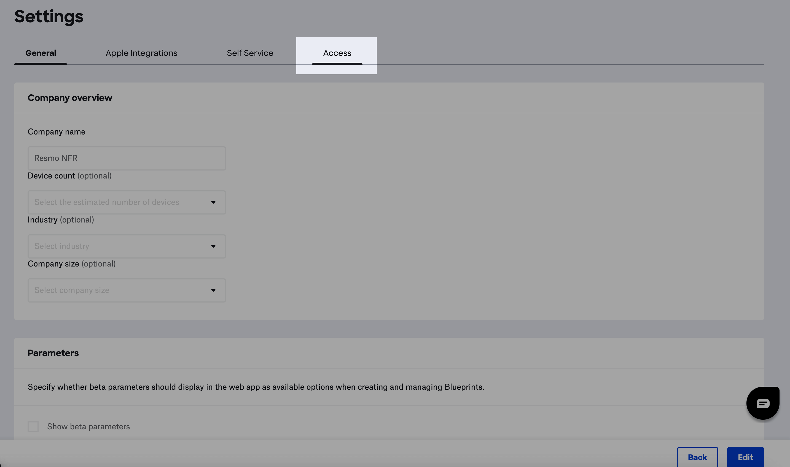
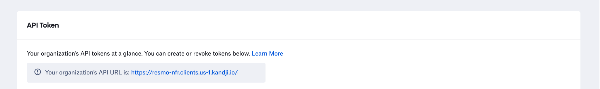
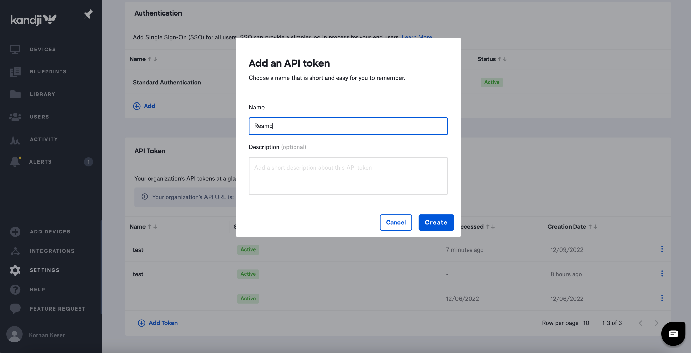
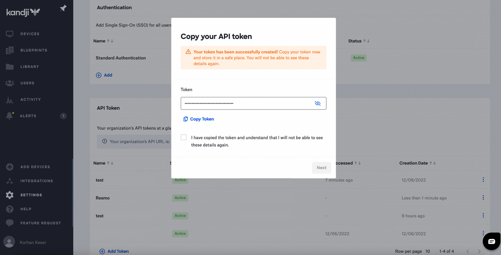
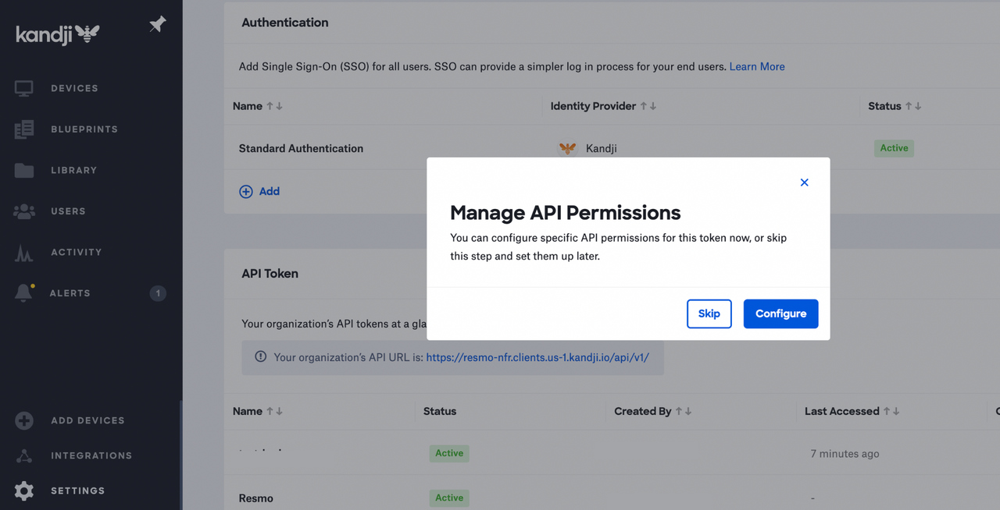
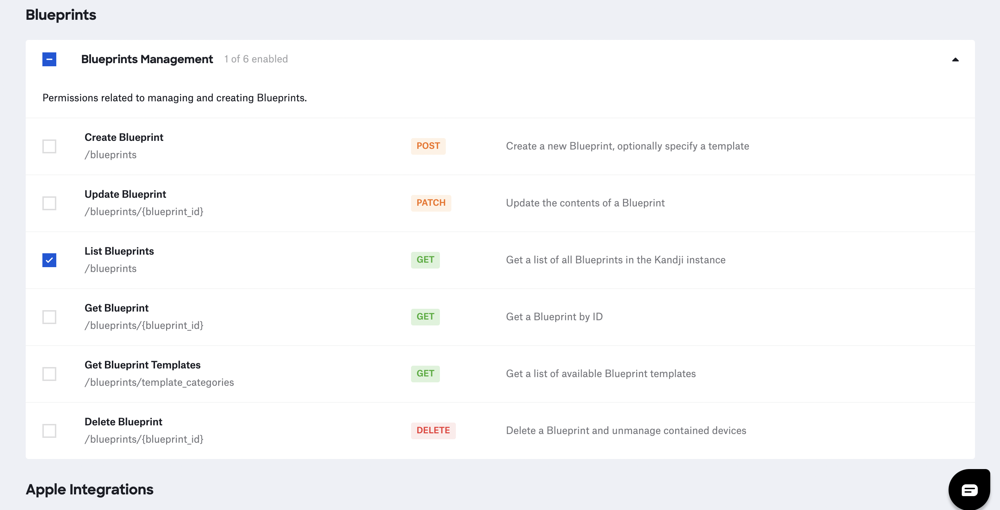
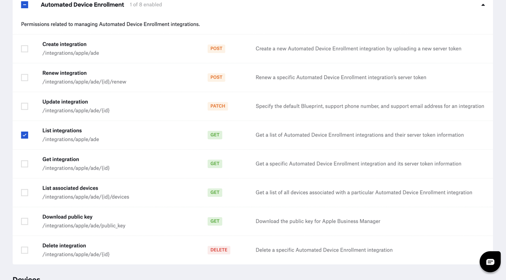
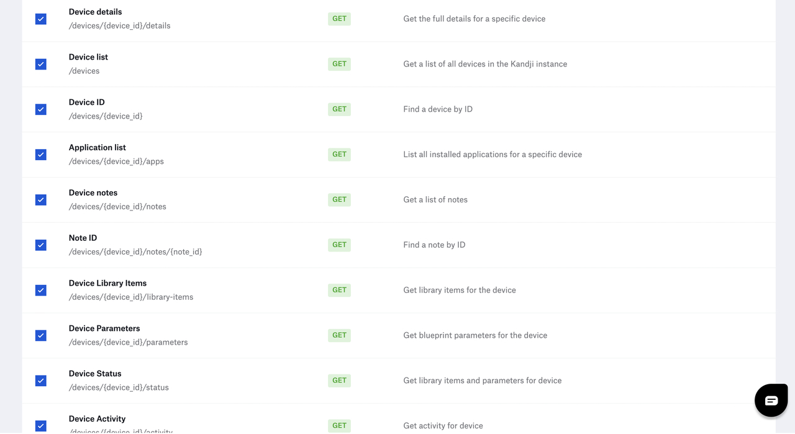
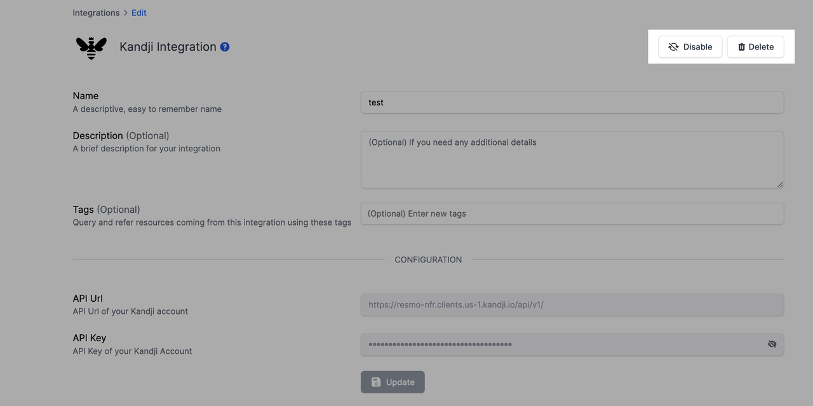

# Kandji Integration

## Resmo + Kandji Integration Fundamentals

<figure><figcaption></figcaption></figure>

Resmo integrates with Kandji to help you bolster your device security efforts by bringing visibility, security, and compliance into your environment.

### What does Resmo offer to Kandji users?

* Collect and monitor your Kandji devices, device apps, device users, and more in one place.
* Query your Kandji devices, device apps, device users, and more using SQL and free text search.
* Set up security rules to continuously assess your Kandji resources.
* Monitor changes, and get notified when a resource falls out of your security rule compliance.

### How does the integration work?

Resmo uses API to do the initial polling and collect existing resources. Following the initial polling, it receives updates and changes in real-time through webhook and regular polling.

#### Available resources



## Integration walkthrough

### How to install

1. Select Kandji on the Integrations page of your Resmo account.
2. Click the Add Integration button at the bottom right corner of the opening modal.
3. Go to your **Kandji Settings > Access** on a new tab**.**

<figure><figcaption></figcaption></figure>

4. Copy your **API Url** and paste it to the API Url field on the setup page.

<figure><figcaption></figcaption></figure>

5. Follow [Generate an API Token](https://support.kandji.io/support/solutions/articles/72000560412-kandji-api) flow and **create your API Key**.&#x20;

<figure><figcaption></figcaption></figure>

6. Copy your API Key.

<figure><figcaption></figcaption></figure>

7. Select **Consumer Secret** from your Connect App and paste it to **Client Secret** in the integration configuration screen.

* Manage API permissions. Click Configure.

<figure><figcaption></figcaption></figure>

* Check **List Blueprint**.

<figure><figcaption></figcaption></figure>

* Check **List Integrations**.

<figure><figcaption></figcaption></figure>

* Check every item under Device.

<figure><figcaption></figcaption></figure>

8. Paste it to the API Key field on the setup page.

<figure><figcaption></figcaption></figure>

9. Hit the Create button.
10. You are ready to run queries.

### How to uninstall

1. Select Kandji on your Integrations page.
2. Navigate to the Connected Integrations tab on the opening modal.
3. Click the Kandji integration you want to remove.
4. To temporarily disable it, click the **Disable** button from the top right. To permanently uninstall it, click the **Delete** button instead. Note that the disabling action can be undone later while deletion cannot be undone.

<figure><figcaption></figcaption></figure>

### Support

Still have questions about your Kandji integration? Contact our team via live chat or email us at contact@resmo.com.&#x20;
