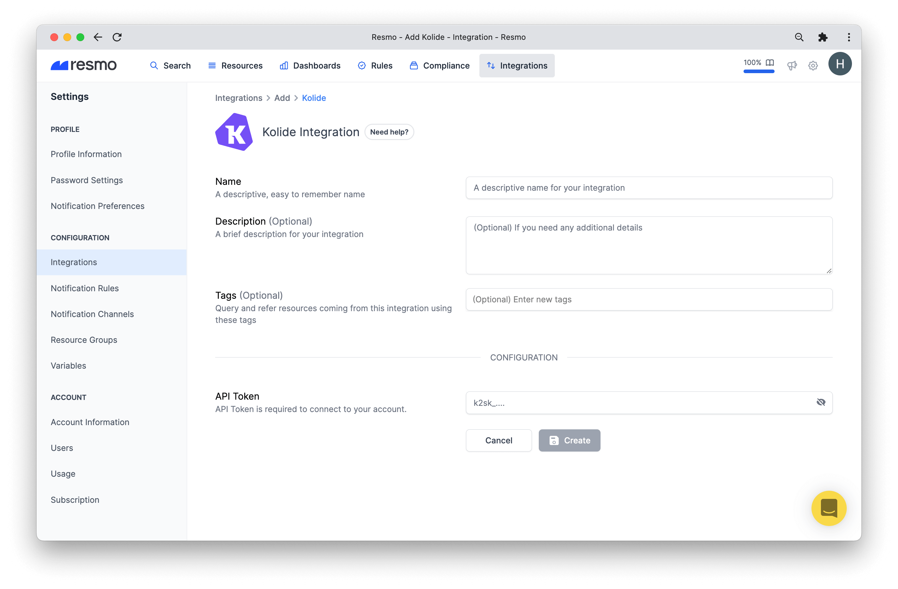
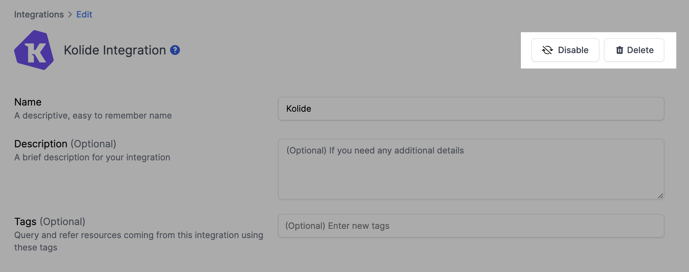

# Kolide Integration

## Resmo + Kolide Integration Fundamentals

<figure><figcaption></figcaption></figure>

Resmo's agent-free, one-click integration with Kolide provides centralized visibility, security, and compliance for your Kolide asset environment.

### What does Resmo offer to Kolide users?

* Collect your directory assets like devices, users, and checks from your Kolide account.
* Query your Kolide users, teams, roles, and much more.
* Automatically audit your Kolide resources' security and compliance
* Set up rule notifications based on Kolide resource configurations.

### How does the integration work?

Resmo uses API keys created from the Kolide Admin page. Our application uses API to make the initial polling and receive existing resources. Then, we receive resource changes and updates in real-time by regular polling.

#### Available resources

Resmo consolidates Kolide resources in one place, including devices, identities, checks, and more.



## Integration Walkthrough

### How to install

1. Sign up or sign in to your Resmo account.
2. Navigate to your Integrations page and click the Add Integration button from the top right corner.
3. Add Kolide. Give a name to your Kolide integration, and optionally a description.

<figure><figcaption></figcaption></figure>

4\. Go to your Kolide account and create an API Key from Kolide [Settings Page](https://k2.kolide.com/x/settings/admin/api).

5\. Fill the form with API Key and click Save.

6\. You are now ready! Now you can start querying your Kolide resources!

### How to uninstall

1. Login to your Resmo account and go to your Integrations page.
2. Click the Kolide integration you wish to remove.
3. You can temporarily disable or permanently delete your integration from the top right buttons (Disable - Delete.)&#x20;

<figure><figcaption></figcaption></figure>

### Support

If you still have any questions about your Resmo Kolide integration, contact us via live chat or email us at contact@resmo.com.
