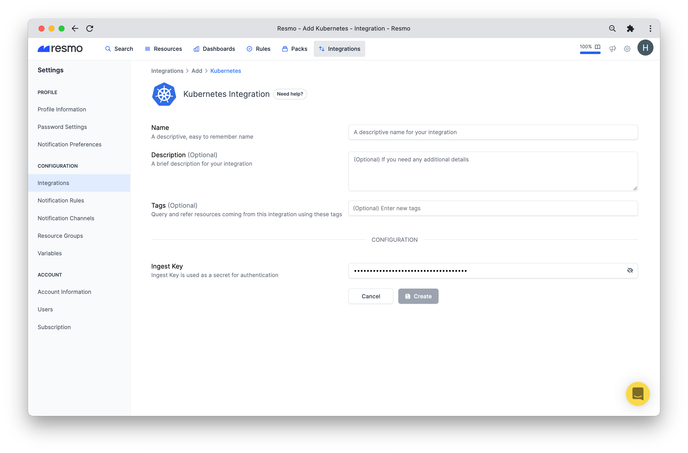

# Kubernetes Integration

## Resmo + Kubernetes Integration Fundamentals


Resmo seamlessly integrates with [Kubernetes](https://kubernetes.io/) to ensure your resources stay secure and compliant.

### What does Resmo offer Kubernetes users? <a href="#what-does-opsgenie-offer-slack-users" id="what-does-opsgenie-offer-slack-users"></a>

* Collect and monitor all your Kubernetes resources in one place
* Run automated audits with predefined or custom rules
* Set up notification rules to get alerted on rule violation
* Query your assets and receive instant answers
* Use the Best Practices pack to check your Kubernetes security and compliance posture.

### How does the integration work?&#x20;

Resmo Kubernetes Integration collects resources by establishing a trust relationship in your cluster. After you copy and paste the YAML specified in the [How to install section](kubernetes-integration.md#how-to-install) to your Kubernetes cluster, a CronJob starts operating periodically. Once triggered, it sends requests to our servers, pulling resources inside the cluster. Then, we process them on the server. The app operating in your Kubernetes cluster is provided as a docker image without any authorization limits. Resmo performs the resource validation with a unique IngestKey. Note: An IngestKey is different for each integration.&#x20;

* YAML
* IngestKey

### Available resources

Resmo Kubernetes integration aggregates deployments, jobs, pods, cluster roles, services, and more.

| Kubernetes Resources |
| -------------------- |
| Cluster Role         |
| Cluster Role Binding |
| Cron Job             |
| Daemonset            |
| Deployment           |
| Job                  |
| Namespace            |
| Pod                  |
| Replicaset           |
| Role                 |
| Role Binding         |
| Service              |

### Common queries and rules

* List job containers without livenessProbe.
* Find deployment containers with privilege escalation.
* See Kubernetes services with NodePort and LoadBalancer type.
* Find pod containers with privileged ports.
* List replicaset in default namespace.
* Identify cronjob containers without a memory limit.

### Integration walkthrough

#### How to install

1. Apply the following YAML to your Kubernetes cluster:

```
apiVersion: batch/v1beta1
kind: CronJob
metadata:
  name: resmo-data-collector
spec:
  schedule: "*/30 * * * *"
  successfulJobsHistoryLimit: 1
  failedJobsHistoryLimit: 1
  jobTemplate:
    spec:
      backoffLimit: 2
      template:
        metadata:
          name: resmo-data-collector
        spec:
          restartPolicy: Never
          serviceAccountName: resmo-data-collector-service-account
          containers:
            - name: resmo-data-collector
              image: resmoio/resmo-kubernetes-agent:0.0.1
              imagePullPolicy: IfNotPresent
              env:
                - name: RESMO_KUBERNETES_ENDPOINT
                  value: "https://id.resmo.app/integration/kubernetes/ingest"
                - name: RESMO_INGEST_KEY
                  value: "f039650b-6410-4cf1-93d9-5cf240b6ba62"
              resources:
                limits:
                  cpu: "300m"
                  memory: "200Mi"
                requests:
                  cpu: "200m"
                  memory: "100Mi"
---
apiVersion: rbac.authorization.k8s.io/v1
kind: ClusterRole
metadata:
  name: resmo-data-collector-role
rules:
  - apiGroups:
      - ""
    resources:
      - configmaps
      - endpoints
      - persistentvolumeclaims
      - persistentvolumeclaims/status
      - pods
      - replicationcontrollers
      - replicationcontrollers/scale
      - serviceaccounts
      - services
      - services/status
    verbs:
      - get
      - list
      - watch
  - apiGroups:
      - ""
    resources:
      - bindings
      - events
      - limitranges
      - namespaces/status
      - pods/log
      - pods/status
      - replicationcontrollers/status
      - resourcequotas
      - resourcequotas/status
    verbs:
      - get
      - list
      - watch
  - apiGroups:
      - ""
    resources:
      - namespaces
    verbs:
      - get
      - list
      - watch
  - apiGroups:
      - discovery.k8s.io
    resources:
      - endpointslices
    verbs:
      - get
      - list
      - watch
  - apiGroups:
      - apps
    resources:
      - controllerrevisions
      - daemonsets
      - daemonsets/status
      - deployments
      - deployments/scale
      - deployments/status
      - replicasets
      - replicasets/scale
      - replicasets/status
      - statefulsets
      - statefulsets/scale
      - statefulsets/status
    verbs:
      - get
      - list
      - watch
  - apiGroups:
      - autoscaling
    resources:
      - horizontalpodautoscalers
      - horizontalpodautoscalers/status
    verbs:
      - get
      - list
      - watch
  - apiGroups:
      - batch
    resources:
      - cronjobs
      - cronjobs/status
      - jobs
      - jobs/status
    verbs:
      - get
      - list
      - watch
  - apiGroups:
      - extensions
    resources:
      - daemonsets
      - daemonsets/status
      - deployments
      - deployments/scale
      - deployments/status
      - ingresses
      - ingresses/status
      - networkpolicies
      - replicasets
      - replicasets/scale
      - replicasets/status
      - replicationcontrollers/scale
    verbs:
      - get
      - list
      - watch
  - apiGroups:
      - policy
    resources:
      - poddisruptionbudgets
      - poddisruptionbudgets/status
    verbs:
      - get
      - list
      - watch
  - apiGroups:
      - networking.k8s.io
    resources:
      - ingresses
      - ingresses/status
      - networkpolicies
    verbs:
      - get
      - list
      - watch
  - apiGroups:
      - rbac.authorization.k8s.io
    resources:
      - roles
      - rolebindings
      - clusterroles
      - clusterrolebindings
    verbs:
      - get
      - list
      - watch
---
apiVersion: v1
kind: ServiceAccount
metadata:
  name: resmo-data-collector-service-account
---
apiVersion: rbac.authorization.k8s.io/v1
kind: ClusterRoleBinding
metadata:
  name: resmo-data-collector-role-binding
subjects:
  - kind: ServiceAccount
    name: resmo-data-collector-service-account
    namespace: default
roleRef:
  apiGroup: rbac.authorization.k8s.io
  kind: ClusterRole
  name: resmo-data-collector-role
```

2\. Sign up for or sign in to your Resmo account.

3\. Go to your Integrations page from the navigation bar.

.png>)

4\. Click the Add Integration button and select Kubernetes.

5\. Name the integration. Optionally add a description and tags.



6\. Paste your Ingest Key into the related field. (Ingest Key is used as a secret for authentication.)

7\. Hit the Create button, and you can start querying your Kubernetes resources!

#### How to uninstall

1. Log in to your Resmo account.
2. Navigate to Settings>Integrations and select the Kubernetes integration you wish to uninstall.
3. To temporarily pause the integration, click Disable. To remove it permanently, click Delete.

