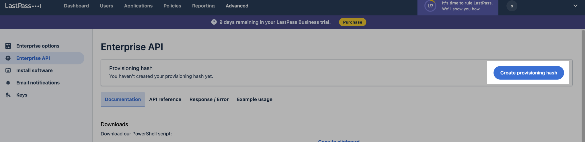

# LastPass Integration

## Resmo + LastPass Integration Fundamentals

<figure><figcaption></figcaption></figure>

Resmo integrates with LastPass to help you safeguard your LastPass assets with complete visibility, security, and compliance.

### What does Resmo offer to LastPass users?

* Collect your LastPass directory assets like users and groups.
* Query your LastPass resources using SQL or free text search.
* Set up custom rules and run custom SQL queries to improve asset visibility.
* Get notified of critical rule changes in real-time.

### How does the integration work?

Resmo uses API to do the initial polling and collect existing resources. Following the initial polling, it receives updates and changes in real-time through webhook and regular polling.

#### Available resources



## Integration walkthrough

### How to install

1. Select LastPass on the Integrations page of your Resmo account.
2. Click the Add Integration button at the bottom right corner of the opening modal.
3. Go to the Admin Dashboard of your LastPass account.
4. Copy your account number under the dashboard header.
5. Paste it to the Customer Id field on the setup page.

<figure><figcaption></figcaption></figure>

6. Go to the Advanced page on your LastPass account.
7. Go to the Enterprise API section.
8. Create a Provisioning Hash, or if you already have one, copy it.

<figure><figcaption></figcaption></figure>

<figure><figcaption></figcaption></figure>

9. Paste it to the Provisioning Hash field on the integration setup page.
10. Click the Create button on your Resmo LastPass integration screen.
11. All set! Now you can start running queries on your LastPass resources.

### How to uninstall

1. Select LastPass on your Integrations page.
2. Click the LastPass integration you wish to uninstall from the Connected Integrations tab of the opening modal.
3. To temporarily pause the integration, click the Disable button from the top right. For permanent removal, click the Delete button.

<figure><figcaption></figcaption></figure>
