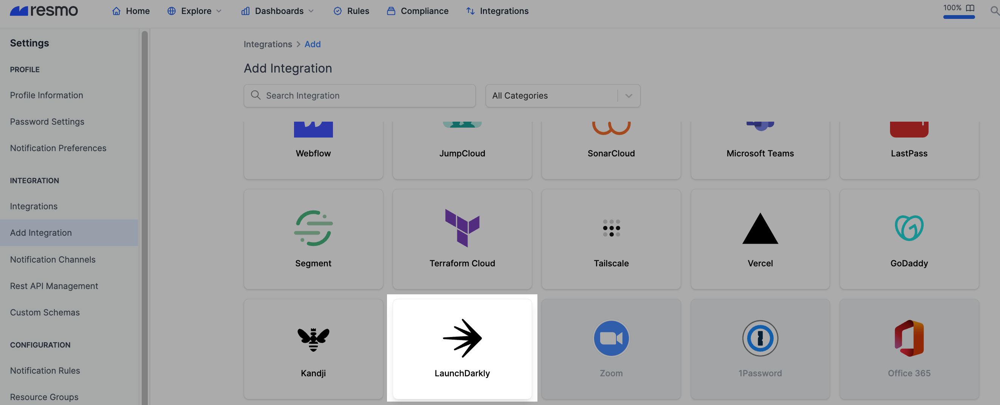
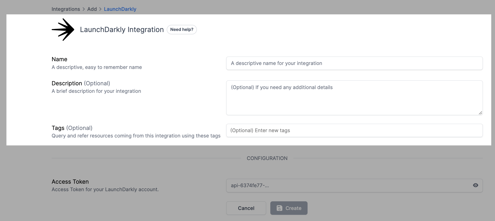
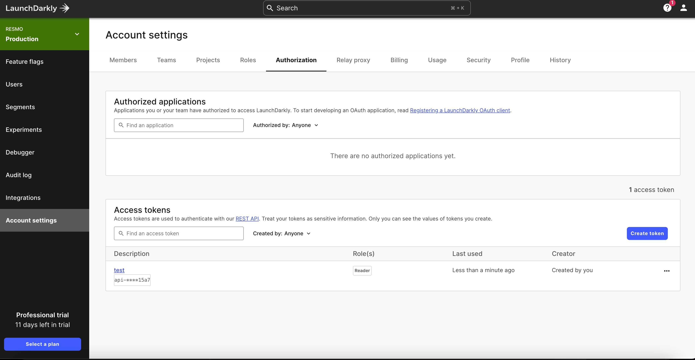
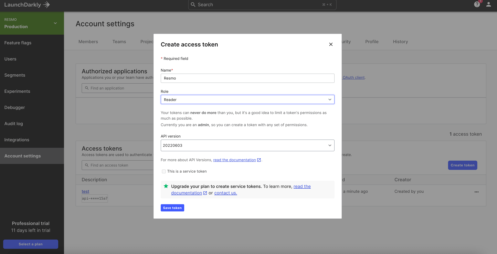
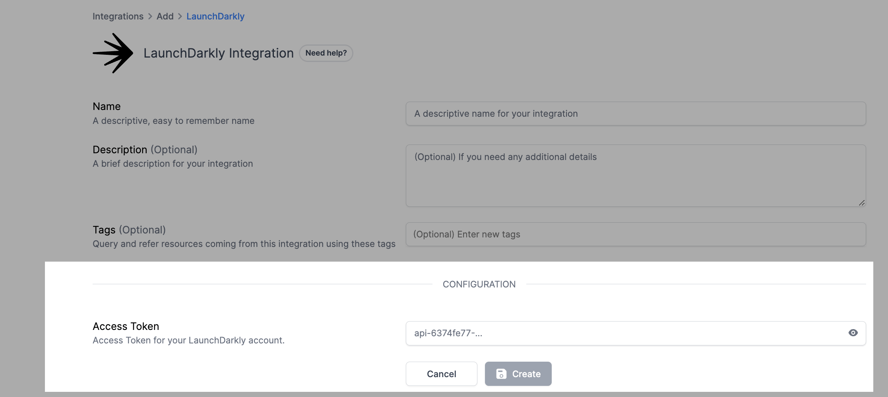

# LaunchDarkly Integration

## Resmo + LaunchDarkly Integration Fundamentals

<figure><figcaption></figcaption></figure>

Resmo connects with LaunchDarkly to improve the visibility, security, and compliance of your LaunchDarkly resources by collecting them on a single platform.

### What does Resmo offer to LaunchDarkly users?

* Collect your directory assets like members, feature flags, and projects from your LaunchDarkly account.
* Query your LaunchDarkly members, feature flags, projects, and more.
* Set up security rules and run SQL queries to improve asset visibility.
* Receive notifications of critical rule changes in near real-time through your favorite notification channels like Slack, Opsgenie, webhook, PagerDuty, or email.

### How does the integration work?

Resmo uses API to do the initial polling and collect existing resources. Following the initial polling, it receives updates and changes in real-time through webhook and regular polling.

#### Available resources



## Integration walkthrough

### How to install

1. Sign up or sign in to your Resmo account and navigate to the Integrations page.
2. Click the **Add Integration** button and add LaunchDarkly.

<figure><figcaption></figcaption></figure>

3\. Type a descriptive name for the integration and, optionally, a description.

<figure><figcaption></figcaption></figure>

4\. Go to your LaunchDarkly account and navigate to [Account Settings -> Authorization](https://app.launchdarkly.com/settings/authorization).

<figure><figcaption></figcaption></figure>

5\. Create and copy the **Reader Access Token** from your LaunchDarkly account.

<figure><figcaption></figcaption></figure>

6\. Paste it to the Access Token field on the setup page on Remso.

<figure><figcaption></figcaption></figure>

7\. Click Create.

8\. All set! Now you can start running queries on your LaunchDarkly resources.

### How to uninstall

1. Go to your Integrations page on Resmo.
2. Click the LauncDarkly integration you want to uninstall.
3. For temporary disabling, click the **Disable** button from the upper right-hand. You can enable it back later. Or you can permanently remove the integration by clicking the **Delete** button. This action cannot be undone.

<figure><figcaption></figcaption></figure>

### Support

Contact our team for support requests or troubleshooting about your LaunchDarkly integration via live chat or email us at contact@resmo.com. We'll get in touch in no time!
