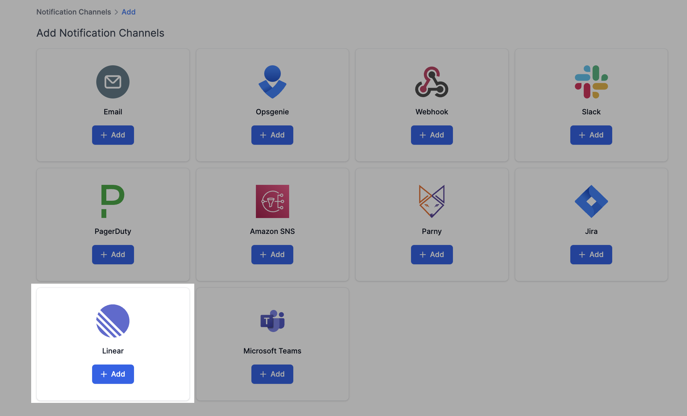
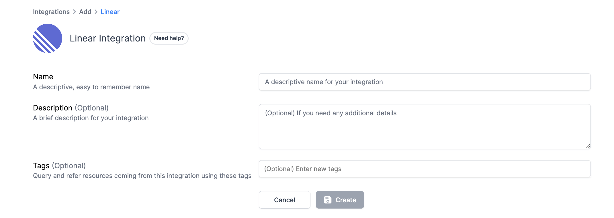
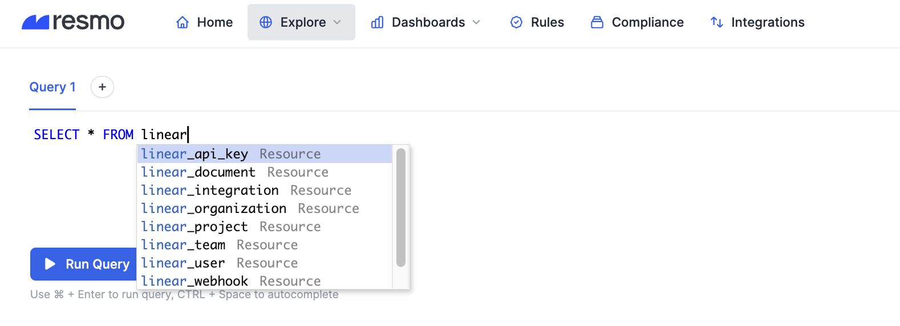
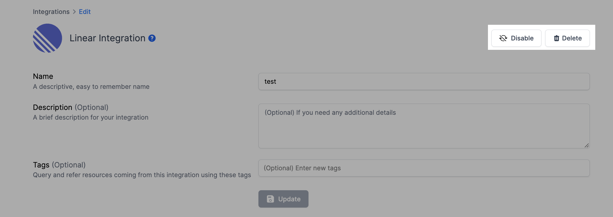

# Linear Integration

## Resmo + Linear Integration Fundamentals

<figure><figcaption></figcaption></figure>

Resmo integrates with Linear in one click to bring complete visibility, security, and compliance into your environment.

### What does Resmo offer to Linear users?

* Collect your directory assets like users, teams, and projects from your Linear account.
* Query your Linear users, teams, projects, and more using SQL or free text search.
* Set up custom security rules and run custom SQL queries to improve your asset visibility.
* Get notified of critical security rule violations in near real-time.

### How does the integration work?

Resmo uses API to do the initial polling and collect existing resources. Following the initial polling, it receives updates and changes in real-time through webhook and regular polling.

## Integration walkthrough

### How to install

1. Sign up or sign in to Resmo and navigate to the Integrations page.
2. Click the Add Integration button and add Linear.

<figure><figcaption></figcaption></figure>

3\. Name your Linear integration and optionally write a description.

<figure><figcaption></figcaption></figure>

4\. Hit the Create button.

5\. You'll be redirected to Linear. Accept permissions.

6\. Your Linear integration is ready! Now you can start querying your resources.

<figure><figcaption></figcaption></figure>

### How to uninstall

1. Go to your Integrations page on Resmo.
2. Click the Linear integration you want to remove.
3. You can either temporarily disable the integration or permanently delete it. Depending on your choice, click the related button (Disable / Delete) from the upper right corner, as seen in the image below.

<figure><figcaption></figcaption></figure>

### Support

Contact us via lie chat or email us at contact@resmo.com for support requests or troubleshooting.
