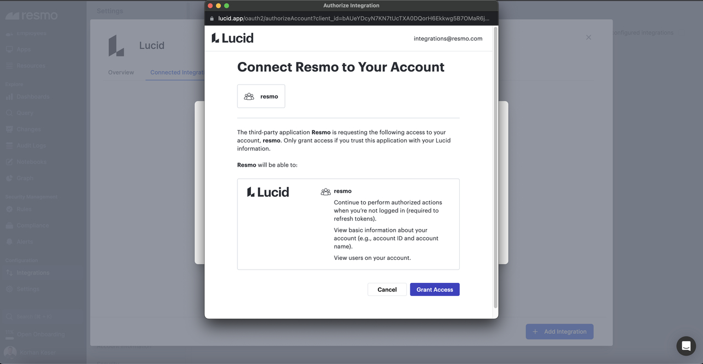

# Lucid Integration

<figure><figcaption></figcaption></figure>

Identify changes in your Lucid environment; configure alerts for vulnerabilities. View user activities on dashboards or craft specific security rules that run automated checks.

### What does Resmo offer to Lucid users?

* Collect your directory assets like users from Lucid account
* Ability to query your Lucid users and more
* Set up custom rules and run custom SQL queries to improve asset visibility

### How does the integration work?

Resmo uses API to do the initial polling and collect existing resources. Following the initial polling, it receives updates and changes in real-time through webhook and regular polling.

### Integration walkthrough

#### How to install

1. Go to your Integrations page on Resmo.
2. Find and click on Lucid.
3. Hit the Add Integration button from the bottom right corner.
4. Grant access to Resmo from the opening OAuth screen.

<figure><figcaption></figcaption></figure>

5. Your Lucid integration will be ready to query in a few minutes.

#### How to uninstall

1. Find and click Lucid from your Integrations page on Resmo.
2. Navigate to the Connected Integrations tab and select the Lucid account you want to remove.
3. To temporarily disable, click the 'Disable' button on the top right. To permanently remove the integration, click the 'Delete' button.
