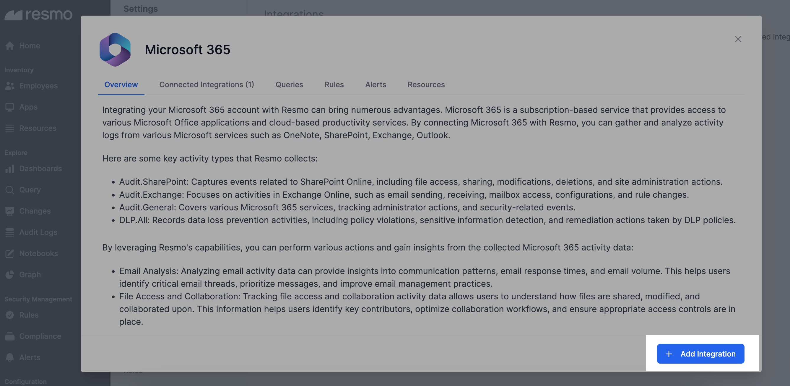

# Microsoft 365 Integration

<figure><figcaption></figcaption></figure>

Resmo's Microsoft integration provides comprehensive email activity analysis, efficient file access tracking, and detailed assessment of meeting and application usage. Furthermore, it enables robust security monitoring, ensuring a safe and productive Microsoft 365 environment for your organization.

### What does Resmo offer to Microsoft 365 users?

* Monitor SharePoint Online activities for enhanced collaboration and optimal access control&#x20;
* Analyze email activity on Exchange Online with Resmo to improve email management practices.&#x20;
* Assess meeting habits and efficiency using Resmo's meeting activity data analytics.
* Track application usage across Microsoft 365 services to maximize productivity and identify training opportunities.
* Ensure robust security and compliance monitoring by tracking security-related events.

### How does the integration work?

Currently, the Microsoft 365 integration supports the [Audit Logs](broken-reference) feature only. Upon successfully integrating the system, you gain the ability to conveniently access and review system activities associated with your Microsoft 365 account through the dedicated Audit Logs page.

This allows you to collect and analyze activity logs from various Microsoft services such as OneNote, SharePoint, Exchange, and Outlook.


Resmo has **native integrations** with certain Microsoft 365 tools; you can set them up to leverage more features like [asset inventory](../resources/resources.md), [data querying](broken-reference), [security rules](../rules/rules.md), [alerts](../alerts/alerts.md), and [dashboards](../dashboards/dashboards.md).

* [Microsoft Teams](microsoft-teams-integration.md)
* [Intune](microsoft-intune-integration.md)
* [Defender](microsoft-defender-integration.md)


**Available resources**



### Integration Walkthrough

#### How to install

1. Select Microsoft 365 on the Integrations page of your Resmo account.
2. Click Add Integration from the bottom right corner of the opening modal.

<figure><figcaption></figcaption></figure>

3. Allow the required permissions for the integrations.
4. Your integration will be ready. Now, you can monitor the system activities through your Audit Logs page.

#### How to uninstall

1. On your Integrations page on Resmo, find and select Microsoft 365.&#x20;
2. Navigate to the Connected Accounts tab on the opening modal.&#x20;
3. Select the integrated account you want to uninstall.&#x20;
4. You can either disable the integration temporarily and enable it back later or delete it permanently.&#x20;
5. Click the related button (Disable/Delete)from the top right depending on your choice.

<figure><figcaption></figcaption></figure>
