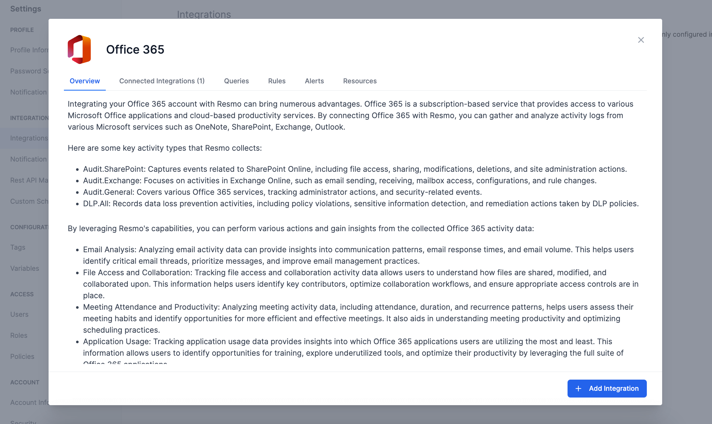
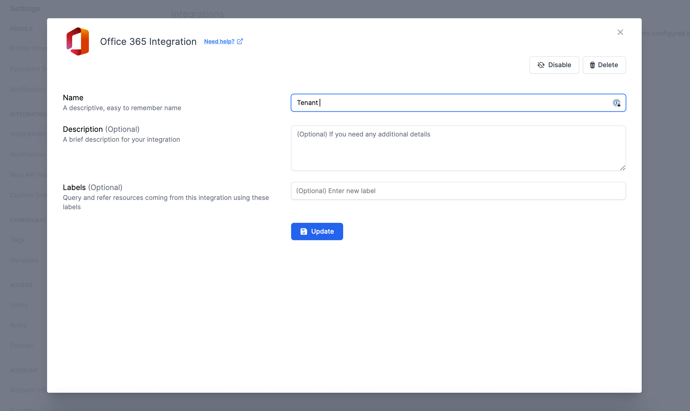

# Microsoft 365 Integration

<figure><figcaption></figcaption></figure>

Resmo provides tools for comprehensive email activity analysis, efficient file access tracking, and detailed assessment of meeting and application usage. Furthermore, it enables robust security monitoring, ensuring a safe and productive Microsoft 365 environment for your organization.

### What does Resmo offer to Microsoft 365 users?

* Monitor SharePoint Online activities for enhanced collaboration and optimal access control&#x20;
* Analyze email activity on Exchange Online with Resmo to improve email management practices.&#x20;
* Assess meeting habits and efficiency using Resmo's meeting activity data analytics.
* Track application usage across Office 365 services to maximize productivity and identify training opportunities.
* Ensure robust security and compliance monitoring by tracking security-related events.

### How does the integration work?

Resmo uses API to do the initial polling and collect existing Microsoft 365 resources. Following the initial polling, it receives updates and changes in real-time through webhook and regular polling.

**Available resources**



### Integration Walkthrough

#### How to install

1. Select Office 365 on the Integrations page of your Resmo account.
2. Click Add Integration from the bottom right corner of the opening modal.

<figure><figcaption></figcaption></figure>

3. Allow the required permissions for the integrations.
4. Your integration will be ready.

#### How to uninstall

1. On your Integrations page on Resmo, find and select Office 365.&#x20;
2. Navigate to the Connected Accounts tab on the opening modal.&#x20;
3. Select the integrated account you want to uninstall.&#x20;
4. You can either disable the integration temporarily and enable it back later or delete it permanently.&#x20;
5. Click the related button (Disable/Delete)from the top right depending on your choice.

<figure><figcaption></figcaption></figure>

### Support

Still have questions? Contact us via live chat or email us at contact@resmo.com.
