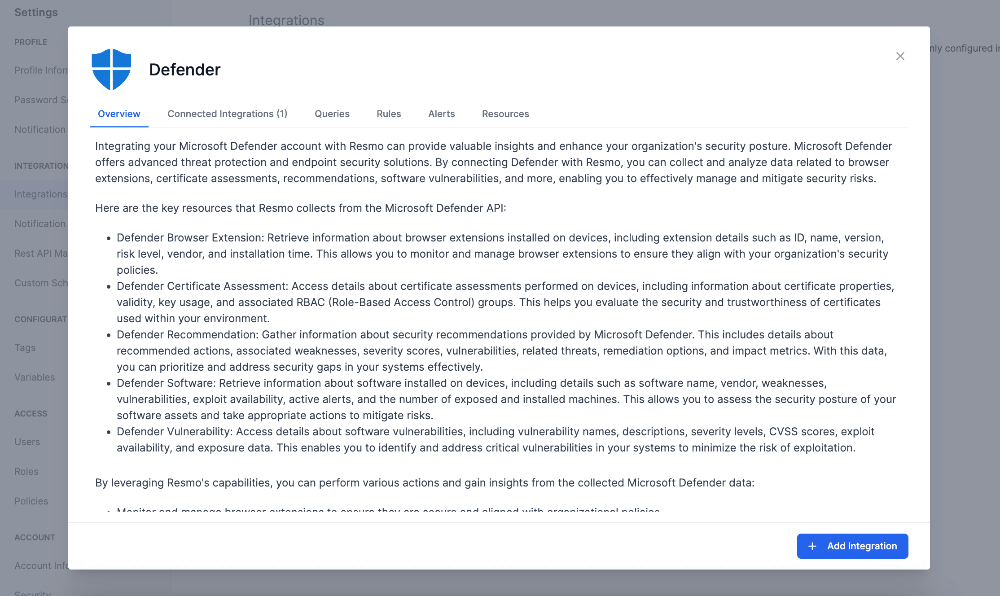
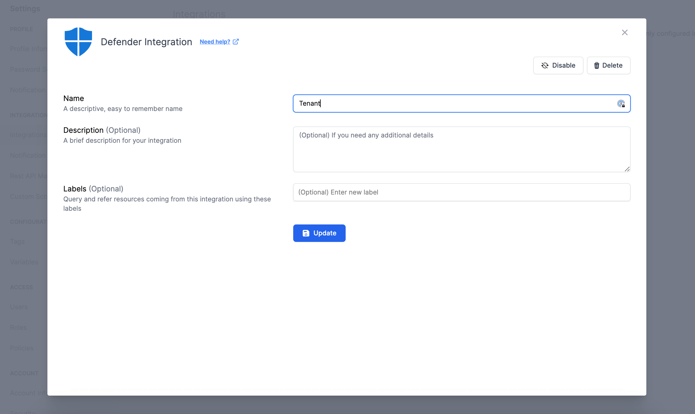

# Microsoft Defender Integration

<figure><figcaption></figcaption></figure>

Resmo allows you to monitor and manage browser extensions, evaluate certificate trustworthiness, address security recommendations, assess software security postures, and pinpoint critical software vulnerabilities. This integration effectively utilizes Microsoft Defender's advanced threat protection capabilities, enhancing your organization's security measures and reducing the risk of exploitation.

### What does Resmo offer to Microsoft Defender users?

* Monitor and manage browser extensions with Resmo to ensure they align with organizational policies in Microsoft Defender.&#x20;
* Evaluate and assess the trustworthiness of certificates in your Microsoft Defender environment.&#x20;
* Prioritize and address Microsoft Defender's security recommendations to mitigate vulnerabilities and weaknesses.&#x20;
* Assess the security posture of software assets and take necessary actions to mitigate risks in Microsoft Defender.
* Identify and address critical software vulnerabilities to reduce the risk of exploitation in Microsoft Defender.

### How does the integration work?

Resmo uses API to do the initial polling and collect existing Microsoft Defender resources. Following the initial polling, it receives updates and changes in real-time through webhook and regular polling.

**Available resources**



### Integration Walkthrough

#### How to install

1. Select Defender on the Integrations page of your Resmo account.
2. Click Add Integration from the bottom right corner of the opening modal.

<figure><figcaption></figcaption></figure>

3. Allow the required permissions for the integrations.
4. Your Microsoft Defender integration will be ready.

#### How to uninstall

1. On your Integrations page on Resmo, find and select Defender.&#x20;
2. Navigate to the Connected Accounts tab on the opening modal.&#x20;
3. Click on the account you want to remove.&#x20;
4. You can either disable the integration temporarily and enable it back later or delete it permanently. Based on your choice, click the related button (Disable/Delete)from the top right.

<figure><figcaption></figcaption></figure>
