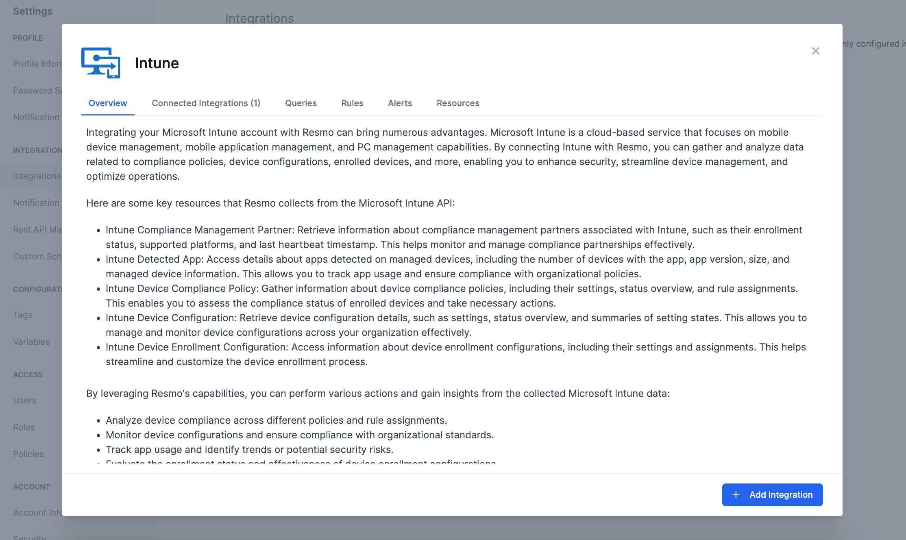
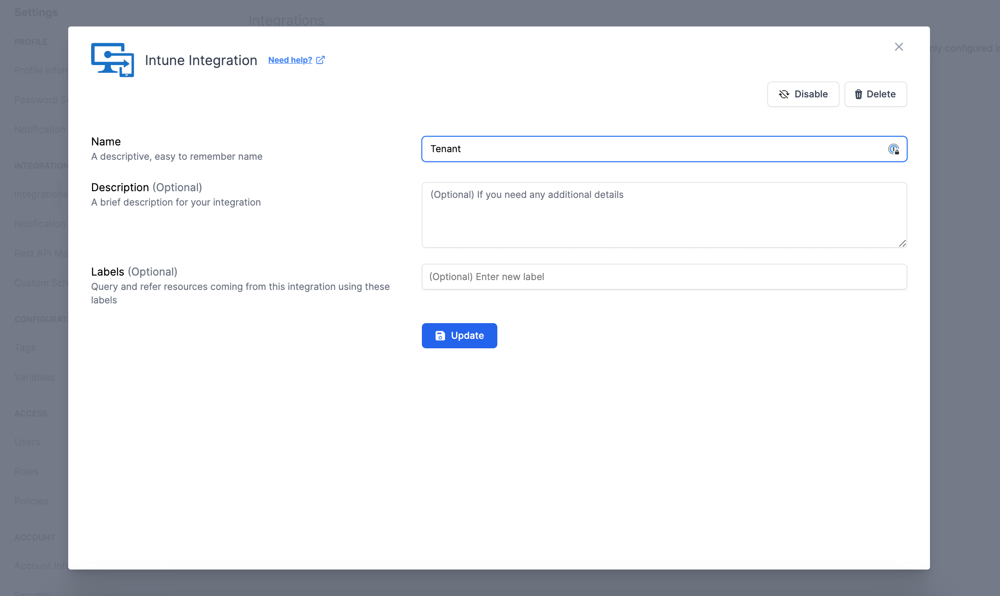

# Microsoft Intune Integration

<figure><figcaption></figcaption></figure>

With Resmo,  you can analyze compliance, monitor device configurations, track app usage, evaluate enrollment status, and gain insight into device health. This integration ensures optimal Intune environment management, strengthens security, and streamlines device management processes.

### What does Resmo offer to Microsoft Intune users?

* Analyze device compliance across different policies and rule assignments with Resmo in Microsoft Intune.&#x20;
* Monitor device configurations and ensure compliance with organizational standards
* Track app usage and identify potential security risks or trends in Microsoft Intune.&#x20;
* Evaluate the enrollment status and effectiveness of device enrollment configurations.
* Gain visibility into device health, including security patches, encryption status, and threat reports in Microsoft Intune.

### How does the integration work?

Resmo uses API to do the initial polling and collect existing Microsoft Intune resources. Following the initial polling, it receives updates and changes in real-time through webhook and regular polling.

**Available resources**



### Integration Walkthrough

#### How to install

1. Select Intune on the Integrations page of your Resmo account.
2. Click Add Integration from the bottom right corner of the opening modal.

<figure><figcaption></figcaption></figure>

3. You will be redirected to a permissions page for the integration. Allow the required permissions.
4. Your Intune integration will be all set.

#### How to uninstall

1. On your Integrations page on Resmo, find and select Intune.&#x20;
2. Navigate to the Connected Accounts tab on the opening modal.&#x20;
3. Click on the account you want to remove.&#x20;
4. You can either disable the integration temporarily and enable it back later or delete it permanently. Based on your choice, click the related button (Disable/Delete)from the top right.

<figure><figcaption></figcaption></figure>

### Support

Contact us via live chat or email us at contact@resmo.com for support requests.
