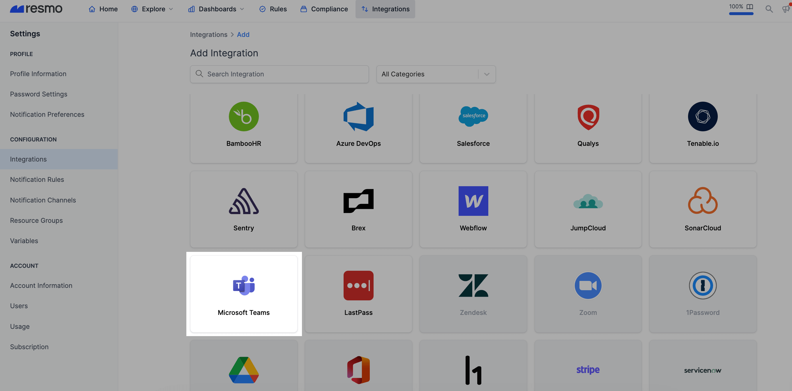
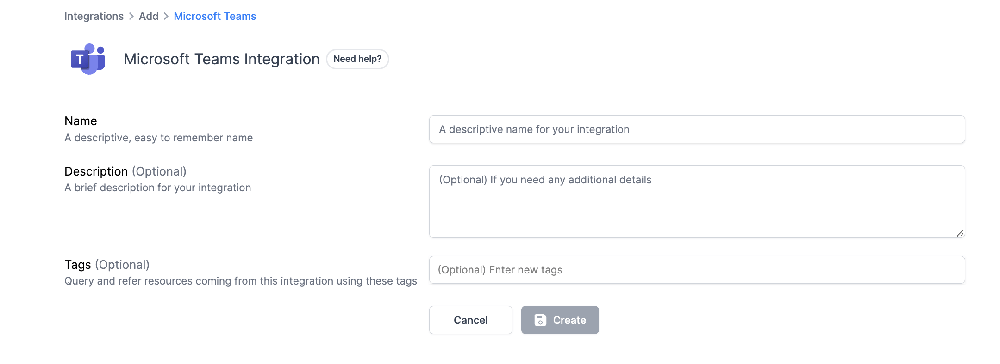
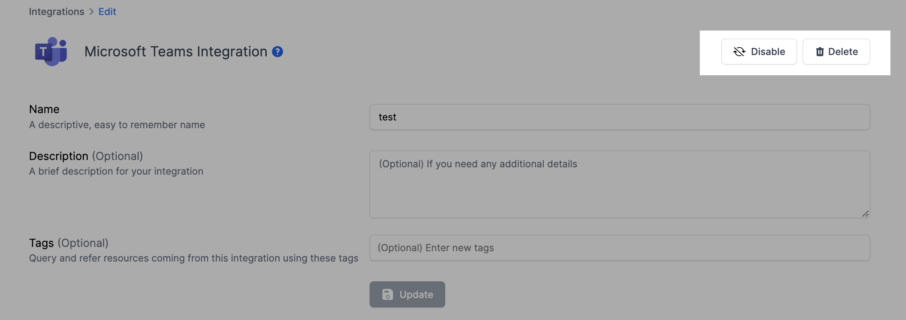

# Microsoft Teams Integration

## Resmo + Microsoft Teams Integration Fundamentals

<figure><figcaption>
,
</figcaption></figure>

Resmo integrates with Microsoft Teams to ensure the security and compliance of your MS Teams environment.

### What does Resmo offer to Microsoft Teams users?

* Collect your directory assets like users, teams, and domains from Microsoft Teams account
* Query your Microsoft Teams users, teams, and more using SQL or free text search.
* Set up custom security rules and run custom SQL queries to improve asset visibility.
* Track asset changes and users on a single platform.

### How does the integration work?

Resmo uses API to do the initial polling and collect existing resources. Following the initial polling, it receives updates and changes in real-time through webhook and regular polling.

#### Available resources



## Integration walkthrough

### How to install

1. Log in to your Resmo account and navigate to your Integrations page.
2. Add Microsoft Teams.

<figure><figcaption></figcaption></figure>

3\. Give a descriptive name to your MS Team integration and optionally a description.

<figure><figcaption></figcaption></figure>

4\. Hit the Create button, and you will be redirected to Microsoft Teams.

5\. Accept permissions.

6\. That's it! Now, you can start querying your Microsoft Teams resources.

### How to uninstall

1. Go to your Integrations page and open the MS Teams integration you want to uninstall.
2. To temporarily pause the integration, click the Disable button, or you can permanently remove it by clicking the Delete button.

<figure><figcaption></figcaption></figure>
