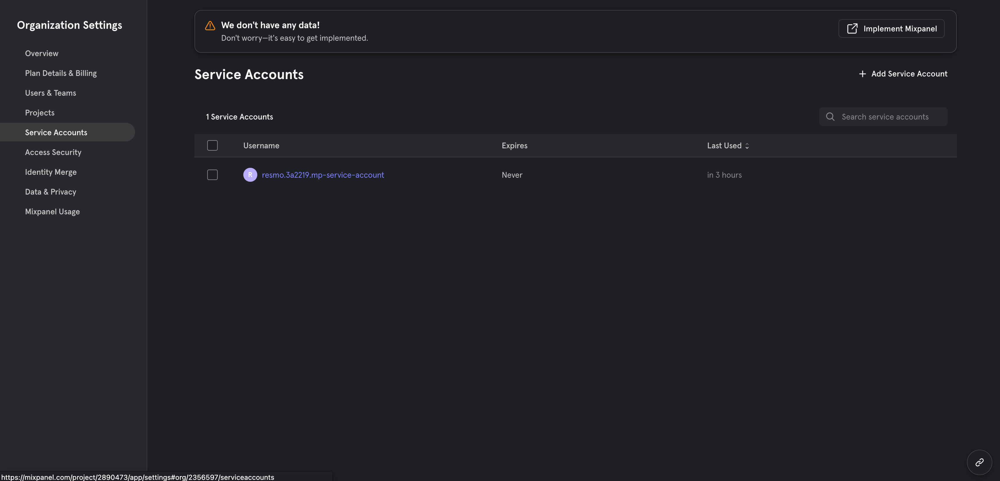
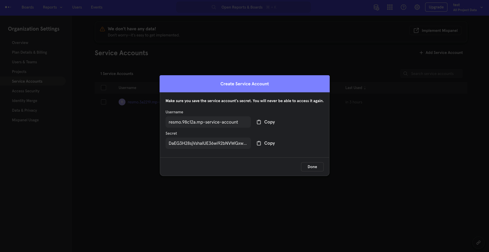
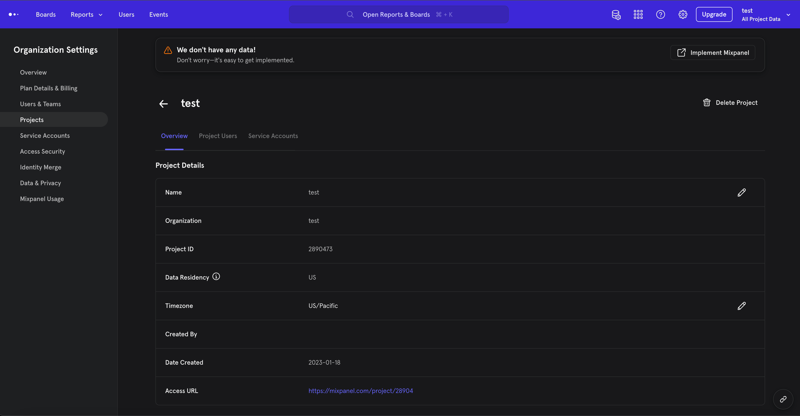
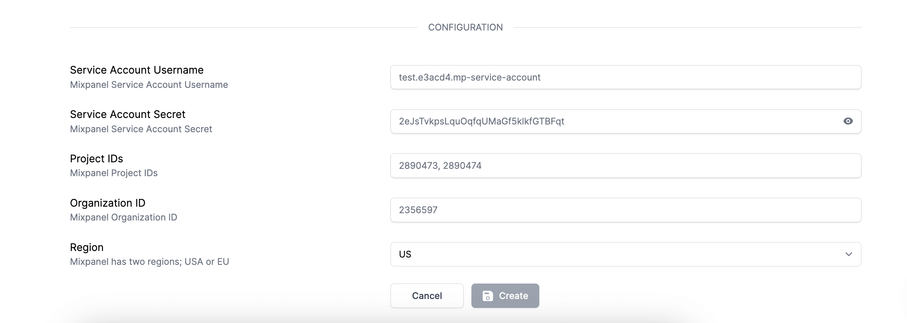
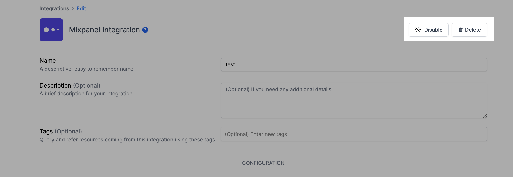

# Mixpanel Integration

## Resmo + Mixpanel Integration Fundamentals

<figure><figcaption></figcaption></figure>

Resmo connects to Mixpanel to bring continuous visibility, security, and compliance to your Mixpanel environment.

### What does Resmo offer to Mixpanel users?

* Collect and monitor all your Mixpanel assets on a single platform.
* Query your Mixpanel users, cohorts, service accounts, and more.
* Set up automated security rules to continuously assess your Mixpanel resources.
* Set up and receive rule notifications based on your Mixpanel resource configurations.

### How does the integration work?

Resmo uses API to do the initial polling and collect existing resources. Following the initial polling, it receives updates and changes in real-time through webhook and regular polling.

#### Available resources



## Integration walkthrough

### How to install

1. Select Mixpanel on the Integrations page.
2. Click the Add Integration button at the bottom right corner of the opening modal.

<figure><figcaption></figcaption></figure>

4\. Go to your Mixpanel service accounts page under the organization settings.

5\. Click on "+ Add Service Account"

<figure><figcaption></figcaption></figure>

6\. Select "Member" as the organization role.

7\. Select the desired projects.

8\. Select "Admin" as the project role.

9\. Copy and paste the username field to Service Account Username.

10\. Copy and paste the secret field to Service Account Secret.

<figure><figcaption></figcaption></figure>

11\. Go to your projects page under the organization settings.

12\. Click on the desired projects and copy and paste their project IDs to the Project IDs field on the setup page(Separate them with ",").

<figure><figcaption></figcaption></figure>

13\. Go to your organization page under personal settings. Copy the organization ID for your organization.

14\. Paste it to the Organization ID field on the setup page.

<figure><figcaption></figcaption></figure>

15\. Select your region.

16\. Click create.

17\. All set! Now you can start running queries on your Mixpanel resources.

### How to uninstall

1. Select Mixpanel on your Integrations page.
2. Navigate to the Connected Integrations tab on the opening modal.
3. Click the Mixpanel integration you want to remove.
4. To temporarily pause the integration, click the Disable button from the upper right corner. You can enable it back later on. For permanent deletion, click the Delete button instead. Note that this action cannot be undone.

<figure><figcaption></figcaption></figure>

### Support

Contact our team via live chat or email us at contact@resmo.com for troubleshooting or support requests.
