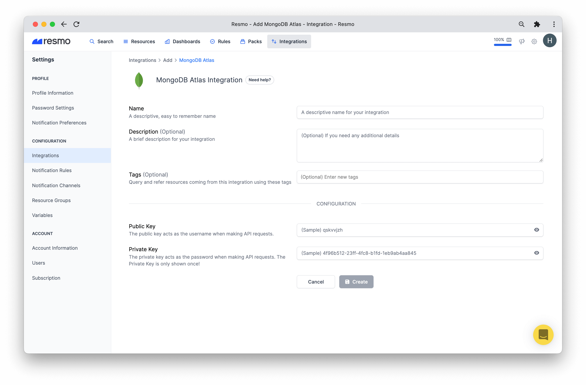
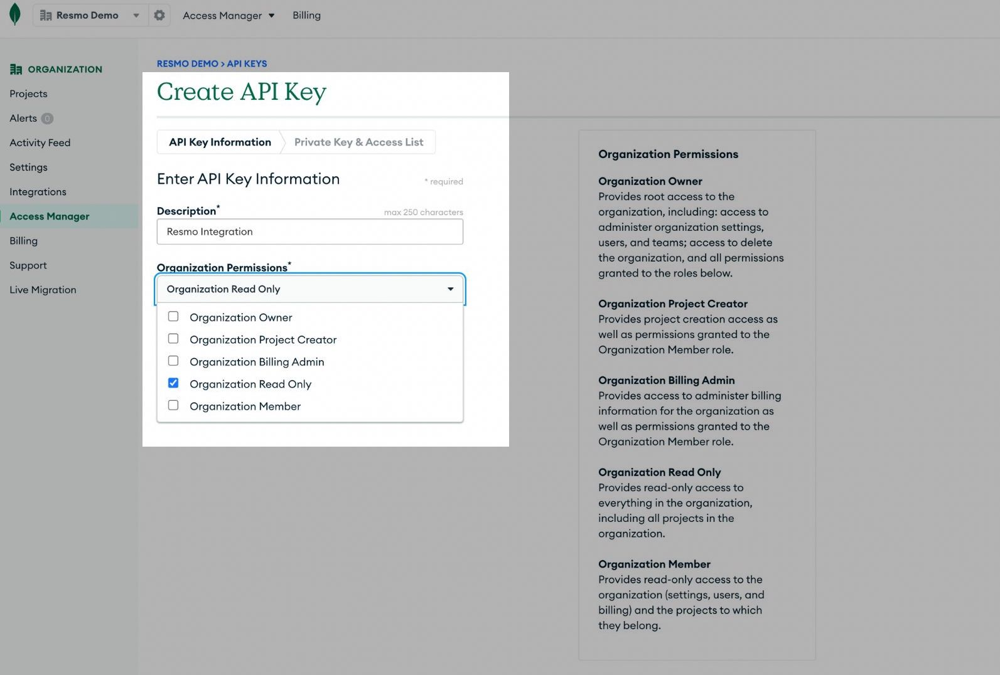
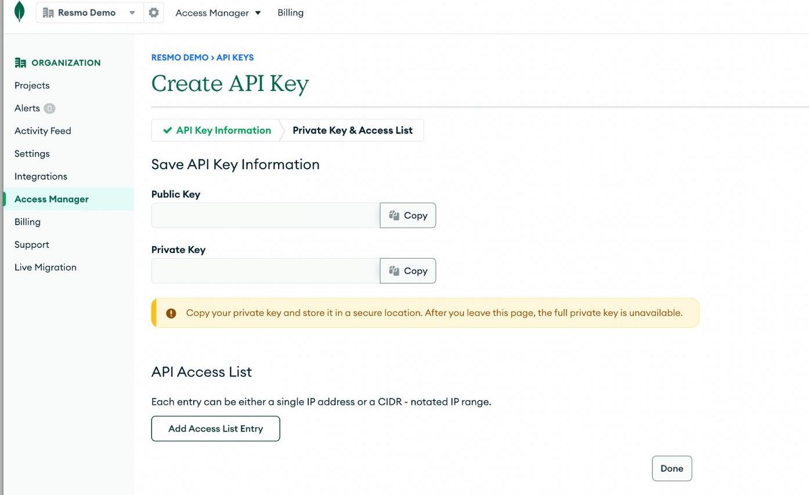
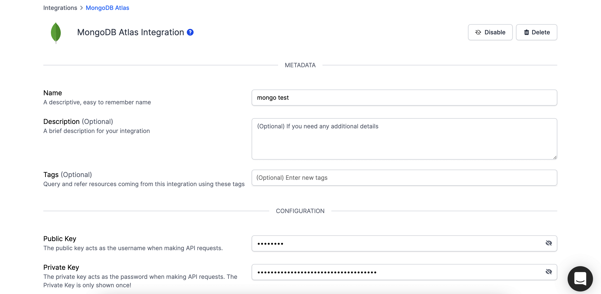
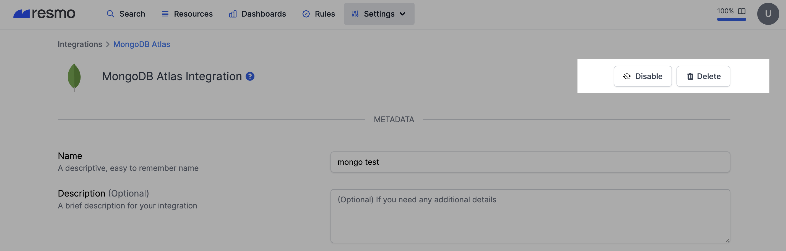

# MongoDB Atlas Integration

### Resmo + MongoDB Atlas Integration Fundamentals

Resmo seamlessly integrates with MongoDB Atlas to keep all your resources fully secure and compliant.

### What does Resmo offer to MongoDB users?

* Consolidate all MongoDB resources in one place
* Query assets using managed or custom SQL queries
* Set up predefined or custom rules to run automated audits
* Get real-time alerts on rule violations
* Detect changes to configurations, rules, and resources with historic data

### How does the integration work?

Resmo connects with your MongoDB organizations through API Key (Public Key and Private Key) and requests an Organization Read-Only permission to start the initial polling of your existing resources. We continue polling at regular intervals to receive the resource updates.

| Available Resources |
| ------------------- |
| Alert Configuration |
| API Key             |
| Cluster             |
| Organization        |
| Organization Key    |
| Project             |
| Root                |

### Common queries and rules

* Observe cluster counts per project for an organization
* List users per organizations
* List users per teams
* Identify owners of projects
* See owners of organizations
* Detect roles owned by programmatic API keys

### Integration walkthrough

#### How to Install

1. Sign up or sign in to your Resmo account.
2. Go to Integrations from the navigation bar.

.png>)

3\. Click on the Add Integration button and then select MongoDB.

4\. Name your integration and, optionally, add a description and tags.

5\. Then, go to your MongoDB account and [create an API Key in your Organization](https://www.mongodb.com/docs/atlas/configure-api-access/#create-an-api-key-in-an-organization) with **Organization Read-Only** permission.

6\. Copy the Public Key and Private Key of your newly created API Key.

7\. Paste them to the corresponding fields on the integration setup page.

8\. Hit the Create button, and your MongoDB + Resmo integration will be complete!

#### How to Uninstall

1. Log in to your Resmo account.
2. Navigate to Settings>Integrations and select the MongoDB integration you wish to delete.

3\. To temporarily pause the integration click the Disable button, or you may permanently remove the integration by clicking the Delete button at the top right.

### Support

Still have questions about the MongoDB integration or Resmo? You can contact us via the live chat on our website or email us at contact@resmo.com.
