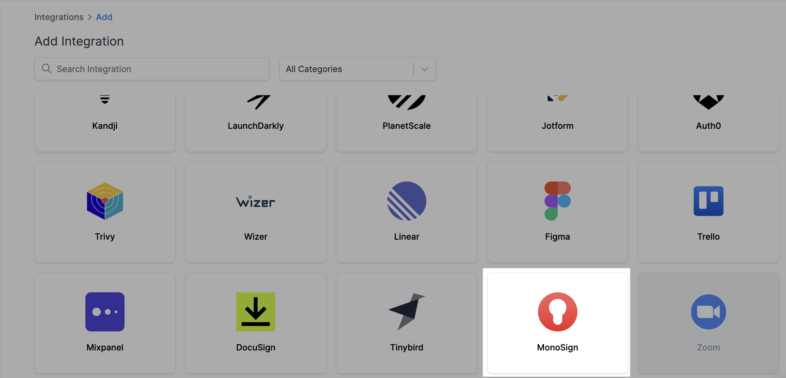
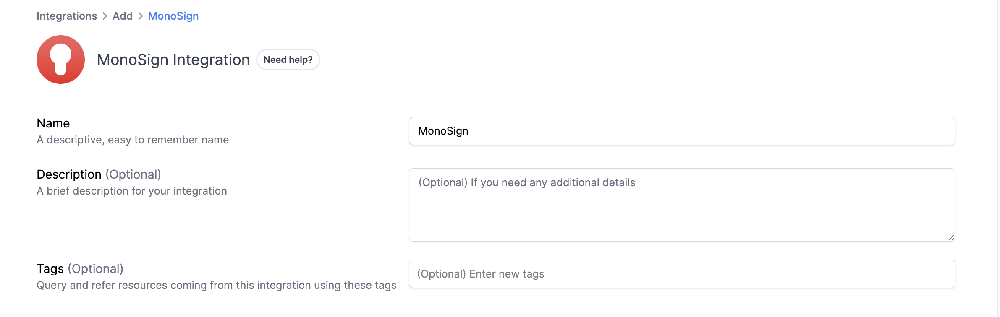
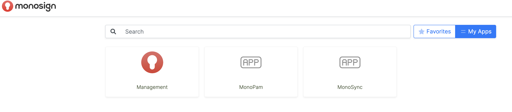
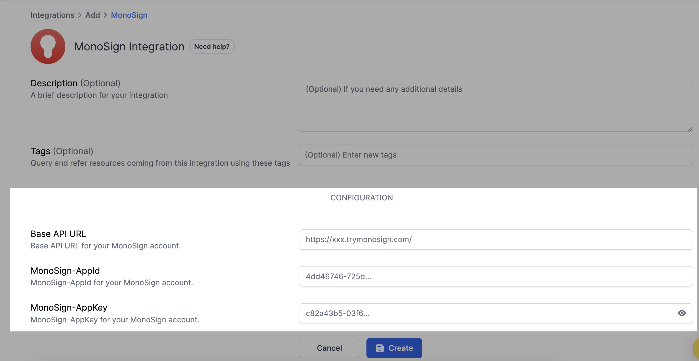
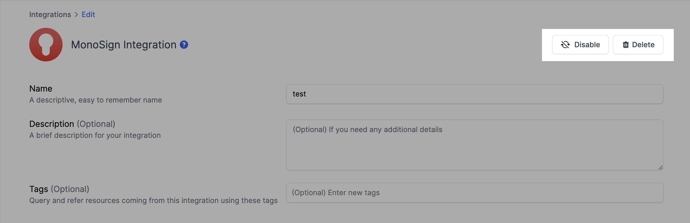

# MonoSign Integration

## Resmo + MonoSign Integration Fundamentals

<figure><figcaption></figcaption></figure>

Resmo seamlessly integrates with MonoSign to bring complete visibility, security, and compliance over your MonoSign assets, including users, user permissions, user roles, and more.

### What does Resmo offer to MonoSign users?

* Aggregate directory assets like users, user roles, and user permissions from your MonoSign account
* Query your MonoSign users, user roles, user permissions, and more using SQL or free text search.
* Set up automated security rules to continuously evaluate your asset security and compliance.
* Understand resource relationships in graph view.
* Track users, changes, and security and compliance issues in one place.&#x20;

### How does the integration work?

Resmo uses API to do the initial polling and collect existing resources. Following the initial polling, it receives updates and changes in real-time through webhook and regular polling.

#### Available resources



## Integration walkthrough

### How to install

1. Sign in to your Resmo account, go to the integrations page, and click Add Integration.
2. Add MonoSign.

<figure><figcaption></figcaption></figure>

3. Type a descriptive name for the integration and optionally, a description.

<figure><figcaption></figcaption></figure>

4. Go to the **MonoSign management page**.

<figure><figcaption></figcaption></figure>

5. Navigate to the **Applications page**.

<figure><figcaption></figcaption></figure>

6. Click on **"API"**.

<figure><figcaption></figcaption></figure>

7. On the API page, click on **"Keys"**.
8. **Copy and paste the Base API URL** to the related field on the setup page.

<figure><figcaption></figcaption></figure>

9. Copy and paste the **MonoSign-AppId** to the related field on the setup page.
10. Copy and paste the **MonoSign-AppKey** to the related field on the setup page.
11. Click create.
12. All set! Now you can start running queries on your MonoSign resources.

### How to uninstall

1. Open the Integrations page on your Resmo account and click the MonoSign integration you want to remove.
2. To temporarily pause Resmo from collecting your MonoSign resources, click the Disable button from the top right. For permanent deletion, click the Delete button instead. Disabling can be undone, while deletion cannot.

<figure><figcaption></figcaption></figure>

### Support

Contact us via live chat or email us at contact@resmo.com to request support or troubleshooting.&#x20;
