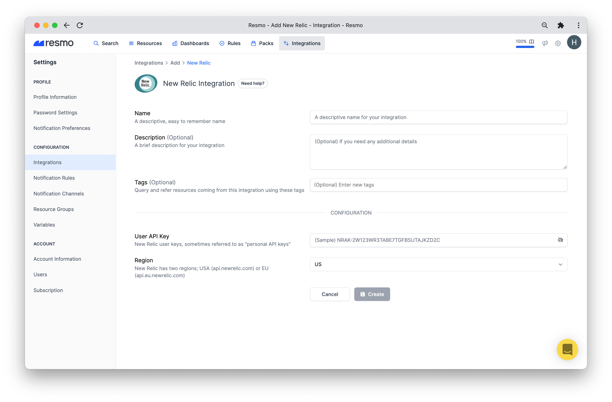
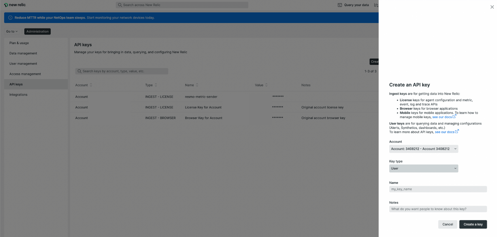
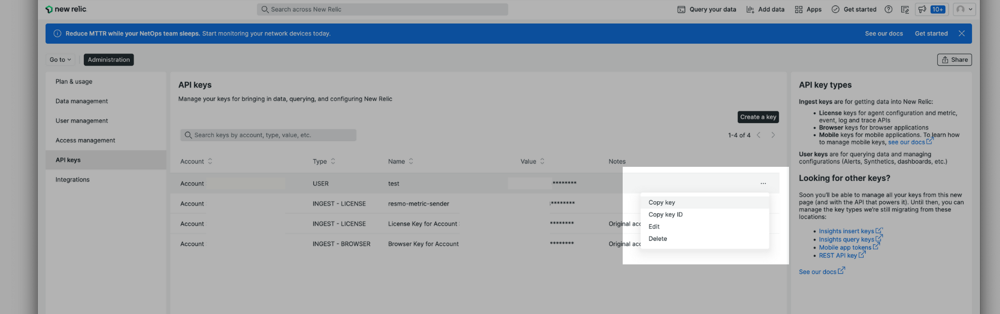
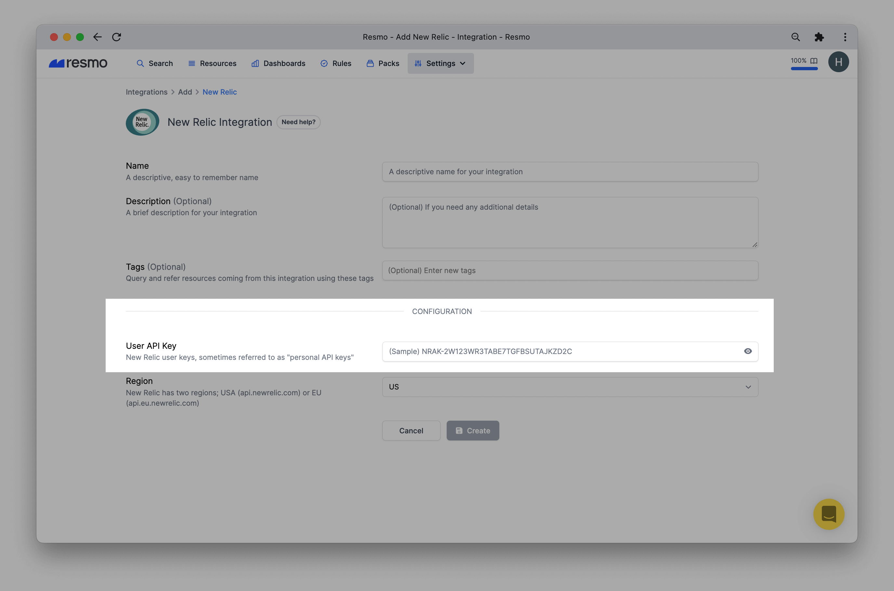
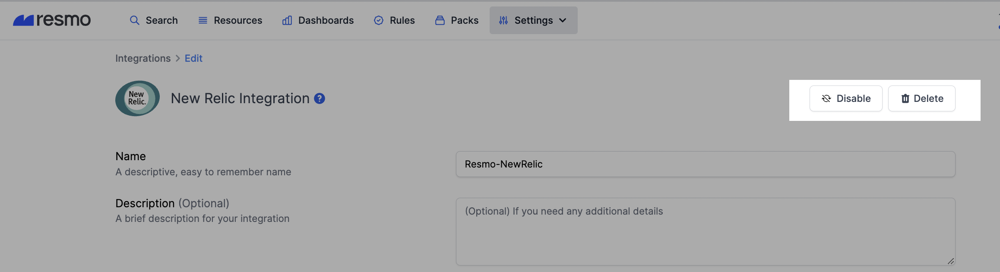

# New Relic Integration

## **Resmo + New Relic Integration Fundamentals**

Resmo integrates with New Relic to help keep your resources secure, compliant, and visible.

### What does Resmo offer to New Relic users?

* Gather and monitor all your New Relic assets on a single platform.&#x20;
* Query your New Relic dashboards, accounts, alert policies, API keys, and more.&#x20;
* Set up rules to continuously assess your New Relic resources.&#x20;
* Set up and receive rule notifications based on your New Relic resource configurations.

### How does the integration work?&#x20;

Once you sign up to Resmo, you can easily integrate your account with New Relic using an API key. Resmo uses API to do the initial polling and collect existing resources. Then, we receive resource changes and updates in real-time by regular polling.

### Available resources&#x20;

Available resources for New Relic include accounts, alert policies, dashboards, API keys, browser applications, device configurations, infrastructures, and many more.

See the complete list:&#x20;


_New Relic resources_


### **Common Queries and Rules**

* Find dashboard widgets with empty queries.&#x20;
* List notification channels that are not associated with an alert policy.
* List alert policies by incident preferences.
* Identify dashboards with public read-write permissions.&#x20;
* See dashboards and queries that don’t belong to integrated New Relic accounts.&#x20;
* List channels that aren’t associated with an alert policy.

### Integration Walkthrough&#x20;

#### How to install&#x20;

1. Sign up or log in to your Resmo account.&#x20;
2. Go to the Integrations page, click the Add Integration button, and select New Relic.&#x20;
3. Name the integration and write a description (optional.)&#x20;

4\. Go to your New Relic account and open the API Keys page from the top-right account dropdown menu.

.png>)

5\. Then, create a new API key.

6\. Copy the created API key and go back to the Resmo New Relic integration screen.

7\. Enter the user API key on the integration screen’s API key field.&#x20;

8\. Next, select a Region from the dropdown menu (New Relic has two regions; USA (api.newrelic.com) or EU (api.eu.newrelic.com).)

9\. Hit the create button, and you are ready to run queries.&#x20;

#### How to uninstall&#x20;

1. Login to your Resmo account.&#x20;
2. Navigate to the Integrations page and click New Relic.&#x20;
3. Click the Delete button to uninstall or Disable to stop polling New Relic resources temporarily.

### Support

If you have further questions about the New Relic integration, contact us via live chat or email us at contact@resmo.com.
