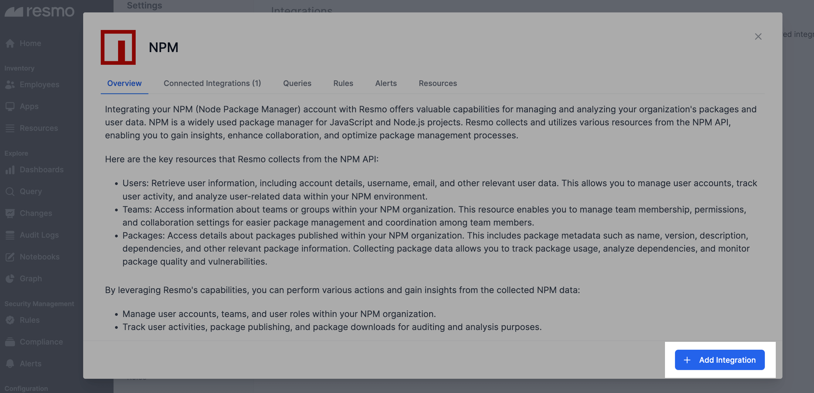
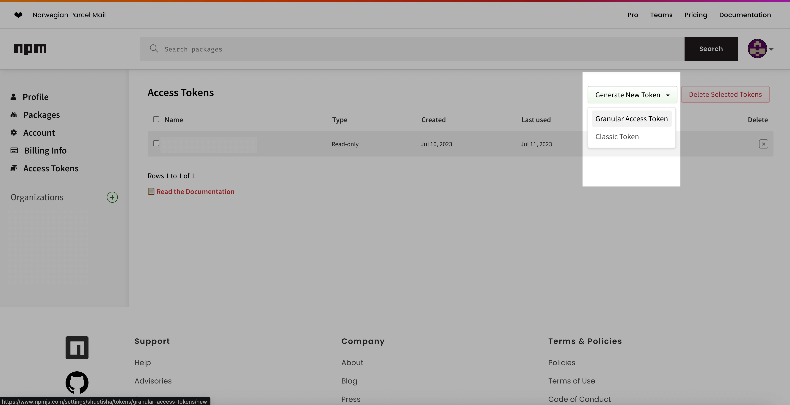
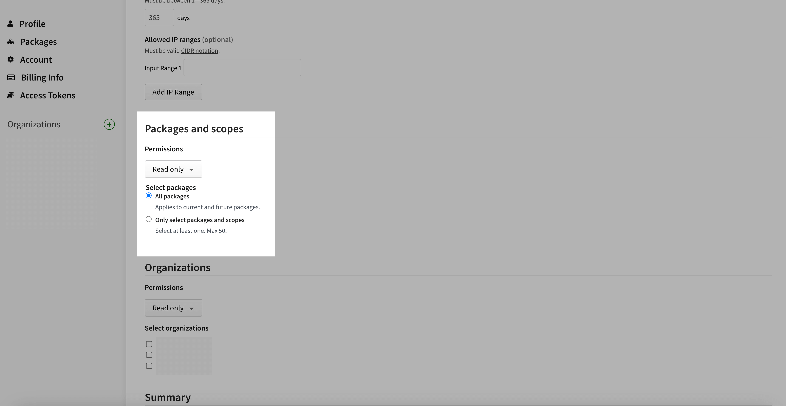
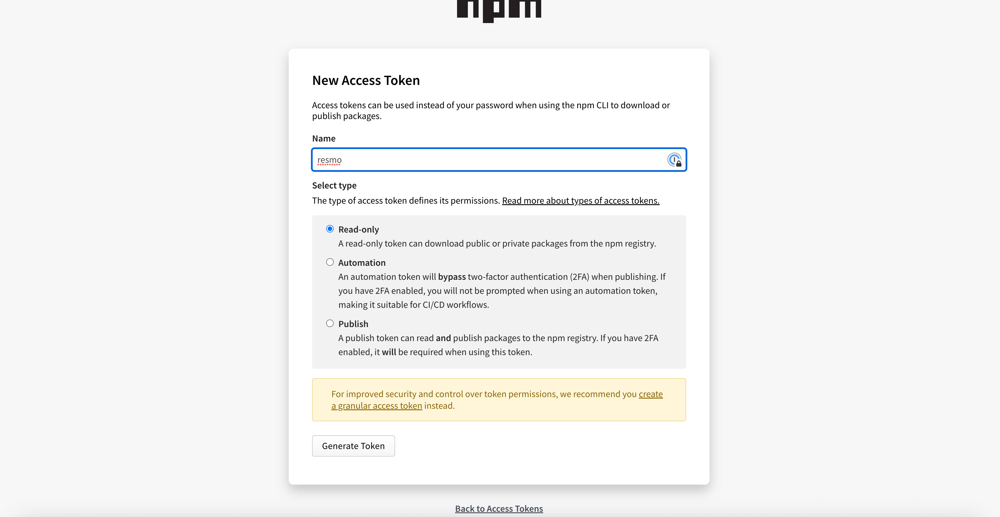
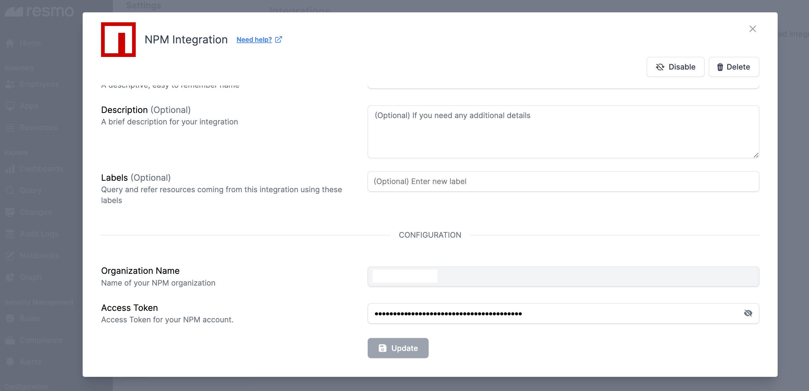
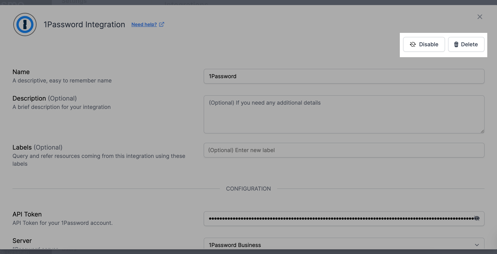

# NPM Integration

<figure><figcaption></figcaption></figure>

Resmo's integration with NPM streamlines resource management, provides auditing capabilities, optimizes package handling, and boosts team collaboration for improved security and efficiency.

### What does Resmo offer to NPM users?

* Collect and query user accounts, teams, and roles within your NPM organization, enhancing operational efficiency.
* Track user activities, package publishing, and downloads, providing crucial data for auditing and analysis.&#x20;
* Analyze package metadata, dependencies, and usage patterns, thereby optimizing package management and identifying potential vulnerabilities or outdated packages.&#x20;
* Receive real-time alerts of changes and security policy violations in your NPM organization.

### How does the integration work?

Resmo employs APIs to execute initial polling and gather pre-existing NPM resources. After this initial data collection, it receives updates and modifications in real-time, using webhooks and consistent polling.

#### Available resources



### Integration Walkthrough

#### How to install

1. Select NPM from your Integrations page on Resmo.
2. Click the Add Integration button from the bottom right corner of the opening modal.

<figure><figcaption></figcaption></figure>

3. Head over to your NPM account on a new tab. Click on your Profile -> Access Tokens.
4. Generate a new token.

<figure><figcaption></figcaption></figure>

* Choose either Granular Access Token or Classic Token option.&#x20;
* Select "Read Only. "
* Select Packages as you like. Then, click Generate.

<figure><figcaption></figcaption></figure>

* You can view our Organization names from your profile -> Organizations.

<figure><figcaption></figcaption></figure>

5. Copy and paste the generated access token on the related field on your Resmo NPM integration screen.

<figure><figcaption></figcaption></figure>

5. Hit the Create button.

#### How to uninstall

1. Select NPM from your Integrations page.
2. Navigate to the Connected Integrations tab and select the account you want to remove.
3. You can either disable the integration temporarily and enable it back later or delete it permanently.&#x20;
4. Click the related button (Disable/Delete)from the top right depending on your choice.

<figure><figcaption></figcaption></figure>

### Support

Contact us via live chat or email us at contact@resmo.com for troubleshooting and support requests.
