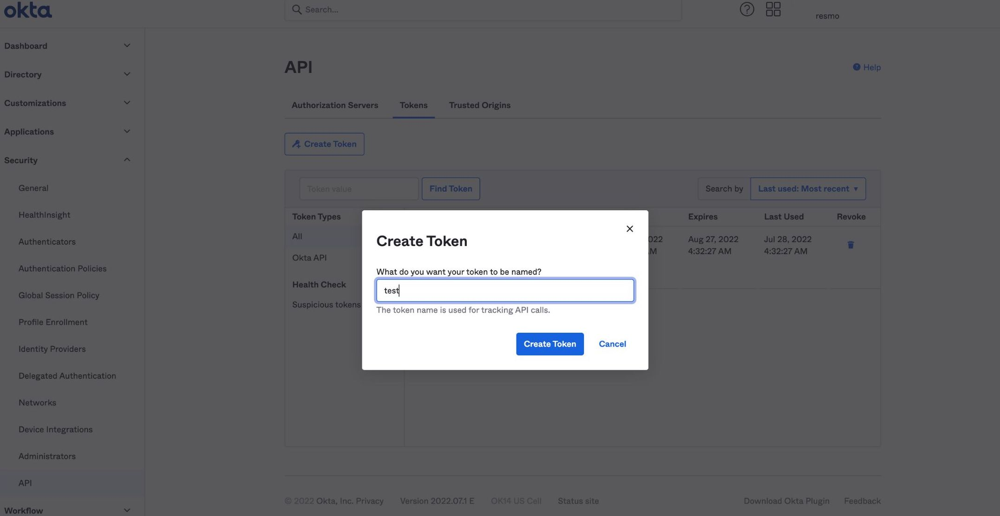
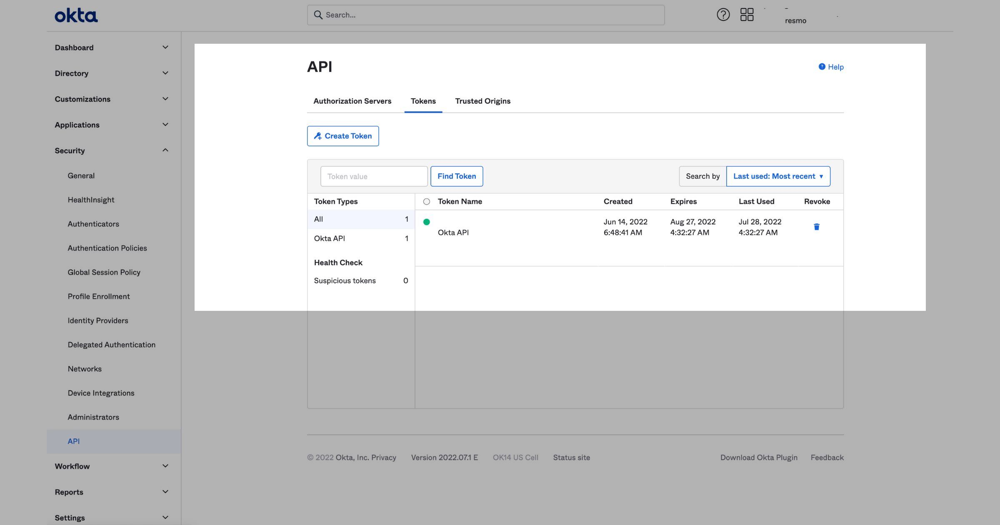
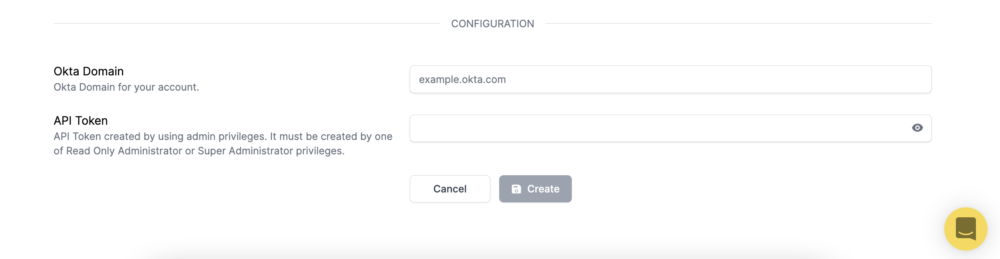
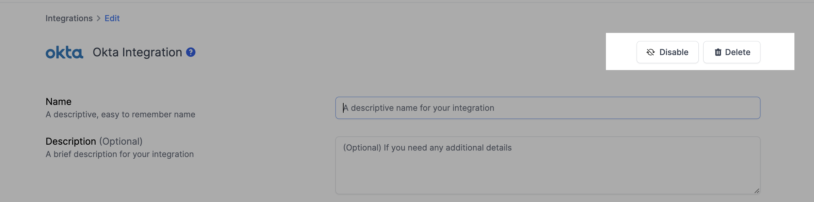

# Okta Integration

## Resmo + Okta Integration Fundamentals

Resmo continuously enhances your Okta asset visibility, security, and compliance.

### What does Resmo offer to Okta users?

* Collect and monitor all Okta resources in one place, near real-time.
* Query your Okta groups, users, policies, applications, rules, and more.&#x20;
* Perform automated audits for security and compliance.
* Set up rule notifications based on Okta resource configurations.
* Mitigate risks and remediate incidents faster

### How does the integration work?

Once you sign up for Resmo, you can easily integrate your account with Okta using an API token and Okta Domain. Resmo uses API to do the initial polling and collect existing resources. Then, we receive resource changes and updates in real-time by regular polling.




**Tip:** Use [Audit Logs](../audit-logs/audit-logs.md) for comprehensive monitoring of all Okta activities and system events.


### Common queries and rules

* List application groups
* See group rules that assign users to group
* Identify inactive user factors
* See application user count
* Find policy rule count per policy
* See applications with inactive status
* Find policies updated in the last seven days

### Integration Walkthrough

#### How to Install

1. Log in to your Resmo account and navigate to Integrations>Okta.
2. Click the Add Integration button from the opening modal.
3. On a new tab, sign in to your Okta organization as a user with administrator privileges.

* In Okta, API tokens have the same permissions as the user who creates them, and if the user permissions change, the API token permissions also change. It is, therefore, good practice to create a service account to use when you create API tokens so that you can assign the token the specific privilege level needed.
* For integrating with Resmo, either Read Only Administrator or Super Administrator must be used. If Read Only Administrator is used, Resmo will not reach the following resources:
  * Okta Support Setting
  * Features
* Access Policies and Profile Enrollment Policies are provided by Okta Identity Engine. Resmo will check if the policy type is available in your account. Otherwise, they will not be collected.

4. Access the API page: In the Admin Console, select API from the Security menu and then select the Tokens tab. Click Create Token.

5. Copy the created API key.

6. Enter the copied API token on the integration screen’s API token field.

7. Enter your Okta Domain on the integration screen’s Okta domain field.
8. Hit the create button, and you are ready to run queries.

#### How to Uninstall

1. Go to Integrations>Okta.&#x20;
2. Navigate to the Connected Integrations tab on the opening modal and select the account you want to remove.
3. There are two paths you may take:&#x20;

* To temporarily pause the integration, click the Disable button.
* To permanently remove it, click Delete.&#x20;

