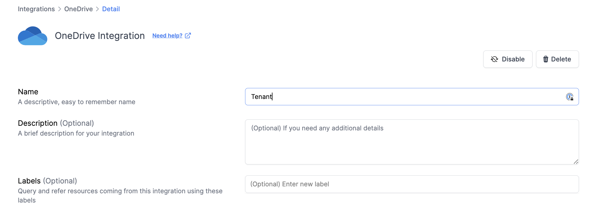

# OneDrive Integration

<figure><figcaption></figcaption></figure>

Connecting OneDrive with Resmo helps you organize and look into your files and user details. It's a better way to understand and monitor your files, improving the security of your digital assets.

### What does Resmo offer to OneDrive users?

* Monitor user behavior and access patterns for audit and security.
* Evaluate file metadata and usage to improve file management and accessibility.
* Oversee storage capacities and apply user or group storage restrictions.
* Control file permissions and configurations to maintain data safety and adhere to regulations.
* Set up custom security rules to automate audits
* Get real-time alerts of any anomalies via your favorite [notification channels](../notifications/notification-channels.md) like Slack or Microsoft Teams.

### How does the integration work?

Resmo utilizes an API for initial data gathering and to accumulate current resources. After this first collection, it obtains real-time updates and modifications via webhook and consistent polling.


**Key resources collected with the OneDrive API**

**User:** Retrieve user information, including account details, contact information, organizational data, license details, manager information, authentication details, and more. This allows you to manage user accounts, track user activity, and analyze user-related data within your OneDrive environment.

**Drive:** Access drive-specific details, such as drive type, name, owner information, quota, sharing permissions, and SharePoint identifiers. This resource enables you to manage and monitor drives, enforce storage limits, and gain insights into drive usage and collaboration patterns.

**Drive Item:** Retrieve information about individual files and folders within a drive, including details such as name, creation/modification timestamps, file properties, permissions, and sharing status. This allows you to manage files, track file activities, and analyze file metadata to understand usage patterns and access control.


**Available resources:**



### Integration walkthrough

#### How to install

1. Go to Settings>Integrations on your Resmo account.
2. Find and click OneDrive on the Integrations page.

<figure><figcaption></figcaption></figure>

3. Hit the Add Integration button.

<figure><figcaption></figcaption></figure>

4. Give the required access permissions.
5. Your OneDrive integration will be ready in no time!

#### How to uninstall

1. Open your OneDrive integration page from Settings>Integrations>OneDrive.
2. Click on the Connected Integrations tab and select the OneDrive integration you want to remove.
3. Click on the Disable button to temporarily pause the integration or Delete to permanently remove it.

<figure><figcaption></figcaption></figure>
