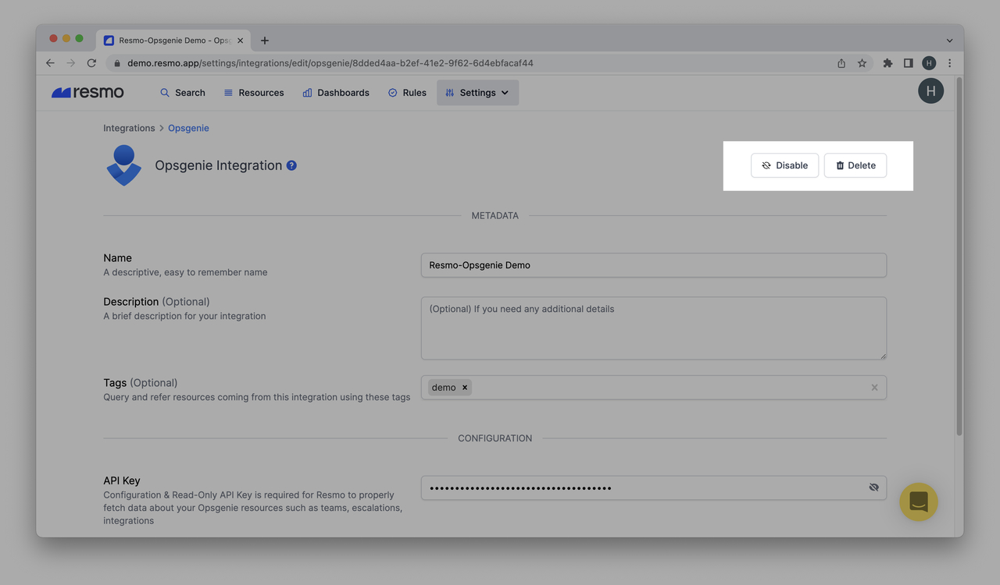

# Opsgenie Integration

## Resmo + Opsgenie Integration Fundamentals

Resmo integrates with Opsgenie to make sure your configurations and assets are secure and compliant.

### What does Resmo offer to Opsgenie users?

* Query your Opsgenie resources like integrations, escalations, teams, and more with SQL.
* Automated configuration audits based on predefined or custom rules.
* See change histories and actors of configurations.
* Get notified in real-time when a rule is violated.
* Consolidate and monitor all cloud and SaaS assets in one place.


Opsgenie is also available as a notification channel.&#x20;

See [Opsgenie Notification Channel](../notifications/opsgenie-notification-channel.md).


### How does the integration work?

Resmo connects with Opsgenie through a Configuration & Read-Only API key. The API key enables the initial polling and consolidating of existing Opsgenie resources. Then, Resmo performs regular polling to receive resource changes and updates in real-time.

### Available resources

Resmo Opsgenie integration aggregates users, teams, escalations, accounts, schedules, and more.

See the full list:


Opsgenie resources



**Tip:** Use [Audit Logs](../audit-logs/audit-logs.md) for comprehensive monitoring of all Opsgenie activities and system events.


### Common queries and rules

* List users who aren't participating in escalations.
* See API integrations with configuration change access.
* View integrations with suppressed notifications.
* List users who aren't participating in on-call schedules.

### Integration walkthrough

#### How to install

1. Sign up or sign in to your Resmo account.
2. Go to your Integrations page and select Opsgenie.
3. Click the Add Integration button from the bottom right corner of the opening modal.
4. Go to your Opsgenie account and copy a Configuration & Read-Only API key.&#x20;
5. Then, select an endpoint. Since Opsgenie has two regions, it should be either USA or the EU.
6. Lastly, click Create, and your integration is all set!

#### How to uninstall

1. Log in to your Resmo account.
2. Navigate to Integrations and select Opsgenie.
3. Go to the Connected Integrations tab from the opening modal and select the one you want to remove or disable.
4. You may disable it to pause the integration and enable it when you need it back.
5. Or, click the Delete button to remove the integration permanently.&#x20;

### Support

If you have any questions about Opsgenie integration or Resmo in general, feel free to email us at contact@resmo.com or contact us via live chat on our website.
