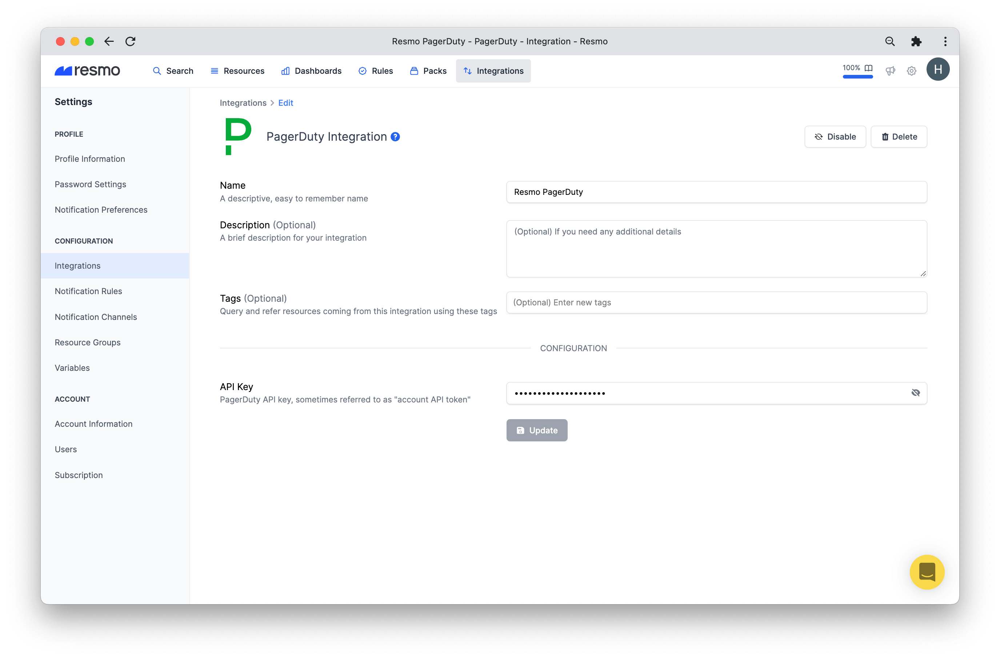
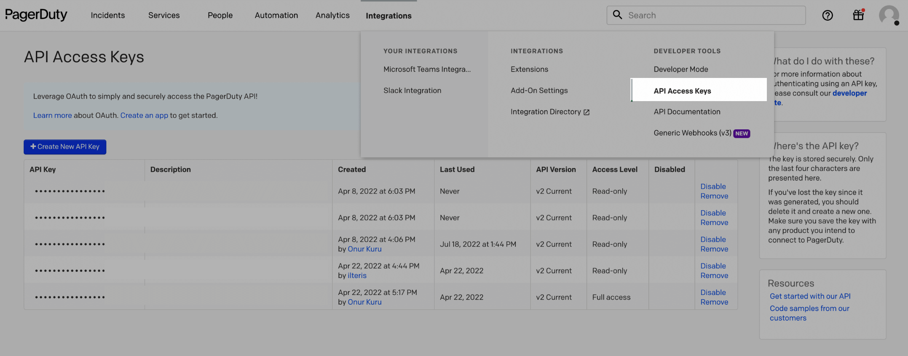
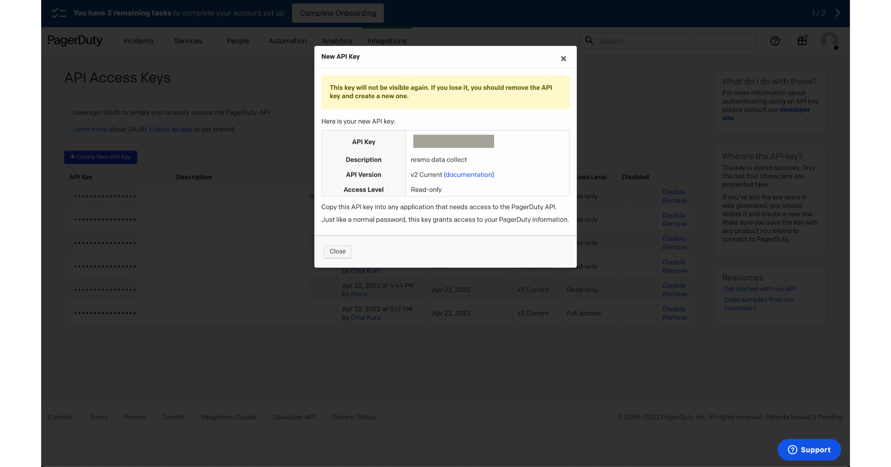
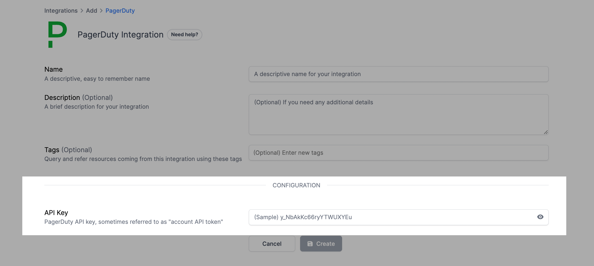
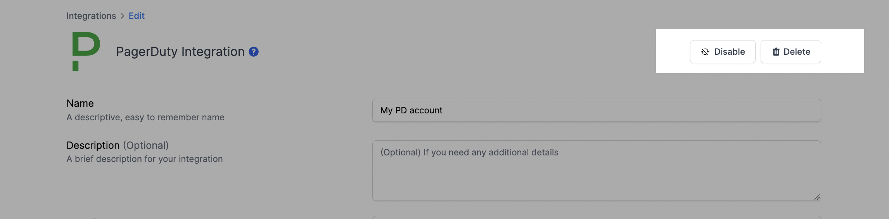

# PagerDuty Integration

## Resmo + PagerDuty Integration Fundamentals

Resmo's one-click integration with PagerDuty ensures secure digital operations and helps mitigate threats to your assets.

### What does Resmo offer to PagerDuty users?

* Consolidate and monitor all PD assets in one place.
* Use simplified SQL querying to answer questions on your resources.
* Set up custom or predefined rules for continuous security and compliance auditing.
* Add notification rules to get alerted on rule violations in real-time.


PagerDuty is also available as a notification channel.&#x20;

See [PagerDuty Notification Channel](../notifications/pagerduty-notification-channel.md).


### How does the integration work?

Resmo seamlessly integrates with PagerDuty using an API key to connect the services. The API key allows initial polling and collecting of existing PD resources. Then, Resmo receives updates and resource changes in real-time through regular polling.&#x20;

**Available resources**

Resmo PagerDuty integration aggregates resources such as add-ons, business services, escalation policies, and more.

See the full list:



### Common queries and rules

* List PagerDuty integrations per type
* Detect webhooks without events
* Identify users without notification rule
* List users without a team
* See users with multiple subdomain access

### Integration walkthrough

#### How to install

1. Sign up or sign in to Resmo.
2. Navigate to Integrations from the navigation bar.
3. Click the Add Integration button from the top right corner.

.png>)

4\. Select PagerDuty.

5\. Name the integration and give it a description.

6\. Optionally, add tags to the integration.

7\. Go to your PagerDuty account and navigate to the API Access Keys page.

8\. Then, create a new API key with Read-only permission.

.png>)

9\. Next, copy the created API key and go back to the Resmo PagerDuty integration screen.

10\. Paste the copied API key into the API Key field on the integration screen.

11\. Click Create, and your integration is all set!

#### How to uninstall

1. Navigate to Settings>Integrations.
2. Click the PagerDuty integration.
3. Disable it to enable later or click delete to remove the integration permanently.

### Support

For further questions and issues, please contact us via live chat or email us at contact@resmo.com.
