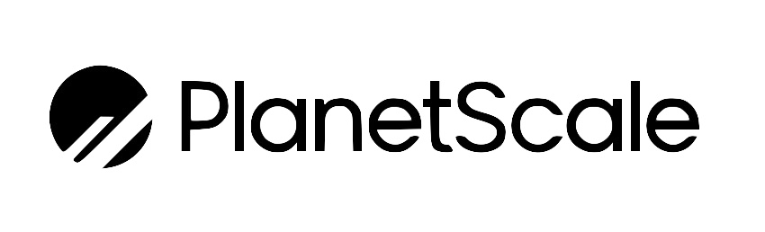
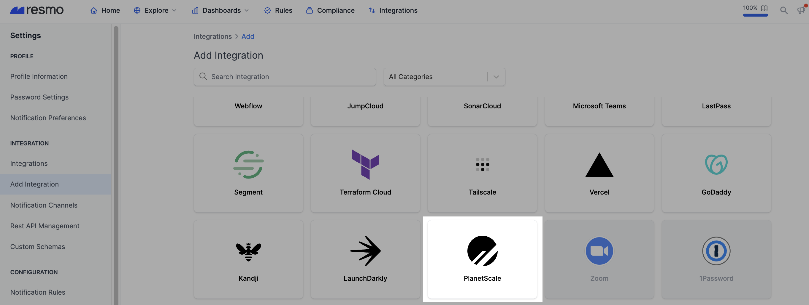
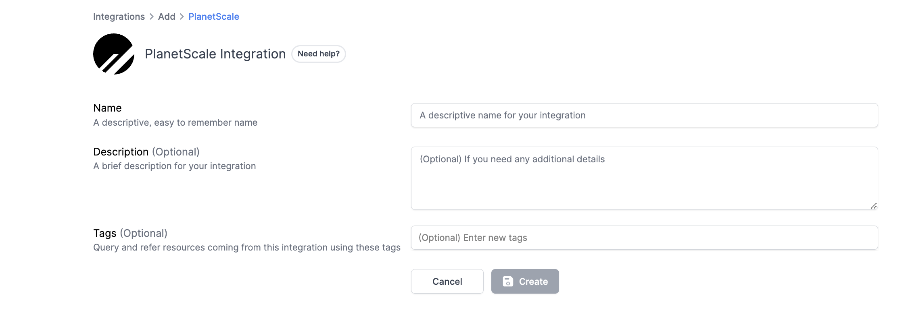
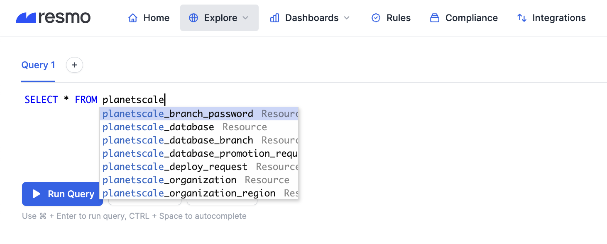

# PlanetScale Integration

## Resmo + PlanetScale Integration Fundamentals

<figure><figcaption></figcaption></figure>

Resmo connects to PlanetScale in one click to bring asset visibility, continuous security, and compliance into your environment.

### What does Resmo offer to PlanetScale users?

* Collect your directory assets like databases, organizations, and database branches from your PlanetScale account.
* Query your PlanetScale databases, organizations, database branches, and more with SQL queries or free text searches.
* Set up custom security rules to automate security checks.
* Get notified of rule changes in real-time to close security gaps in time.

### How does the integration work?

Resmo uses API to do the initial polling and collect existing resources. Following the initial polling, it receives updates and changes in real-time through webhook and regular polling.

* API polling
* Webhook

#### Available resources

PlanetScale resources you can collect with the integration include branch passwords, databases, organizations, and more. See the complete list from the resource directory:



## Integration walkthrough

### How to install

1. Sign up or sign in to Resmo and navigate to your Integrations page.
2. Click **Add Integrations** and **Add PlanetScale**.

<figure><figcaption></figcaption></figure>

3\. Give a descriptive name to your integration and, optionally, write a description.

<figure><figcaption></figcaption></figure>

4\. You'll be redirected to PlanetScale. **Accept permissions**.

5\. Your PlanetScale integration is all set! Now you can start querying your PlanetScale resources!

<figure><figcaption></figcaption></figure>

### How to uninstall

1. Go to your Integrations page on Resmo.
2. Click the PlanetScale integration you want to uninstall.
3. Click the **Disable** button from the top right to temporarily disable the integration. You can enable it back later. To permanently remove the integration, click the **Delete** button instead. Note that this action cannot be undone.

### Support

Still have questions about the PlanetSacle integration? Contact us for further queries and troubleshooting via live chat or email us at contact@resmo.com.
