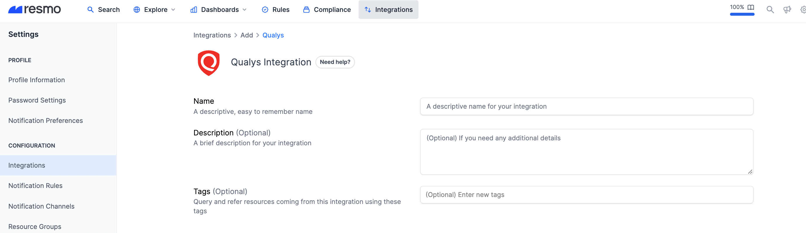
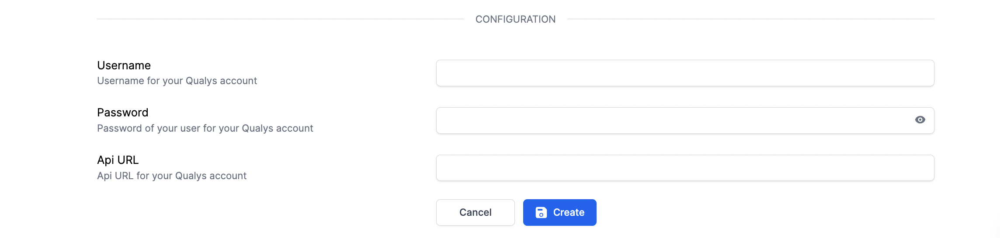
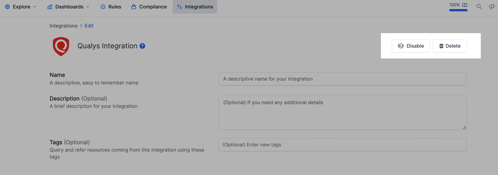

# Qualys Integration

## Resmo + Qualys Integration Fundamentals

<figure><figcaption></figcaption></figure>

Resmo seamlessly integrates with your Qualys account to help you keep your resources and configurations visible, secure, and compliant.

### What does Resmo offer to Qualys users?

* Collect your Qualys resources like users, findings, and compliance scans in one place.
* Query your Qualys assets and keep track of every single change.
* Set up security rules to continuously evaluate your security posture.
* Receive timely notifications about resource and configuration changes.

### How does the integration work?

Once you sign up to Resmo, you can easily integrate your account with Qualys using the API URL of your account and your user credentials.

* The Qualys API URL you should use for API requests depends on the Qualys platform where your account is located.
  * You can check the following resources to get your account URL:
    * [URL API Server](https://qualysguard.qg2.apps.qualys.com/portal-help/en/assetview/api\_doc/online/get\_started/url\_api\_server.htm)
    * [Platform Identification](https://www.qualys.com/platform-identification/)


The integration uses your username and password to authenticate with Qualys API. Please be careful to use a user with the following permissions:

* Compliance Scan List
* Host List Detection
* User List
* KnowledgeBase
* Search Web Application
* Search Web Application Scans
* Search Web Application Findings
* Search Host Assets


#### Available resources

Resmo aggregates Qualys resources, including users, compliance scans, host assets, and more.

See the full list:



## Integration walkthrough

### How to install

1. Sign up or sign in to your Resmo account.&#x20;
2. Go to your Integrations page and click the **Add Integration** button.

<figure><figcaption></figcaption></figure>

3\. Name your integration and optionally write a description.

<figure><figcaption></figcaption></figure>

4\. Enter your **user credentials** (username and password) into the required fields.

<figure><figcaption></figcaption></figure>

5\. Enter the **API Url of your Qualys account** on the integration screen’s API Url field.

6\. Hit the Create button, and you are ready to run queries.

### How to uninstall

1. Log in to your Resmo account and navigate to the Integrations page.
2. Click the Qualys integration you wish to uninstall.
3. To temporarily disable your Qualys integration, click the Disable button, or you can permanently remove it by clicking the Delete button.

<figure><figcaption></figcaption></figure>

### Support

If you have further questions or issues with your Qualys integration, feel free to contact us via live chat or email us at contact@resmo.com.
