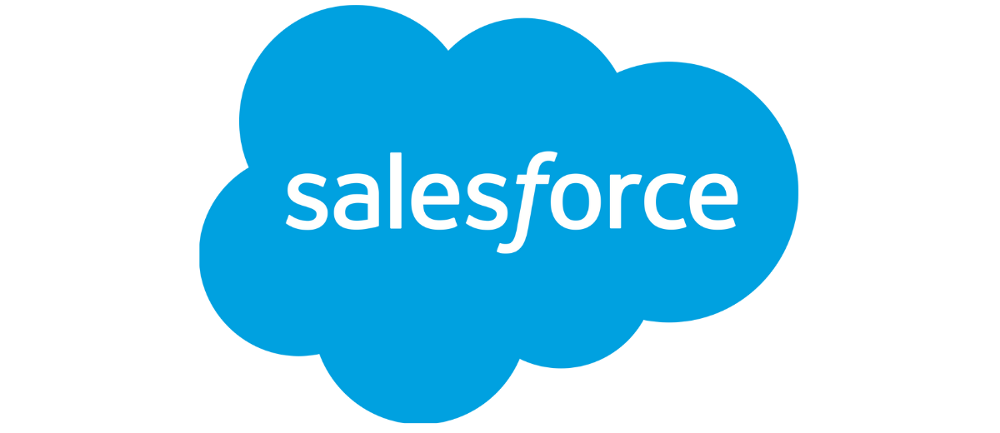
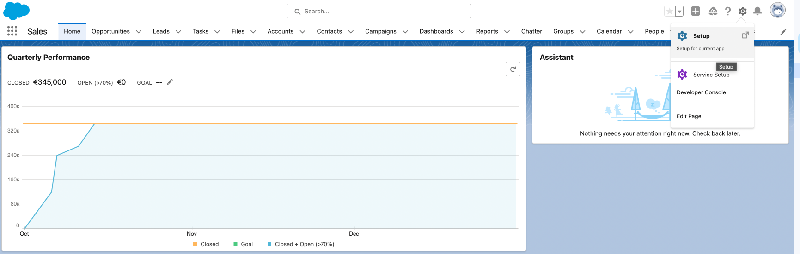
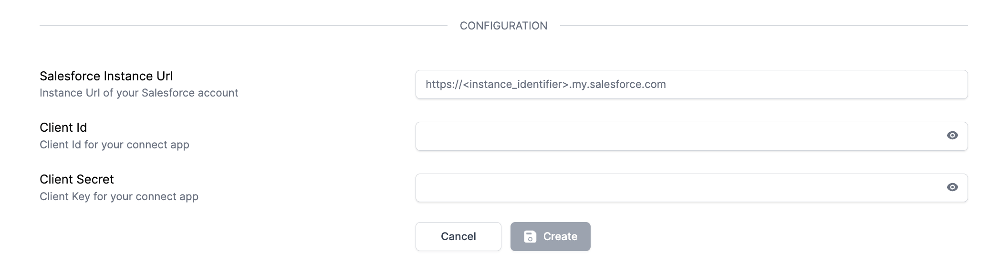
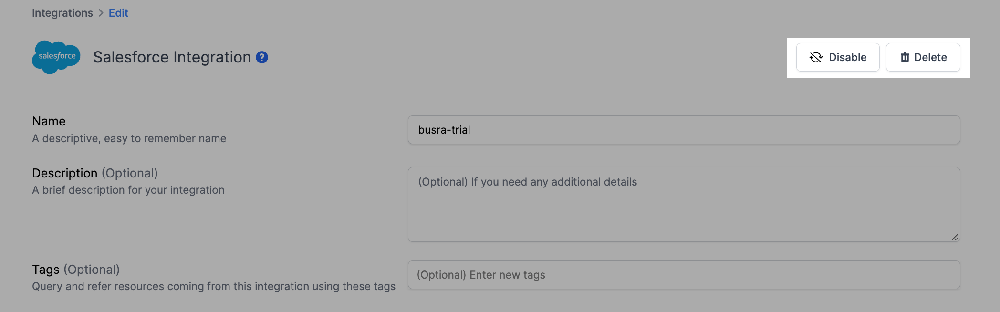

# Salesforce Integration

## Resmo + Salesforce Integration Fundamentals

<figure><figcaption></figcaption></figure>

Resmo's agentless integration with Salesforce helps you keep your assets like users, groups, and profiles visible, secure, and compliant.

### What does Resmo offer to Salesforce users?

* Collect and monitor all your Salesforce resources like users, permission sets, profiles, and more in a unified asset inventory
* Query your Salesforce users, permission sets, profiles, asset changes, and more.
* Set up rules to continuously assess your Salesforce resources' security and compliance.
* Get notified of critical rule violations in real-time.

### How does the integration work?

Once you sign up to Resmo, you can easily integrate your account with Salesforce using an account that has needed privileges. Resmo uses API to do the initial polling and collect existing resources. Then, we receive resource changes and updates in real-time through regular polling.

#### Available resources



## Integration walkthrough

### How to install

1. Select Salesforce on the Integrations page of your Resmo account.
2. Click the Add Integration button at the bottom right corner of the opening modal.
3. Go to your **Salesforce Account** and **Create a Connected App** by following the steps below:

* Click on Setup -> Apps -> App Manager -> New Connected App

<figure><figcaption></figcaption></figure>

* Enter required fields for Basic Information.
* Check Enable OAuth Settings as true.
* Enter Callback URL as `https://id.resmo.app/integration/salesforce/callback`

<figure><figcaption></figcaption></figure>

* Select the following scopes and add them to Selected OAuth Scopes:
  * Manage user data via APIs (api)
  * Perform requests at any time (refresh\_token, offline\_access)
* Click Save.

4. **Copy the Consumer Key** from your Connect App.

<figure><figcaption></figcaption></figure>

5. Paste it to the Client Id in the integration configuration screen.

<figure><figcaption></figcaption></figure>

6. **Copy the Consumer Secret** from your Connect App and paste it to the Client Secret in the integration configuration screen.
7. Enter your **Salesforce Instance Url** to the Instance Url field in the integration configuration screen.
8. Hit the Create button, and you'll be redirected to Salesforce. Accept permissions.
9. You are ready to run queries.


Please ensure that your refresh token policy is set as **`Refresh token is valid until revoked`** in your Salesforce Connected App.


### How to uninstall

1. To uninstall your Resmo Salesforce integration, go to your Integrations page and select Salesforce.
2. On the opening modal window, navigate to the Connected Integrations tab and select the integrated Salesforce account you want to remove.

There are two options you may follow. One is to temporarily disable the integration so that you can enable it back later. The other is to remove it permanently.&#x20;

3. Depending on your choice, click either Disable or Delete from the top right of the integration configuration screen.

<figure><figcaption></figcaption></figure>

