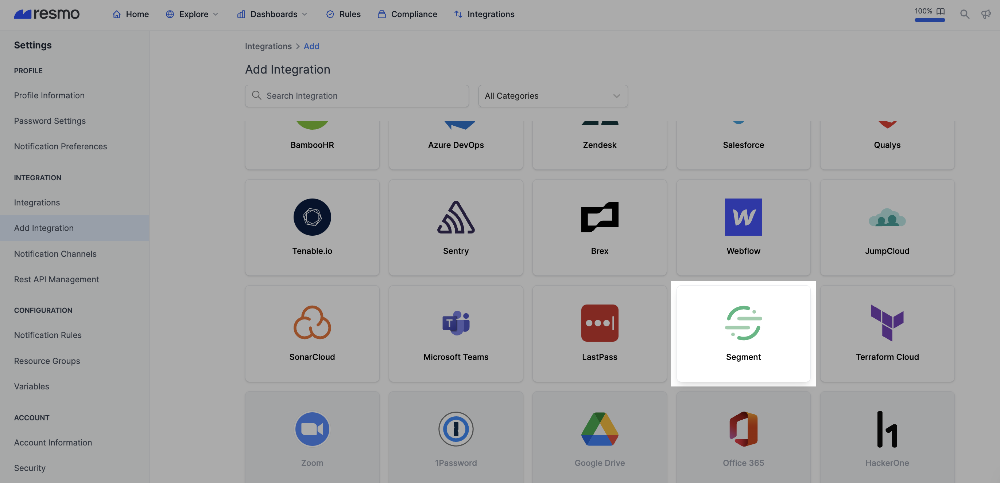
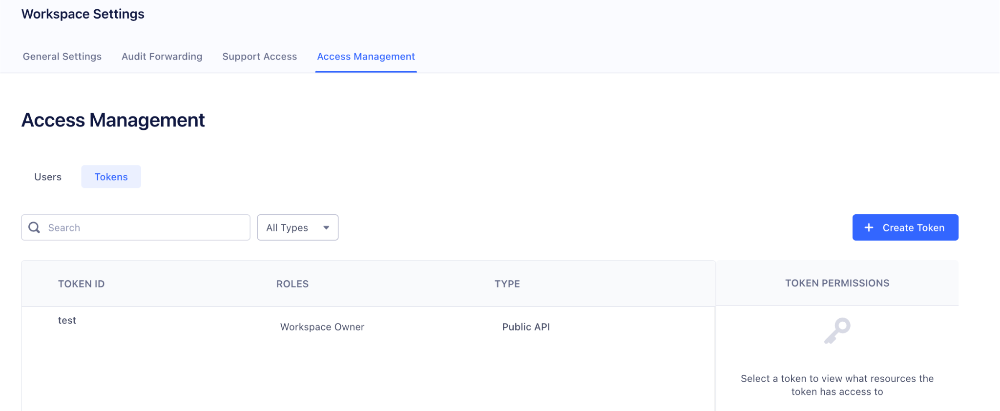

# Segment Integration

## Resmo + Segment Integration Fundamentals

<figure><figcaption></figcaption></figure>

Resmo's agentless integration with Segment allows you to gain visibility, security, and compliance over your resources.

### What does Resmo offer to Segment users?

* Collect directory assets like roles, users, groups, and sources from your Segment account.
* Query your Segment roles, users and sources, and much more.
* Set up security rules based on Segment resource configurations.
* Receive timely notifications of critical rule changes and take faster remediation actions.

### How does the integration work?

Resmo uses an API key created from the Segment Admin page. Our application uses API to make the initial polling and receive existing resources. Then, we receive resource changes and updates in real-time through regular polling.

#### Available resources



## Integration walkthrough

### How to install

1. Sign in to your Resmo account and navigate to the Integrations page.
2. Click the Add Integration button and Add Segment.

<figure><figcaption></figcaption></figure>

3\. Type a descriptive name for your Segment integration and optionally a description.

<figure><figcaption></figcaption></figure>

4\. On your Segment workspace, go to Settings -> Workspace Settings -> Access Management -> Tokens and create a new token.

<figure><figcaption></figcaption></figure>

5\. Assign Access should be 'Workspace Owner'; unfortunately, there is no read-only option for Segment integration. Don't worry; Resmo only polls your configuration data without any critical information.

<figure><figcaption></figcaption></figure>

6\. Go back to the Resmo Segment integration screen, fill in the form with API Key and click Save.

<figure><figcaption></figcaption></figure>

7\. You are now ready! Now you can start querying your Segment resources!

### How to uninstall

1. Go to your Integrations page and click the Segment integration you want to uninstall.
2. There are two options you can follow. One is to temporarily pause the integration through the **Disable** button from the top right, which can be enabled back later.&#x20;

* The other is to permanently remove it by clicking the **Delete** button, which cannot be undone.&#x20;

<figure><figcaption></figcaption></figure>

### Support

You can reach out to our team for support requests or troubleshooting related to your Segment integration via live chat or email at contact@resmo.com.

