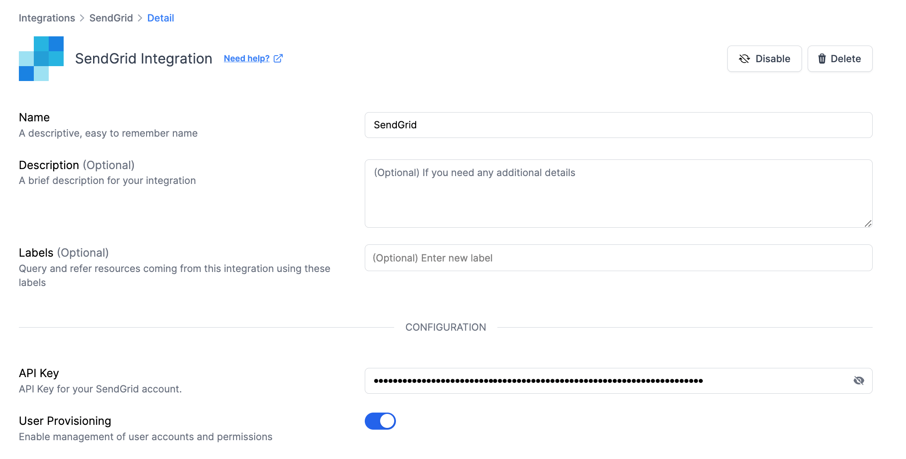

# SendGrid Integration

<figure><figcaption></figcaption></figure>

Monitor, manage, and secure your SendGrid assets like users, alerts, and accounts.

### What does Resmo offer to SendGrid users?

* Gain a comprehensive understanding of your SendGrid account settings and configurations to ensure optimal email deliverability and performance.&#x20;
* Keep a close eye on your SendGrid alerts, categorizing and responding to them efficiently to maintain high email delivery standards.&#x20;
* Collect detailed information about users within your SendGrid environment for better management and security.
* Revoke user access to easily offboard employees.
* Monitor changes in your account for faster investigations and incident response.

### How does the integration work?&#x20;

Resmo connects to SendGrid through APIs for an initial comprehensive data pull. After setup, it continues to update data in real time using webhook notifications and regular polling intervals.

**Available resources:**

* Account
* Alert
* User

### Integration Walkthrough

#### **How to install**

1. Go to your Integrations page on Resmo.
2. Find and select SendGrid from the list.
3. Click on the 'Add Integration' button.
4. Enter your SendGrid API key in the provided field. Need help finding your SendGrid API Key? [Visit this page](https://docs.sendgrid.com/ui/account-and-settings/api-keys).

<figure><figcaption></figcaption></figure>

5. Enable User Provisioning to effectively manage user accounts and permissions, utilizing Resmo’s capabilities for user offboarding and access control.
6. Click 'Create' to finish setting up the integration.

#### **How to uninstall**

1. Navigate to your Integrations page on Resmo and select SendGrid.
2. In the Connected Integrations tab, pick the SendGrid account you wish to disconnect.
3. For a temporary pause, click 'Disable'. To remove the integration completely, choose 'Delete'.

<figure><figcaption></figcaption></figure>
