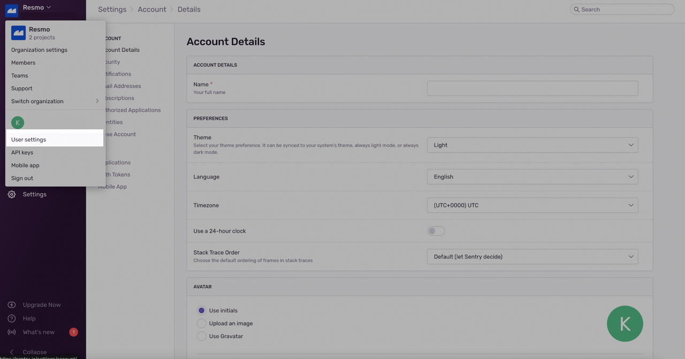
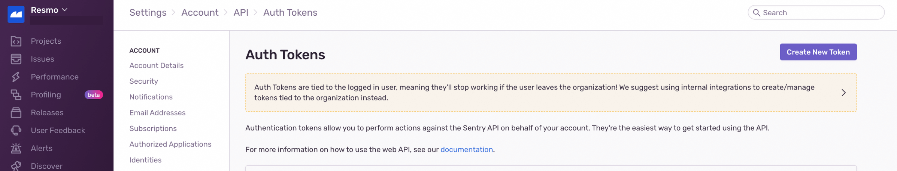
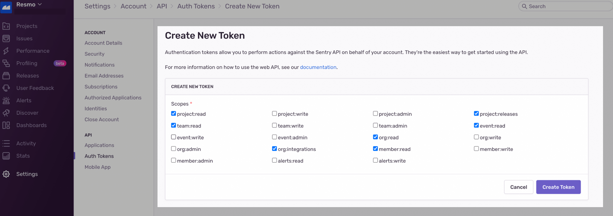
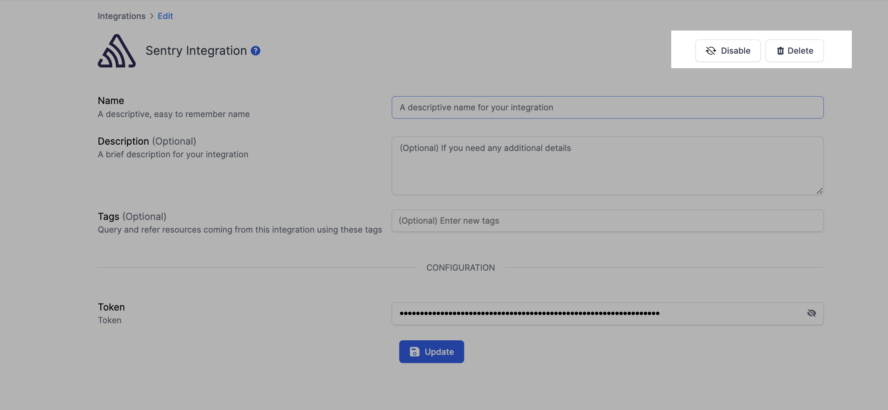

# Sentry Integration

## Resmo + Sentry Integration Fundamentals

<figure><figcaption></figcaption></figure>

Resmo integrates with Sentry to keep your resources and configurations secure and compliant.

### What does Resmo offer to Sentry users?

* Collect directory assets like users, teams, projects, and integrations from your Sentry account.
* Query your Sentry resources using SQL or Free Text search.
* Set up custom security rules or use predefined ones to improve your security posture.
* Get real-time notifications when there's a change in your security rule status.

### How does the integration work?

Resmo uses API to do the initial polling and collect existing resources. Following the initial polling, it receives updates and changes in real-time through webhook and regular polling.

#### Available resources

Resmo consolidates Sentry resources in a single asset inventory, including Integrations, Organizations, Users, and Teams.

**See the full list:**



## Integration walkthrough

### How to install

1. Select Sentry on the Integrations page on Resmo.
2. Open your Sentry account on a new tab on your browser.
3. Go to **Auth Tokens** under the **Sentry Account Details** page.

<figure><figcaption></figcaption></figure>

4. Create a new Auth Token.

<figure><figcaption></figcaption></figure>

5. Copy the **Read-only Auth Token** from your Sentry account. Required scopes:

```html
(project:read, team:read, org:integrations, org:read, member:read, event:read)
```

<figure><figcaption></figcaption></figure>

6. Paste it to the Auth Token field on the setup page.
7. Hit the **Create** button, and your integration is all set! Now you can start running queries on your Sentry resources.

### How to uninstall

1. Select Sentry on your Integrations page.
2. Navigate to the Connected Integrations tab on the modal and click the Sentry integration you wish to remove.
3. To temporarily pause your Sentry integration, click the **Disable** button. For permanent uninstallation, click the **Delete** button.

<figure><figcaption></figcaption></figure>

### Support

Contact us via live chat or email us at contact@resmo.com for issues or further questions.

