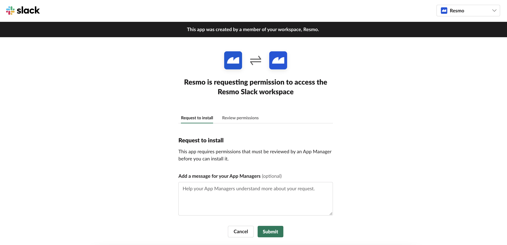
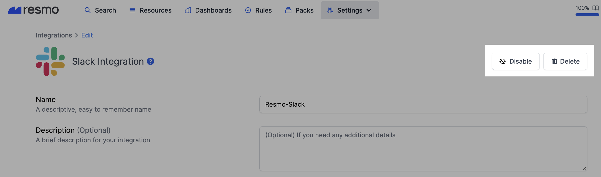

# Slack Integration

## Resmo + Slack Integration Fundamentals

Resmo seamlessly integrates with [Slack](https://slack.com/) to ensure that your team communications remain protected and carry on securely.&#x20;

### What does Resmo offer to Slack users?

* Query your Slack workspaces, teams, and channels.&#x20;
* Set up rules and rule notifications to detect changes and configurations.&#x20;
* Check your Slack security and compliance posture using the Slack Best Practices pack.
* Collect and monitor all your Slack resources from a single place.&#x20;
* Set up custom rules and run custom SQL queries to improve asset visibility.&#x20;

### How does the integration work?&#x20;

Resmo uses API to do the initial polling and collect existing resources. Following the initial polling, it receives updates and changes in real-time through webhook and regular polling.

* API polling&#x20;
* Webhook&#x20;


⚠️ **Important Warning: Admin Privileges Required for Slack Integration**

When setting up the Slack integration, please ensure that you are using an account with admin privileges. If you attempt to integrate Slack without admin privileges, certain fields and information will not be available. Notably, information regarding security features, such as whether "your organization has 2FA (Two-Factor Authentication)" enabled, will not be visible.

To avoid missing crucial information and ensure a seamless integration process, logging in with an account with admin privileges is strongly recommended before initiating the Slack integration.

If you have any questions or need assistance, please contact our support team.



Resmo **cannot read** direct messages or messages on channels. The required permissions allow access to basic information only.&#x20;

The permissions are read-only within **Bot Token Scopes** (viewing basic information about channels, users, and user groups) and **User Token Scopes** (viewing basic information about public and private channels, workspace preferences, and users in a workspace).


### Available resources&#x20;

Resmo + Slack integration helps you monitor and query your Slack resources including channels, channel members, teams, users, user groups, and more.

See the complete updated list:



### Common queries and rules&#x20;

* Check if team members enabled two-factor authentication (2FA)&#x20;
* View users only allowed to log in from certain domains&#x20;
* List channels and their creators&#x20;
* Detect externally shared channels&#x20;
* List active bot users&#x20;
* Identify workspace owners&#x20;

### Integration Walkthrough&#x20;

#### How to install&#x20;

1. Navigate to the Integrations page. Find and select Slack. &#x20;
2. Click the Add Integration button from the bottom right corner of the opening modal.
3. Hit the Create button.
4. You’ll be redirected to Slack. **Accept the permissions**.&#x20;

You can review the required permissions from the same page.

5\. All set! Now you can start running queries on your Slack resources.&#x20;

#### How to uninstall&#x20;

To delete the integration, open the Slack integration from Integrations>Slack. Go to the Connected Integrations tab from the opening modal and select the one you want to remove or disable.

* **If you uninstall the Resmo App on Slack**, we don’t delete the integration from your Resmo account. You can continue viewing your resources and querying them.&#x20;
  * Coming Soon: We are working on displaying a mark to inform you that you deleted the integration and will no longer be receiving updates.&#x20;
* **If you uninstall Slack App on Resmo**, you need to go to your Slack account and delete the Resmo App to uninstall the integration. The auto-deletion feature is coming soon.
