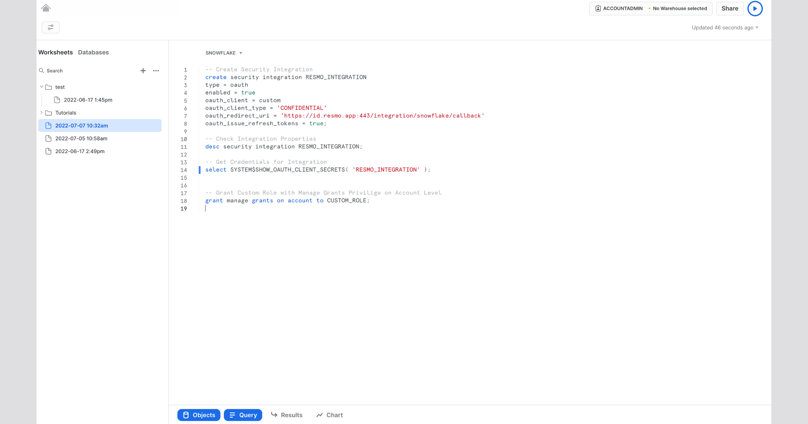
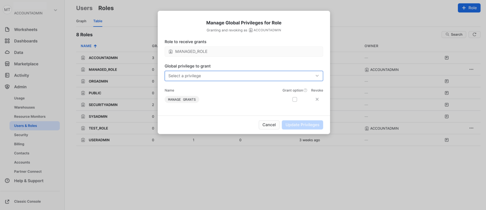
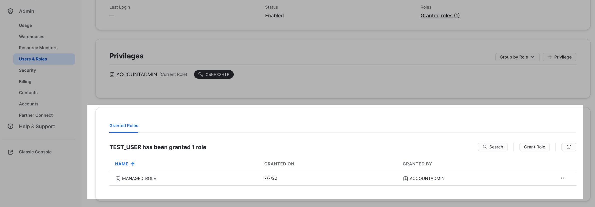
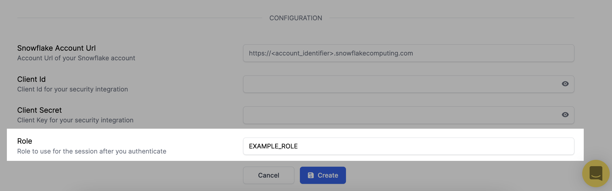
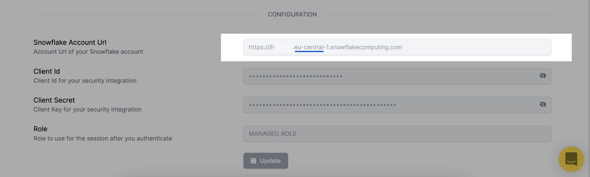

# Snowflake Integration

## Resmo + Snowflake Integration Fundamentals&#x20;


Resmo integrates with Snowflake to help you safeguard your cyber assets for security and compliance.

### What does Resmo offer to Snowflake users?

* Consolidate and monitor all your Snowflake resources in one place.
* Query your Snowflake users, schemas, databases, and more.
* Set up rules to continuously evaluate your resource conformance.
* Add notification rules to get alerted on rule violations in near real-time.

### How does the integration work?

Once you sign up for Resmo, you can easily integrate your account with Snowflake using an account with the required privileges. Resmo uses API to do the initial polling and collect existing resources. Then, we receive resource changes and updates in real-time by regular polling.

#### Available resources

Resmo aggregates Snowflake resources such as databases, users, keys, tables, and more

**See the full list:**



## Integration Walkthrough

### How to Install

1. **Login to your Resmo account and navigate to Integrations. Then, select Snowflake.**

**2. Click the Add Integration button at the bottom right corner of the opening modal.**

**3. On a new tab, go to your Snowflake Account and Create Security Integration with the following properties.**

```bash
create security integration INTEGRATION_NAME
type = oauth
enabled = true
oauth_client = custom
oauth_client_type = 'CONFIDENTIAL'
oauth_redirect_uri = 'https://id.resmo.app:443/integration/snowflake/callback'
oauth_issue_refresh_tokens = true;
```



* OAUTH\_REFRESH\_TOKEN\_VALIDITY is 90 days for custom clients in [Snowflake](https://docs.snowflake.com/en/sql-reference/sql/create-security-integration-oauth-snowflake.html#additional-optional-parameters-custom-clients). Resmo will check your refresh token validity and inform you if it expires soon.
* Check your security integration by executing `desc security integration INTEGRATION_NAME;`
* Get credentials for your security integration by executing `select SYSTEM$SHOW_OAUTH_CLIENT_SECRETS( 'INTEGRATION_NAME' );`. Enter the Client Id and Client Secret in the integration configuration screen.

**4. Create a new user/role with the required privileges.**



* Resmo uses SHOW commands to gather resources from the Snowflake system. The credentials provided to Resmo must be configured with the read permissions required to perform these commands.
* Example: role with MANAGE GRANTS global privilege `grant manage grants on account to ROLE_NAME;`
  * The user must be granted this role.



**5. Enter the role name in the integration configuration screen on Resmo.**



**6. Enter the account URL to the Account Url field in the integration configuration screen.**

* To have it work properly in Resmo, please provide the region in the [URL](https://docs.snowflake.com/en/developer-guide/sql-api/submitting-requests.html#submitting-queries-to-urls-with-an-account-name-in-an-organization-oauth-only).



**7. Hit the create button, and you'll be redirected to Snowflake. Accept permissions.**

**8. You are ready to run queries.**

### How to Uninstall

1. **Go to Integrations->Snowflake.**

**2. Navigate to the Connected Integrations tab on the modal and click the Snowflake integration you wish to remove.**

.png>)

3\. You have two options. To temporarily pause the integration, click the Disable button; to permanently uninstall it, click the Delete button.

4\. Optionally, you can remove your oAuth token after uninstalling the integration permanently. Follow the instructions [here](https://docs.snowflake.com/en/user-guide/oauth-consent.html#revoking-delegated-authorizations).

### Support

If you have any questions or issues regarding the Snowflake integration, feel free to contact us via live chat or email us at contact@resmo.com.
