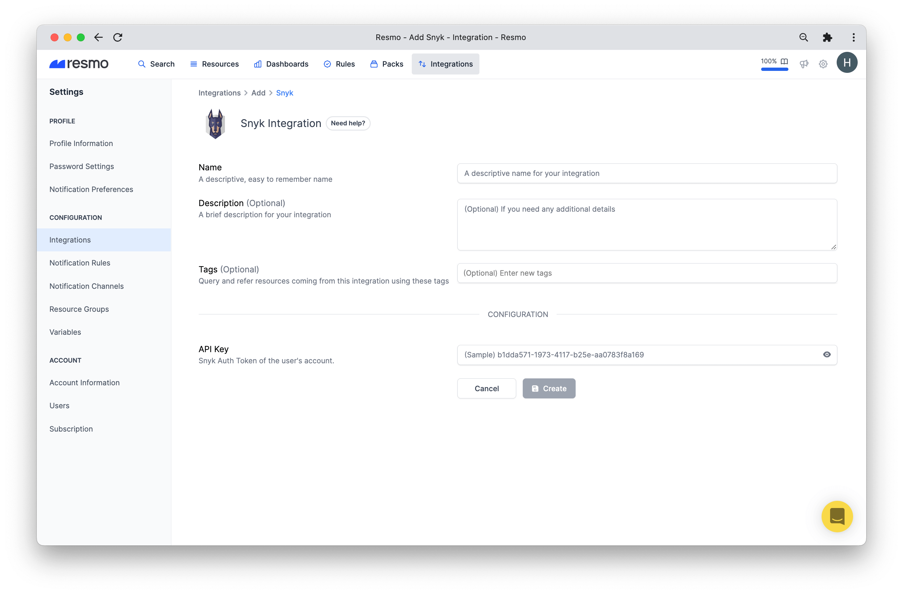
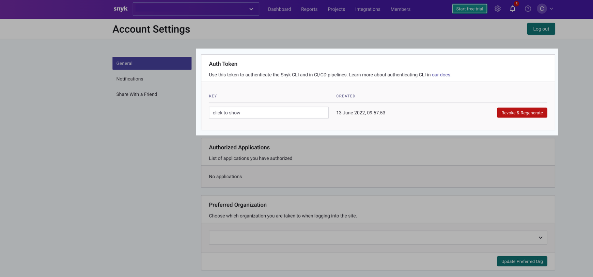
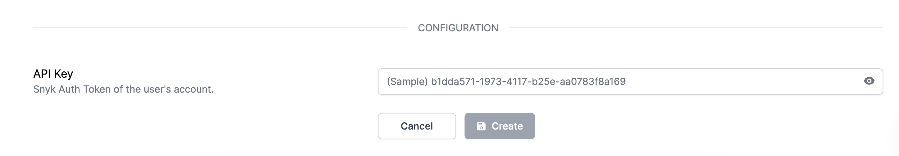

# Snyk Integration

## Resmo + Snyk Integration Fundamentals

Resmo integrates with Snyk to ensure your Snyk environment is safe and compliant.

### What does Resmo offer to Snyk users?

* Consolidate and visualize all Snyk resources in one place
* Query your resources like integrations, dependencies, issues, and members
* Continuously assess your assets and configurations for vulnerabilities
* Set up notification rules to get alerted on rule violations
* Utilize conformance packs to run compliance diagnoses across your resources&#x20;

### How does the integration work?

Once you sign up to Resmo, you can easily integrate your account with Snyk using an API key. Resmo uses API to do the initial polling and collect existing resources. Then, we receive resource changes and updates in real-time by regular polling.

[Available Resources](https://docs.resmo.com/resources/snyk)

### Common queries and rules

(To be added)

### Integration Walkthrough

#### **How to Install**

1. Login to your Resmo account.
2. Navigate to Integrations. Then, click Add Integration and select Snyk.

.png>)

3\. Name your integration and write a description (optional.)

4\.  Go to your Snyk account and create an API token from your Account Settings -> General -> Auth Token field if you have not created it already.

5\. Now, return to Resmo and enter the API key on the integration screen’s API key field.

6\. Hit the Create button, and you are ready to run queries.

**How to Uninstall**

1. Go to Settings>Integrations on your Resmo account.&#x20;
2. Then, select the Snyk integration you want to remove. You have two options;

* To temporarily pause the integration, click Disable.
* To permanently uninstall it, click Delete. Note that this action cannot be undone.

### Support

If you have any questions about the Resmo Snyk integration, feel free to contact us via live chat or email us at contact@resmo.com.
