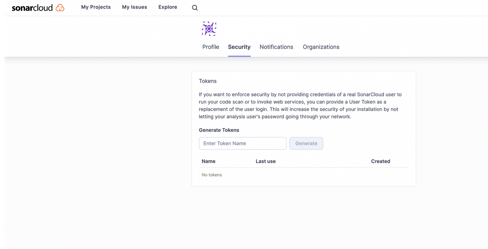
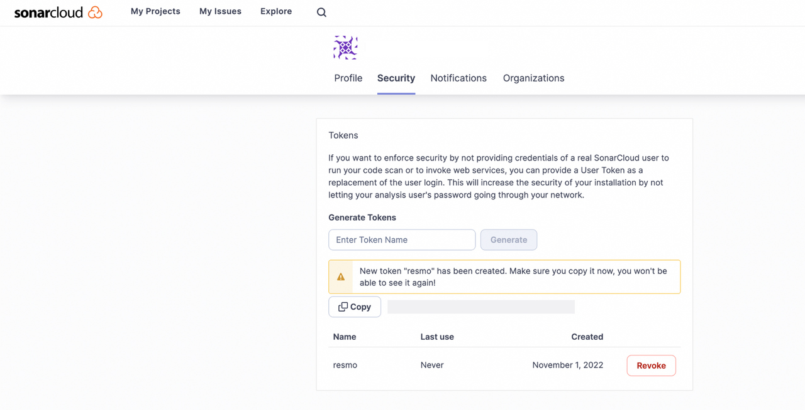
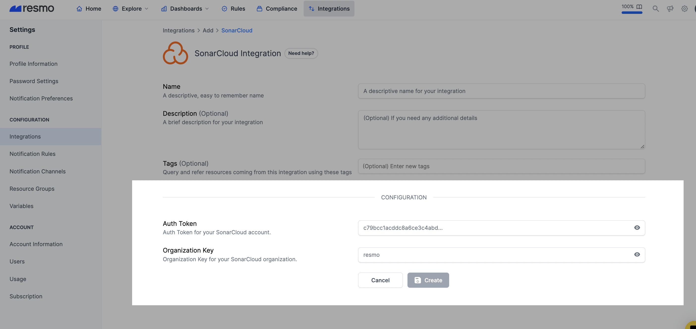
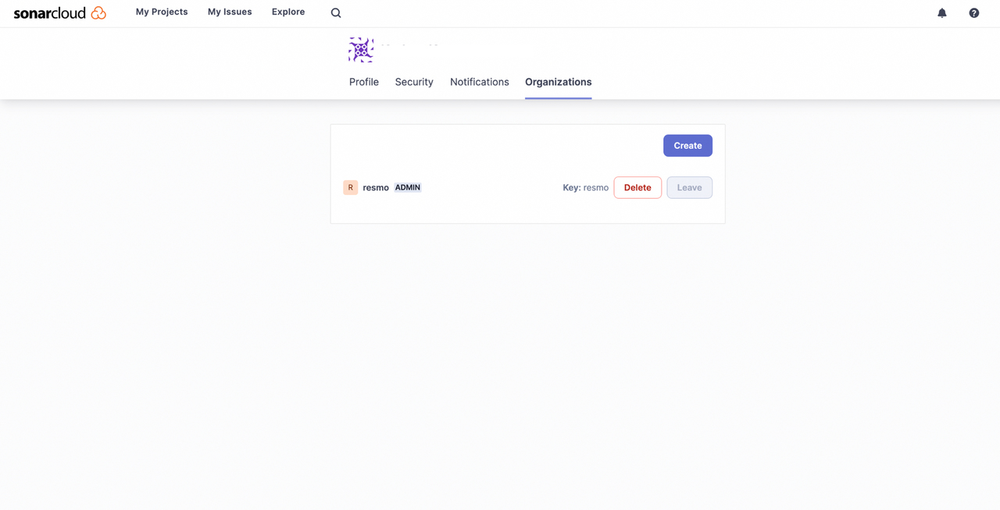
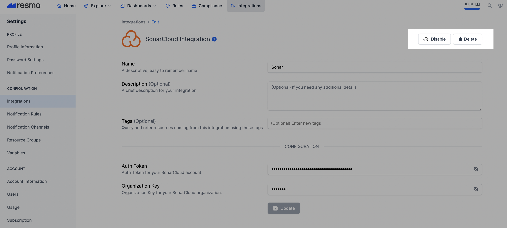

# SonarCloud Integration

## Resmo + SonarCloud Integration Fundamentals

<figure><figcaption></figcaption></figure>

Resmo integrates with SonarCloud to help you gain visibility and control over your SonarCloud asset security and compliance.

### What does Resmo offer to SonarCloud users?

* Collect your directory assets like users, projects from your SonarCloud account
* Query your SonarCloud users, projects, user groups and much more.
* Set up security rules to continuously evaluate asset security and compliance.
* Get real-time notifications on resource or configuration changes.

### How does the integration work?

Resmo uses API to do the initial polling and collect existing resources. Following the initial polling, it receives updates and changes in real-time through webhook and regular polling.

#### Available resources



## Integration walkthrough

### How to install

1. Select SonarCloud on the Integrations page of your Resmo account.
2. Click the Add Integration button at the bottom right corner of the opening modal.
3. Log in to your SonarCloud account on a new tab on your browser.
4. Go to Security page under the SonarCloud My Account page.

<figure><figcaption></figcaption></figure>

5. Generate and copy the Auth Token from your SonarCloud account.

<figure><figcaption></figcaption></figure>

6. Paste it to the Auth Token field on the setup page on Resmo.

<figure><figcaption></figcaption></figure>

7. Go to organizations page under the SonarCloud My Account page.

<figure><figcaption></figcaption></figure>

8. Copy the desired organization key from your SonarCloud organizations.
9. Paste it to the Organization Key field on the setup page.
10. Hit the Create button.
11. All set! Now you can start running queries on your SonarCloud resources.

### How to uninstall

1. Select SonarCloud on the Integrations page.
2. Open the Connected Integrations tab on the modal and select the integrated SonarCloud account you want to remove.
3. To temporarily pause your SonarCloud integration, click the Disable button form the top right. Or, you can permanently remove it by clicking the Delete button.

<figure><figcaption></figcaption></figure>

### Support

Still have questions? Feel free to contact us for troubleshooting at contact@resmo.com or drop us a message via live chat. Our team will be happy to help.

