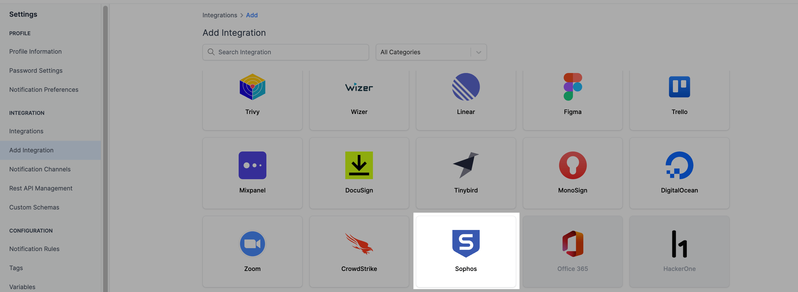
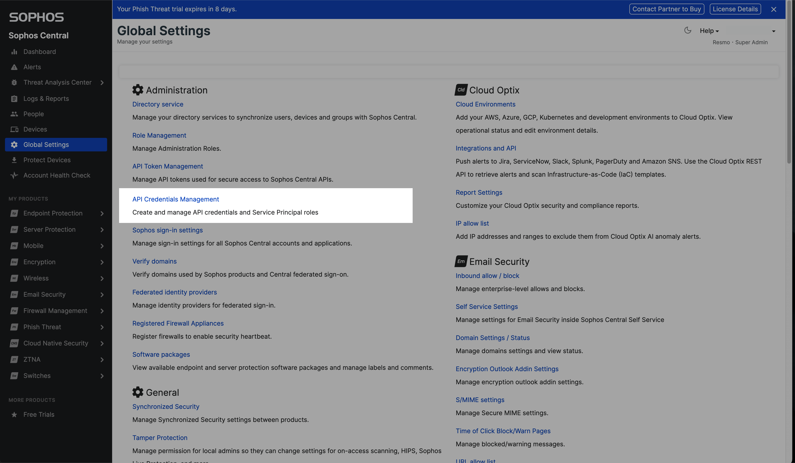
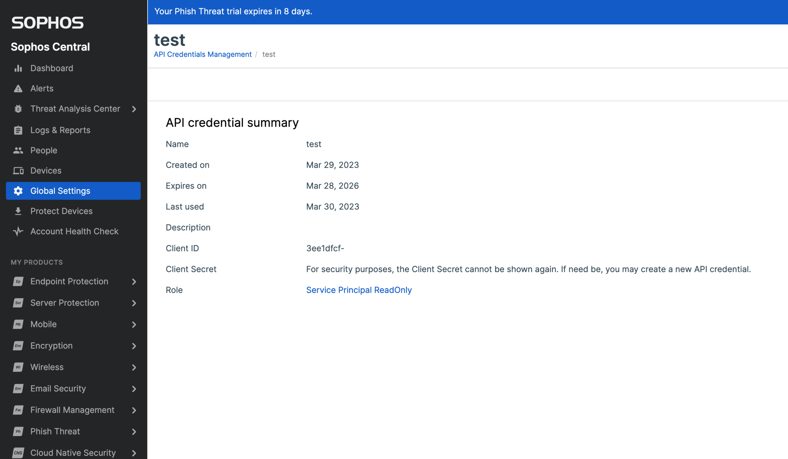
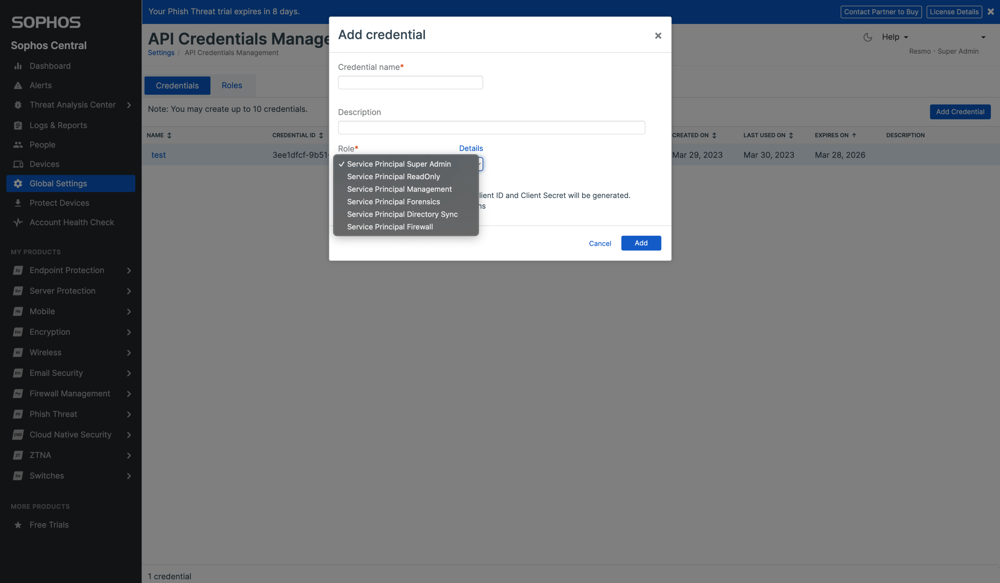
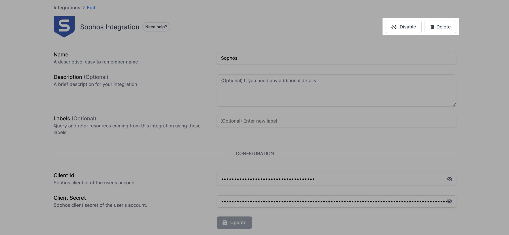

# Sophos Integration

## Resmo + Sophos Integration Fundamentals

<figure><figcaption></figcaption></figure>

Resmo integrates with Sophos to ensure the security and compliance of your Sophos environment.

### What does Resmo offer to Sophos users?

* Collect and monitor all your Sophos assets on a single platform.&#x20;
* Automate security and compliance checks of your Sophos resources like endpoints, users, and roles.
* Get notified of vulnerabilities in real-time via your favorite channels like Slack, email, OpsGenie, or webhook.
* Query your Sophos assets using SQL or free text search and get real-time, up-to-date answers

### How does the integration work?

Once you sign up to Resmo, you can easily integrate your account with Sophos using your Sophos client ID and client secret. It is recommended to create a read-only user account specifically for this integration. Resmo uses API to do the initial polling and collect existing resources. Then, we receive resource changes and updates in real-time through regular polling.


**Required API key permissions for integration:**

* View Endpoint
* View Endpoint Policies
* View Health Checks
* View Users
* View Roles


#### Available resources



## Integration walkthrough

### How to install

1. Select Sophos on the Integrations page of your Resmo account.
2. Click the Add Integration button at the bottom right corner of the opening modal.

<figure><figcaption></figcaption></figure>

3. Sign in to **Sophos Central Partner** on a new tab, click '**Settings & Policies**', then click the "**API Credentials**" link.&#x20;

<figure><figcaption></figcaption></figure>

4. Add a new set of credentials with at least read only role and click 'Copy' to note down the client ID and client secret.&#x20;

<figure><figcaption></figcaption></figure>

5. Enter the client ID and client secret on the integration screen's respective fields.&#x20;

<figure><figcaption></figcaption></figure>

6. Hit the Create button, and you are ready to run queries.

### How to uninstall

1. Select Sophos on your Integrations page.
2. Navigate to the Connected Integrations tab on the opening modal.
3. Click the Sophos integration you want to uninstall.
4. To temporarily pause the integration, click the **Disable** button from the top right. This way, you can enable it back later. For permanent deletion, click the **Delete** button instead. Note that this action cannot be undone.

<figure><figcaption></figcaption></figure>

### Support

Still have questions? Contact us via live chat or email us at contact@resmo.com.
