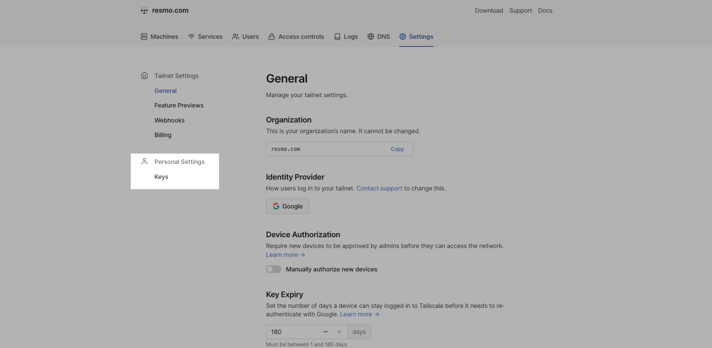
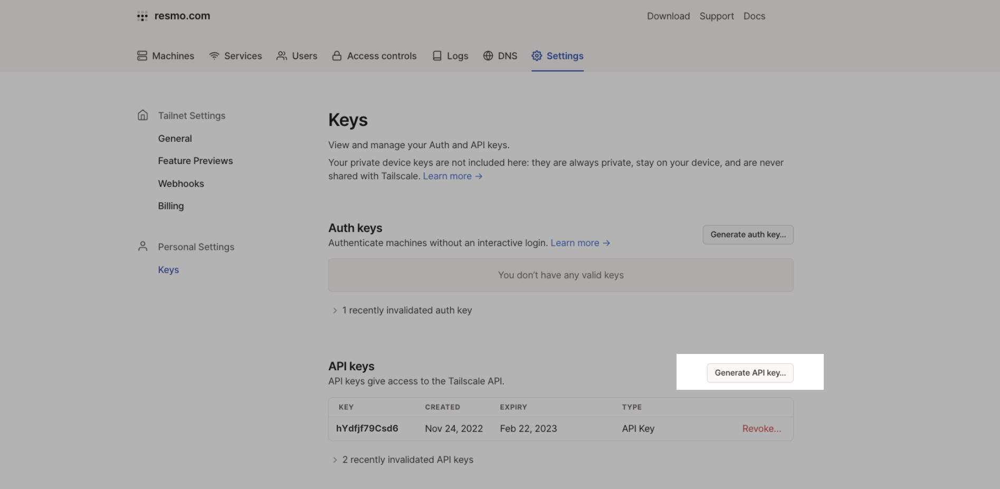
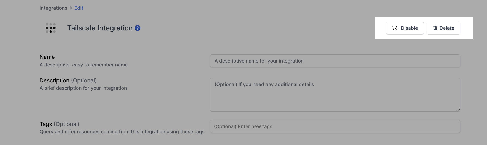

# Tailscale Integration

## Resmo + Tailscale Integration Fundamentals

<figure><figcaption></figcaption></figure>

Resmo integrates with Tailscale to bring you complete asset visibility, security, and compliance in one place.

### What does Resmo offer to Tailscale users?

* Collect your directory assets like devices, tailnet keys, and DNS nameservers from your Tailscale account.
* Query your Tailscale devices, tailnet keys, DNS nameservers, and more using SQL and free text search.
* Set up custom rules and run custom SQL queries to improve asset visibility.
* Get notified on critical security rule changes in near real-time via your favorite channels.

### How does the integration work?

Resmo uses API to do the initial polling and collect existing resources. Following the initial polling, it receives updates and changes in real-time through webhook and regular polling.


**Tailscale API keys automatically expire after the chosen number of days.** You need to generate a new key once the one you used for the Resmo integration is expired.&#x20;

API keys can also be revoked before their expiration dates.


#### Available resources



## Integration walkthrough

### How to install

1. Select Tailscale on the Integrations page.
2. Click the Add Integration button at the bottom right corner of the opening modal.
3. Log in to your Tailscale account on a new tab.
4. Go to [Personel Settings -> Keys](https://login.tailscale.com/admin/settings/keys) on your Tailscale account.

<figure><figcaption></figcaption></figure>

5. **Create and copy the API Key** from your Tailscale account by clicking the "Generate API Key..." button under the API keys.

<figure><figcaption></figcaption></figure>

6. Paste it into the API Key field on the Resmo Tailscale integration setup page.
7. Click **Create**.
8. All set! Now you can start running queries on your Tailscale resources.

### How to uninstall

1. Select Tailscale on your Integrations page.
2. Navigate to the Connected Integrations tab on the opening modal.
3. Click the Tailscale integration you want to uninstall.
4. You have two options:

* To **temporarily pause** your Tailscale integration, click the **Disable button** from the top right of your integration Edit page. You can enable the integration back later.
* To **permanently remove** the integration, click the **Delete button**. This action cannot be undone.

<figure><figcaption></figcaption></figure>
