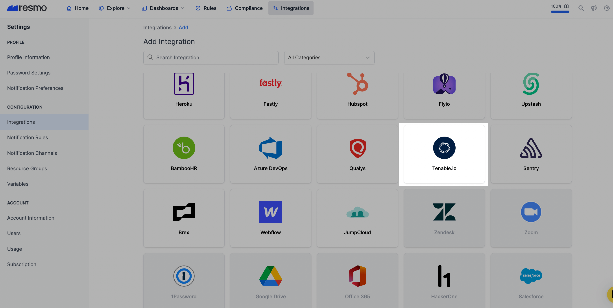
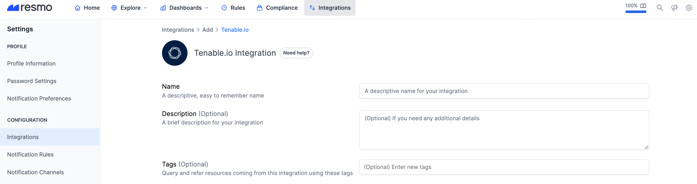
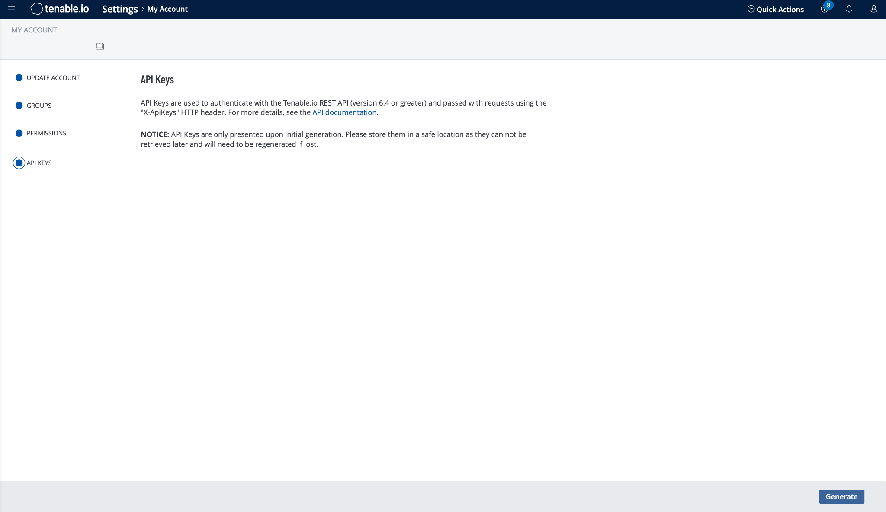

# Tenable Integration

## Resmo + Tenable Integration Fundamentals

<figure><figcaption></figcaption></figure>

Resmo Tenable integration ensures the security and compliance of your Tenable environment.

### What does Resmo offer to Tenable users?

* Collect and monitor your Tenable resources like scans, findings, and users in one place
* Query across your Tenable environment using SQL or free text search
* Set up security rules for continuous security assessments
* Get notifications when a resource or configuration changes

### How does the integration work?

Once you sign up to Resmo, you can easily integrate your account with Tenable.io access key and secret key. The integration uses your access key and secret key to authenticate with Tenable.io API. Please be careful to use a user with the following permissions:


* List Users
* List Groups
* List Permissions
* List Scans
* Export Assets
* Export Vulnerabilities
* Search scan configurations
* Search scans
* Search vulnerabilities
* List images
* List repositories
* Get image report

Do not forget to check [API documentation](https://developer.tenable.com/reference/navigate) for permission details of each resource.


#### Available resources

Resmo collects a wide range of Tenable resources for visibility, including assets, images, users, scans, and more.

See the complete list:



## Integration walkthrough

### How to install

1. Sign up or sign in to Resmo and go to your Integrations page.
2. Click the Add Integration button.
3. Add Tenable.

<figure><figcaption></figcaption></figure>

4\. Name the integration, and optionally write a description.

<figure><figcaption></figcaption></figure>

5\. Go to your Tenable account. Navigate to My Account -> API Keys -> Generate. Then, copy your generated API key.

<figure><figcaption></figcaption></figure>

6\. Enter your access key on the integration screen’s Access Key field.

<figure><figcaption></figcaption></figure>

7\. Enter your secret key on the integration screen’s Secret Key field.

8\. Hit the create button, and you are ready to run queries.

### How to uninstall

1. Login to your Resmo account.
2. Go to the integrations page and open the Tenable integration you want to uninstall.
3. To temporarily pause the integration, hit the Disable button; you can always enable it back later on.&#x20;
4. For permanent uninstallation, click the Delete button. Note that this action cannot be undone.

<figure><figcaption></figcaption></figure>

### Support

For troubleshooting or further inquires, please get in touch with us via live chat or email us contact@resmo.com.
