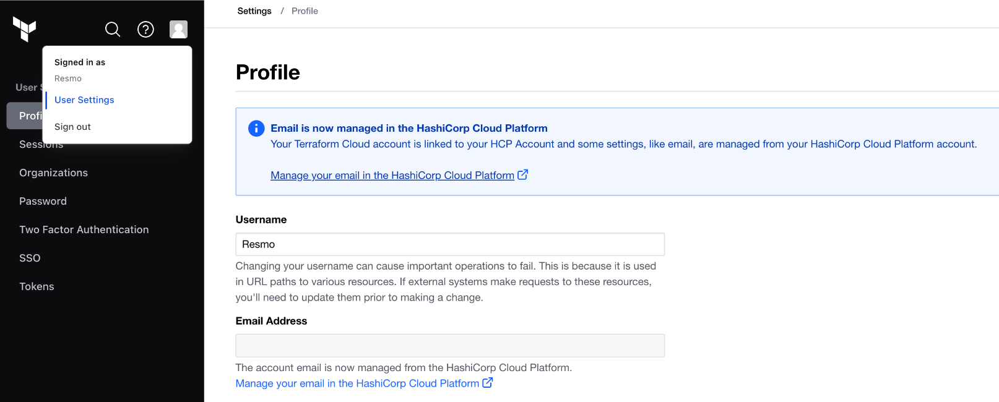
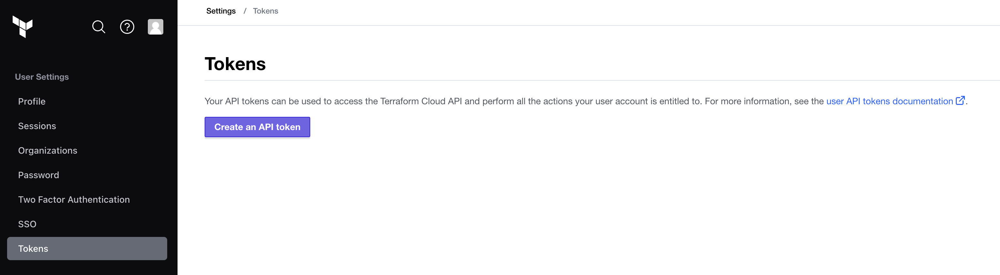
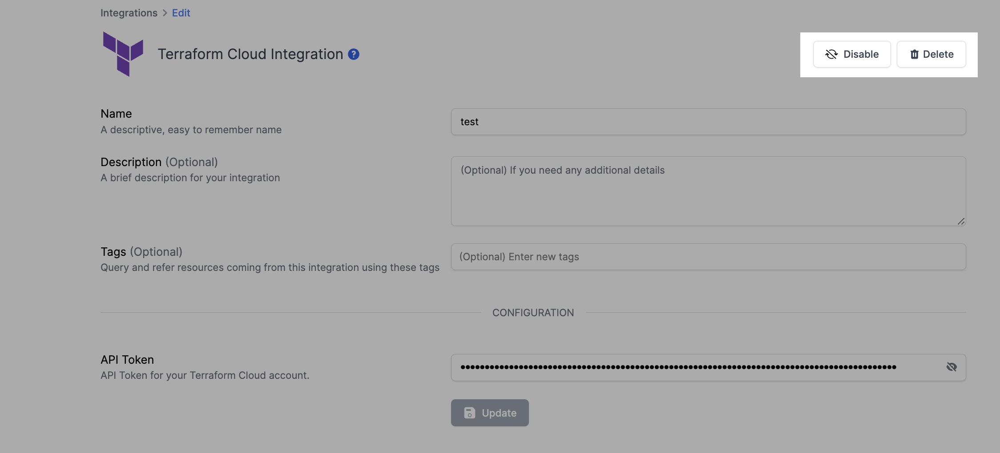

# Terraform Cloud Integration

## Resmo + Terraform Cloud Integration Fundamentals

<figure><figcaption></figcaption></figure>

Resmo integrates with Terraform Cloud to ensure the security and compliance of your Terraform resources.

### What does Resmo offer to Terraform Cloud users?

* Collect your directory assets like users, organizations, and teams from your Terraform Cloud account.
* Query your Terraform Cloud users, organizations, teams, and much more.
* Set up security rules and run custom SQL queries to improve cyber asset visibility.
* Get notified of critical asset changes taking place in your Terraform account.

### How does the integration work?

Resmo uses API to do the initial polling and collect existing resources. Following the initial polling, it receives updates and changes in real-time through webhook and regular polling.

#### Available resources



## Integration walkthrough

### How to install

1. Select Terraform on the Integrations page.
2. Click the Add Integration button at the bottom right corner of the opening modal.
3. Log in to your Terraform account on a new tab.
4. Go to your Terraform User Settings page.

<figure><figcaption></figcaption></figure>

5. Go to the Tokens page under your user settings page.

<figure><figcaption></figcaption></figure>

6. Generate and copy the API Token from your Terraform Cloud account.

<figure><figcaption></figcaption></figure>

7. Paste it to the API Token field on the integration setup page on Resmo.

<figure><figcaption></figcaption></figure>

8. Click Create.
9. All set! Now you can start running queries on your Terraform Cloud resources.

### How to uninstall

1. Go to Integrations -> Terraform.
2. Navigate to the Connected Integrations tab on the opening modal.
3. Click the Terraform integrations you want to remove.


You can either **disable** the integration **temporarily** or **delete** it **permanently**. Disabled integrations can be enabled back, while a deletion cannot be undone.&#x20;


3\. Depending on your choice, click the Disable or Delete button from the top right of the integration's configuration page.

<figure><figcaption></figcaption></figure>

### Support

Contact us via live chat or email us at contact@resmo.com for support requests and troubleshooting; our team will assist as soon as possible.
