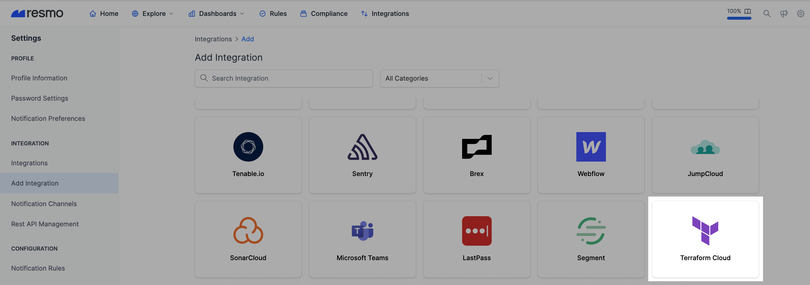
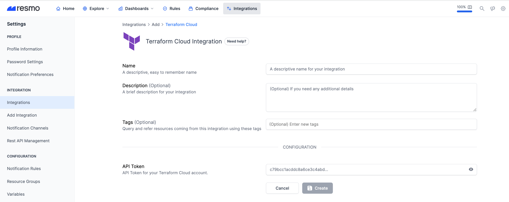

# Terraform Cloud Integration

## Resmo + Terraform Cloud Integration Fundamentals

<figure><figcaption></figcaption></figure>

Resmo integrates with Terraform Cloud to ensure the security and compliance of your Terraform resources.

### What does Resmo offer to Terraform Cloud users?

* Collect your directory assets like users, organizations, and teams from your Terraform Cloud account.
* Query your Terraform Cloud users, organizations, teams, and much more.
* Set up security rules and run custom SQL queries to improve cyber asset visibility.
* Get notified of critical asset changes taking place in your Terraform account.

### How does the integration work?

Resmo uses API to do the initial polling and collect existing resources. Following the initial polling, it receives updates and changes in real-time through webhook and regular polling.

#### Available resources



## Integration walkthrough

### How to install

1. Log in to your Resmo account and go to your Integrations page.
2. Click Add Integration.

<figure><figcaption></figcaption></figure>

3\. Add Terraform Cloud.

<figure><figcaption></figcaption></figure>

4\. Name your Terraform Cloud integration and optionally write a description.

<figure><figcaption></figcaption></figure>

5\. Go to your Terraform User Settings page.

<figure><figcaption></figcaption></figure>

6\. Go to the Tokens page under your user settings page.

<figure><figcaption></figcaption></figure>

7\. Generate and copy the API Token from your Terraform Cloud account.

<figure><figcaption></figcaption></figure>

8\. Paste it to the API Token field on the integration setup page on Resmo.

<figure><figcaption></figcaption></figure>

1. Click Create.
2. All set! Now you can start running queries on your Terraform Cloud resources.

### How to uninstall

1. Navigate to your Integrations page on Resmo.
2. Click the Terraform integrations you want to remove.


You can either **disable** the integration **temporarily** or **delete** it **permanently**. Disabled integrations can be enabled back, while a deletion cannot be undone.&#x20;


3\. Depending on your choice, click the Disable or Delete button from the top right of the integration's configuration page.

<figure><figcaption></figcaption></figure>

### Support

Contact us via live chat or email us at contact@resmo.com for support requests and troubleshooting; our team will assist as soon as possible.
