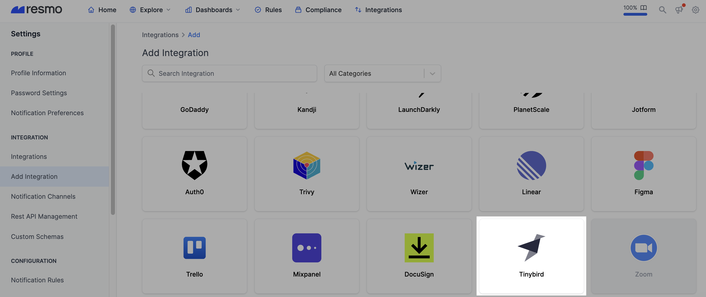

# Tinybird Integration

## Resmo + Tinybird Integration Fundamentals

<figure><figcaption></figcaption></figure>

Resmo connects to Tinybird to provide continuous asset visibility, security, and compliance for your Tinybird environment.

### What does Resmo offer to Tinybird users?

* Collect your directory assets like data sources, pipes, and tokens from your Tinybird account.
* Query and answer complex security questions instantly using custom or managed SQL queries.
* Set up automated security rules to gain continuous security and compliance.
* Understand asset relationships in context by leveraging visual graph views.

### How does the integration work?

Resmo uses API to do the initial polling and collect existing resources. Following the initial polling, it receives updates and changes in real-time through webhook and regular polling.

#### Available resources



## Integration walkthrough

### How to install

1. Log in to your Resmo account and navigate to Integrations.
2. Click **Add Integration** from the upper right. Then, find and **Add Tinybird**.

<figure><figcaption></figcaption></figure>

3. Type a descriptive name for the integration and optionally a description.

<figure><figcaption></figcaption></figure>

4. Go to **Auth Tokens page**.

<figure><figcaption></figcaption></figure>

5. You can **either create a new token** with the desired resources only **or continue with the admin token**.

<figure><figcaption></figcaption></figure>

6. For the admin token, click "**admin token**" under the workspace tokens.
7. For a limited token, click the "**New token**" button in the upper right corner.
8. If you want to poll "Pipes", click on "**Add pipe scope**", select the desired pipes, select "Read" scope only, and click on "Add".

<figure><figcaption></figcaption></figure>

9. If you want to poll "Data sources", click on "**Add Data source scope**", select the desired datasources, select "Read" scope only, and click on "Add".

<figure><figcaption></figcaption></figure>

10. If you want to poll "Jobs", click on "Enabled" under the "Data Sources Scopes".

<figure><figcaption></figcaption></figure>

11. If you want to poll "Tokens", click on "Enabled".
12. Click save changes.
13. **Copy Auth token** from your Tinybird account.

<figure><figcaption></figcaption></figure>

14. **Paste it to the Auth Token field** on the setup page.

<figure><figcaption></figcaption></figure>

15. Click **Create**.
16. All set! Now you can start running queries on your Tinybird resources.

### How to uninstall

1. Go to your Integrations page on Resmo.
2. Click the Tinybird integration you want to uninstall.
3. See the **Disable** and **Delete** buttons in the upper right corner. Disabling an integration pauses data polling until you enable it back. Deleting an integration, on the other hand, cannot be undone.

### Support

Contact us via live chat or email us at contact@resmo.com for support requests or troubleshooting.
