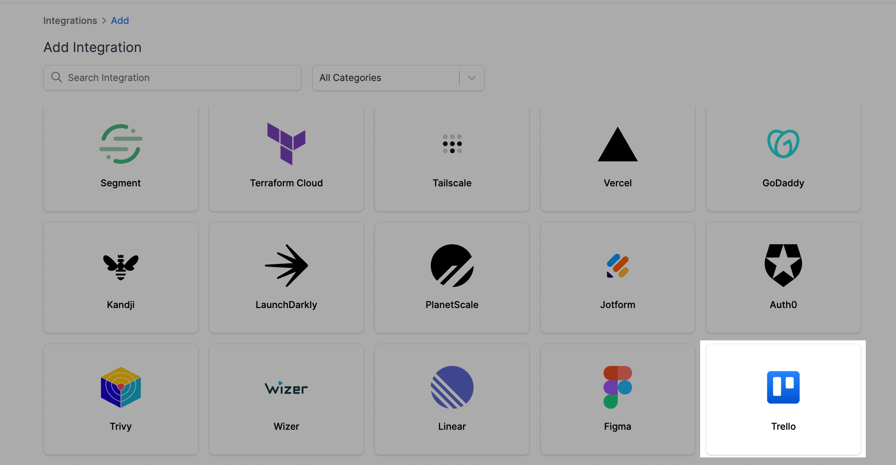
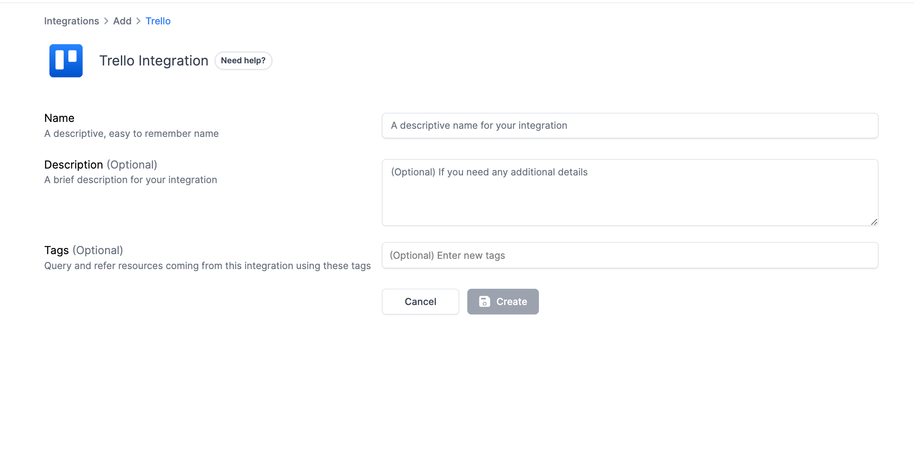
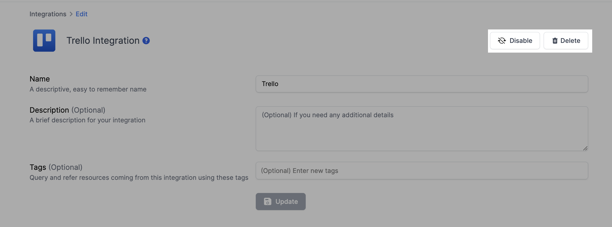

# Trello Integration

## Resmo + Trello Integration Fundamentals

<figure><figcaption></figcaption></figure>

Resmo integrates with Trello to keep your assets, like boards and members, visible, secure, and compliant in one place.

### What does Resmo offer to Trello users?

* Collect your directory assets like members, boards, power-ups, and organizations from your Trello account.
* Query your Trello resources using the powerful SQL query engine or free text search.
* Automate security checks with custom and managed rules.
* Set up rule notifications based on Trello resource configurations.

### How does the integration work?

Resmo uses API to do the initial polling and collect existing resources. Then, we receive resource changes and updates in real-time through regular polling.

#### Available resources



## Integration walkthrough

### How to install

1. Sign up or sign in to Resmo and navigate to your Integrations page.
2. Click the Add Integration button from the upper right corner.
3. Add Trello.

<figure><figcaption></figcaption></figure>

4\. Name your Trello integration and optionally type a description in the related field.

<figure><figcaption></figcaption></figure>

5\. Hit the Create button.

6\. You will be redirected to your Trello account.

7\. Accept permissions.

8\. Now, you can start querying your Trello resources.

### How to uninstall

1. Go to your Integrations page.
2. Open the Trello integration you wish to remove.
3. To **temporarily pause** it, click the Disable button from the top right. You can enable the integrations back later on.
4. For **permanent deletion**, click the Delete button instead. This action cannot be undone.

<figure><figcaption></figcaption></figure>

### Support

For troubleshooting and support requests, feel free to contact us via live chat or email us at contact@resmo.com.
