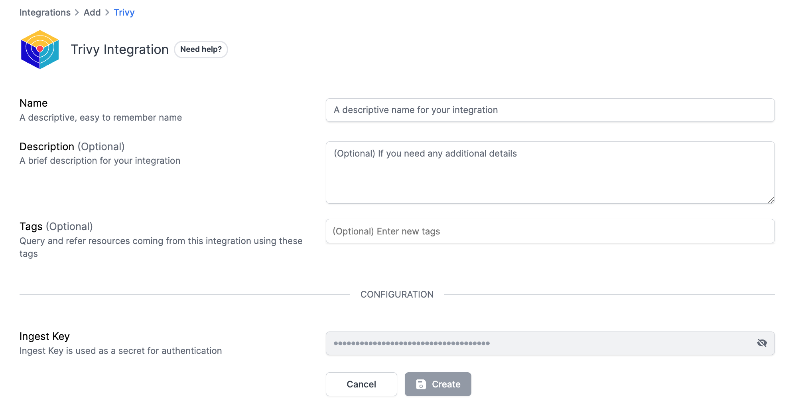

# Trivy Integration

<figure><figcaption></figcaption></figure>

[Trivy](https://trivy.dev/) is an all-in-one open-source security scanner. It has the ability to generate SBOM _(Software Bill of Materials)_ given a repository, file system, or container image. Using the generated SBOM, it can also find vulnerabilities by comparing them to the CVE databases.

### What does Resmo offer to Trivy users?

* Query your SBOM Metadata, SBOM components, component dependencies, and vulnerabilities identified by Trivy.
* Create custom security rules for your Trivy resources.
* Get timely notifications of critical rule changes.
* Understand asset relationships in graph view.

### How does the integration work?

At Resmo, you are expected to send the SBOM in [CycloneDX](https://cyclonedx.org/) JSON format through our REST API. When a new SBOM payload is received, Resmo stores it and also scans it for vulnerabilities using Trivy. The SBOM is also periodically scanned in order to catch any future vulnerabilities in your container images or repositories.&#x20;

This way, you can ensure vulnerabilities are not only caught in build-time and anytime a new one is announced. Consolidating SBOM and vulnerabilities allows you to make cross-tool queries, such as comparing the vulnerabilities with already deployed containers on Kubernetes, Fargate, GCP, and others.

#### Available resources



## Integration Walkthrough <a href="#1.-preparing-your-sbom" id="1.-preparing-your-sbom"></a>

### How to install

1. Select Trivy on the Integrations page.
2. Click the Add Integration button at the bottom right corner of the opening modal.

<figure><figcaption></figcaption></figure>

3. Then, you must enter your Ingest Key to the related field.&#x20;
4. Below, you can find a detailed guide on how you can install Trivy.

### 1. Preparing your SBOM <a href="#1.-preparing-your-sbom" id="1.-preparing-your-sbom"></a>

The first step of the integration is generating an SBOM from your target, whether it's a source code repository or container images. You can make use of Trivy or your build tools plugins to generate an SBOM.

#### 1.1 Software Dependencies & Repositories <a href="#1.1-software-dependencies-and-repositories" id="1.1-software-dependencies-and-repositories"></a>

Trivy can generate SBOM and scan the vulnerabilities at one config, but at Resmo, we only need SBOM from you. To generate an SBOM from a code repository, use the following command:

```
1$ trivy fs --format cyclonedx . > sbom.json
```

However, note that this command traverses all files in the repository recursively (not just root), and in some package managers like npm and yarn, it can generate more files. To reduce the scope, it’s recommended to specify the exact file to scan for your package manager. A few examples are given for you to run at the root directory for your source code repositories:

**Yarn**

```
1$ trivy fs --format cyclonedx yarn.lock --output sbom.json
```

**NPM**

```
1$ trivy fs --format cyclonedx pacakage-json.lock --output sbom.json
```

**Java (Maven):**

```
1$ trivy fs --format cyclonedx pom.xml --output sbom.json
```

**Python (pip)**

```
1$ trivy fs --format cyclonedx Pipfile.lock --output sbom.json
```

**Go**

```
1$ trivy fs --format cyclonedx go.mod --output sbom.json
```

It can also scan the binaries built by Go, that are not minimized with UPX.

```
1$ trivy fs --format cyclonedx some-binary --output sbom.json
```

For the complete list, please refer to the [Trivy documentation.](https://aquasecurity.github.io/trivy/v0.36/docs/vulnerability/detection/language/)

For complex package managers and situations, please refer to how to generate a proper SBOM for your final artifact to reduce the scope. As an example, there is a Gradle [CycloneDX plugin](https://github.com/CycloneDX/cyclonedx-gradle-plugin) that can be helpful in such cases. You are always welcome to reach out to Resmo customer support as well.

### 1.2 Container Images

Generating SBOM from your container images will also help you identify some issues that are present with libraries and operating system packages. You can also cross-reference vulnerabilities of container images with the actual images deployed by joining the vulnerability and container tables on image hashes.

Trivy also identifies binaries and some distributions (like Java) and generates their SBOM too, so you might only use container image scanning with Resmo for better results.

**Note:** One thing to consider is that the names of the container images are not unique. Meaning; in most of the container registries, you can make use of the same name. Therefore, you must note that you can only identify the container images by their ID, not name. This also means you cannot identify containers by **tags** as well, and someone else might have used the same tag to upload their container.

There are many ways of building container images. If you have a specific use case not mentioned here, please do not hesitate to reach out to customer support.

**Using Docker Engine**

If the container image is present on the local container image, trivy will first attempt to use that. To scan a container image, you can use the following commands:

**Image ID (Full, sha256):**


```
1$ trivy image --format cyclonedx sha256:4a138cc5ca0d62f668ea4489ffc62fb7f5a016d606c5cae75a6a96965a8c64df --output sbom.json
```


**Image ID (Short):**


```
1$ trivy fs --format cyclonedx 4a138cc5ca0d --output sbom.json
```


**Image Name & Tag (not-recommended)**


```
1$ trivy fs --format cyclonedx timescale/timescaledb-ha:pg14-latest --output sbom.json
```


### 2. Sending SBOM to Resmo <a href="#2.-sending-sbom-to-resmo" id="2.-sending-sbom-to-resmo"></a>

You need to create a Trivy integration at Resmo. After the integration is created, it will give you an ingest key that we will use it to send the data. You also need to define a **componentName** variable so that we can identify which repository the SBOM belongs to. This also helps clean up the vulnerabilities as they are resolved. You can use any HTTP Client to send the SBOM JSON file to Resmo Rest API. Here is an example with curl:


```
$ CUSTOMER_DOMAIN=happy-resmo-customer
$ INGEST_KEY=1234-abcd
$ SBOM_FILE="@sbom.json"
$ COMPONENT_NAME="my-repo"

$ curl --request POST \
  --compressed \
  --url "https://${CUSTOMER_DOMAIN}.resmo.app/integration/trivy/event?componentName=${COMPONENT_NAME}" \
  --header "Content-Type: application/json" \
  --header "X-Ingest-Key: ${INGEST_KEY}"" \
  --data ${SBOM_FILE}
```


Although Trivy has a component name in the generated SBOM files, at Resmo, you need to explicitly provide a component name. Trivy-generated component names are not distinguishable and lack the context of the actual environment. To keep track of the generated SBOM and discovered vulnerabilities, and fixes over time, choosing a proper component name is crucial.

Our recommendations for component names are:

* For repositories, use the format [GitHub: Let’s build from here](http://github.com/) **\<org>/\<repository>@\<branch>**
* For Docker images, use the format **\<repo>/\<org>@\<environment>**


Docker images have both names/tags and IDs. However, most container registries do not have tag immutability; over time, a tag can identify different images which can be misleading. Therefore, at Resmo, we identify container SBOMs by their IDs. But as a result of building images continuously, to reduce clutter and duplication, we keep track of the images by their component names and only keep the latest 5 image IDs per component name.

**Important:** If you use a different component name for each container image, SBOMs and Vulnerabilities will pile up because Resmo will identify each API call as part of a different component.


### 3. Using SBOM and Vulnerability Data in Resmo  <a href="#3.-using-sbom-and-vulnerability-data-in-resmo" id="3.-using-sbom-and-vulnerability-data-in-resmo"></a>

When a new SBOM is uploaded, Resmo processes it immediately to generate three resource types:

* **SBOM (trivy\_sbom)**: Contains the complete SBOM of a component, including the versions of the software, libraries, and packages used.
* **Vulnerability (trivy\_vulnerability)**: A list of vulnerabilities associated with SBOMs. Contains severity with CVE IDs and the source component (i.e library, package) of the vulnerability.


Resmo uses trivy to scan for vulnerabilities whenever a new SBOM is uploaded through API. Vulnerabilities are also checked periodically for already existing SBOMs to discover new vulnerabilities if they arise after SBOMs are uploaded.


### Use Case Examples <a href="#use-case-examples" id="use-case-examples"></a>

The best way to use Resmo Trivy integration is to integrate it with your CI/CD pipelines to detect issues early. Upon a successful build on the main branch or deployment to a production environment, you can generate an SBOM using Trivy CLI and send the SBOM file to Resmo through our API. Generating an SBOM per branch or non-production environment is also an option, but will possibly generate thousands of SBOM components vulnerabilities which would be duplicated.

We’ve prepared several examples on Github so that you can have a better idea of how Trivy can be integrated into your workflows and how Resmo can be helpful to identify issues.

* [Golang based image deployed to Kubernetes (Docker image example)](https://github.com/resmoio/trivy-example-project)
* (Coming soon) Java Spring Boot application with known vulnerabilities (Repository example)
* (Coming soon) Kubernetes Cron Job to watch related deployments (Docker image example)

### How to uninstall

1. Select Trivy on your Integrations page.
2. Navigate to the Connected Integrations tab on the opening modal.
3. Click the Trivy integration you want to remove.
4. To temporarily disable the integration, click the Disable button from the top right. This way, you can enable it later on. For permanent deletion, click the Delete button instead. This action cannot be undone.
