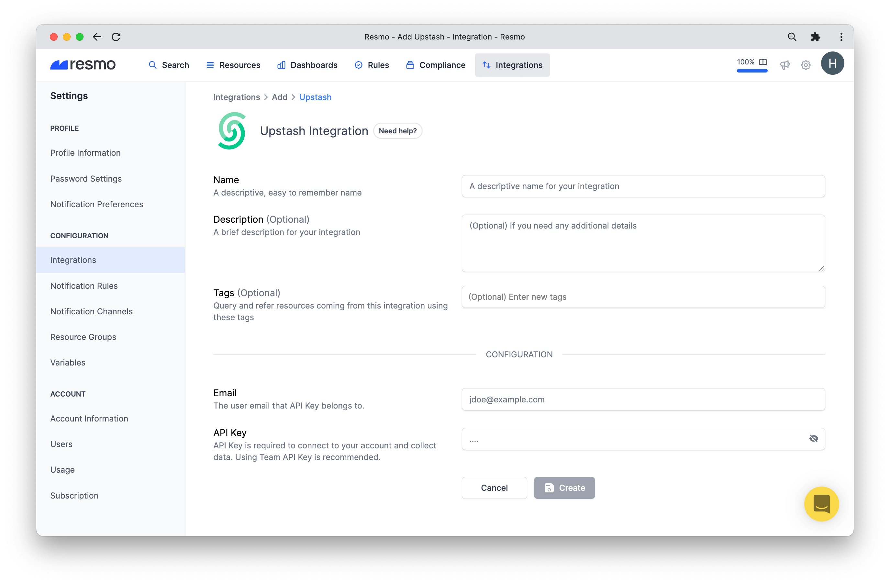
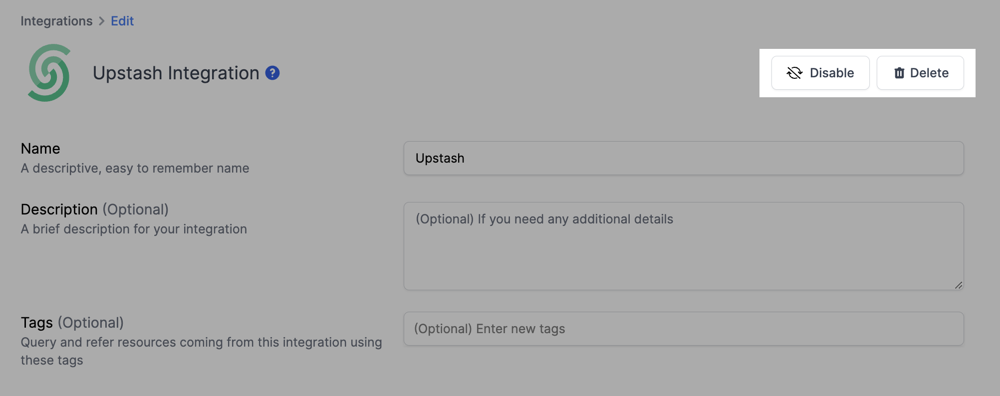

# Upstash Integration

## Resmo + Upstash Integration Fundamentals

<figure><figcaption></figcaption></figure>

Resmo integrates with Upstash in one click to help you keep your Upstash assets continuously secure and compliant.

### What does Resmo offer to Upstash users?

* Create an asset inventory for your Upstash resources, including Redis Databases, Kafka Clusters, users, and more.&#x20;
* Query your resources, configurations, and changes with the flexible SQL engine.
* Assess your resource and configuration security and compliance using rules
* Set up notification rules to get notified of critical changes

### How does the integration work?

Resmo uses API keys created by a user. Ensure that you have Our application uses API to make the initial polling and receive existing resources. Then, we receive resource changes and updates in real-time by regular polling.

#### Available resources

Resmo aggregates Upstash resources in one place, including Kafka topics, Kafka clusters, Redis databases, and more.



## Integration Walkthrough

### How to install

1. Sign up or sign in to Resmo and navigate to your Integrations page.
2. Click the add Integration button and Add Upstash from the list.
3. Type a descriptive name for the integration and optionally a description.

<figure><figcaption></figcaption></figure>

4\. Ensure that the related team or personal account is selected.

5\. Create an API Key from Upstash [Settings Page](https://console.upstash.com/account/api).

6\. Fill the form with API Key and user email address and click Save.

7\. All done! Now you can start querying your Upstash resources!

### How to uninstall

1. Log in to your Resmo account.
2. On your Integrations page, click the Upstash integration you want to uninstall.
3. To temporarily pause the integration, click the Disable button; to permanently remove it, click the Delete button.&#x20;

<figure><figcaption></figcaption></figure>

### Support

For further questions and issues regarding your Resmo Upstash integration, contact us via live chat or email us at contact@resmo.com.&#x20;
