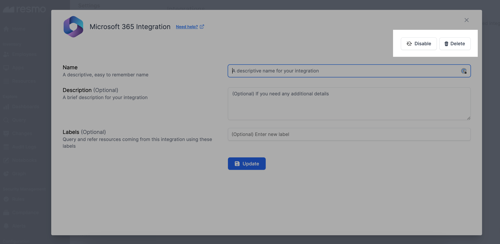

# Vanta Integration

<figure><figcaption></figcaption></figure>

Resmo helps you identify and monitor your Vanta environment's critical security and compliance issues. You can automate security checks, detect changes, receive timely alerts, and query complex questions all in one place.

### What does Resmo offer to Vanta users?

* View and query the details of your Vanta resources, including users, current test results, access reviews, and vendors.
* Visualize your Vanta configuration changes in graph view and create real-time alerts.
* Audit and detect misconfigurations on auto-pilot.
* Receive the alerts from your favorite channels like Slack, Opsgenie, and email, or automatically turn issues into Jira or Linear tasks.
* Monitor all activities on your Vanta environment using Audit Logs; never miss an unusual activity.

### How does the integration work?

Resmo uses API to do the initial polling and collect existing Vanta resources. Following the initial polling, it receives updates and changes in real-time through webhook and regular polling.

**Available resources**



### Integration Walkthrough

#### How to install

1. Log in to your Resmo account and go to your Integrations page.
2. Find and select Vanta.
3. Click the Add Integration button from the bottom right corner of the opening modal window.

<figure><figcaption></figcaption></figure>

4. Next, log in to your Vanta account on another tab.

<figure><figcaption></figcaption></figure>

5. Generate an API Token from [Vanta Settings](https://app.vanta.com/api-tokens) -> API Token -> Create.


Currently, Vanta's capability to generate API tokens is exclusively available to users with admin privileges, and every API token possesses unrestricted access to the entire public graph.


<figure><figcaption></figcaption></figure>

6. Copy the generated API Token and return to the Resmo integration screen.

<figure><figcaption></figcaption></figure>

7. Paste it into the related field and hit the Create button. Your integration will be fully ready in a few seconds.

#### How to uninstall

1. On your Integrations page on Resmo, find and select Vanta.
2. Navigate to the Connected Accounts tab on the opening modal.
3. Click on the account you want to remove.
4. You can either disable the integration temporarily and enable it back later or delete it permanently. Based on your choice, click the related button (Disable/Delete)from the top right.

<figure><figcaption></figcaption></figure>

### Support

For troubleshooting and support requests, contact our team via live chat or email us at contact@resmo.com.
