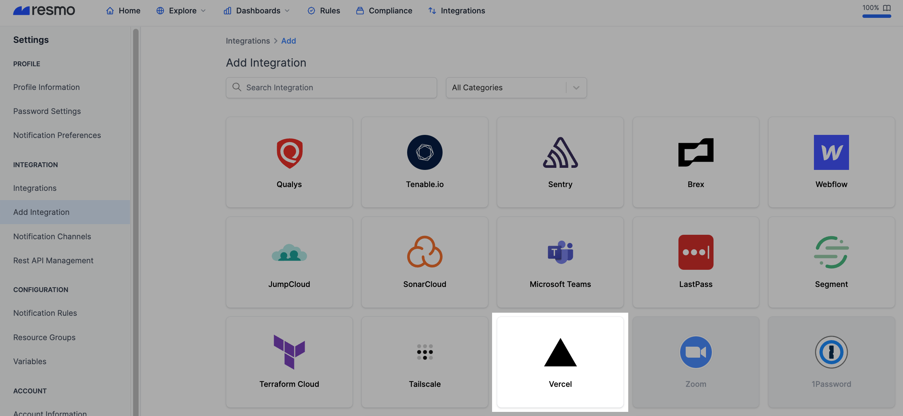
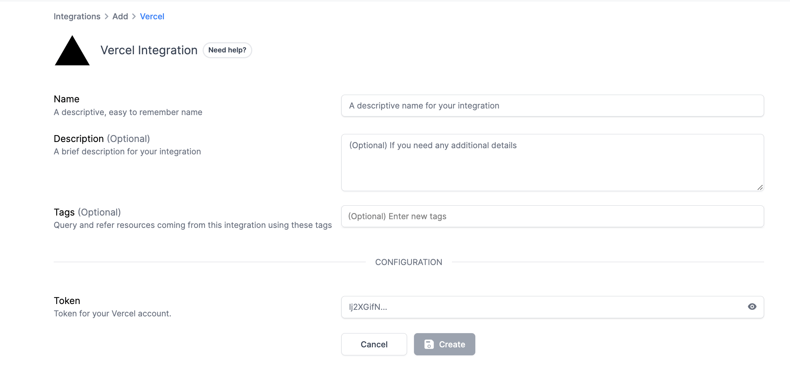
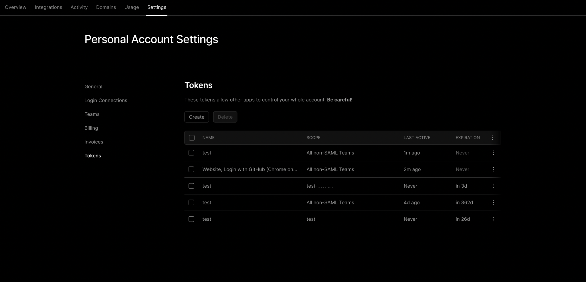
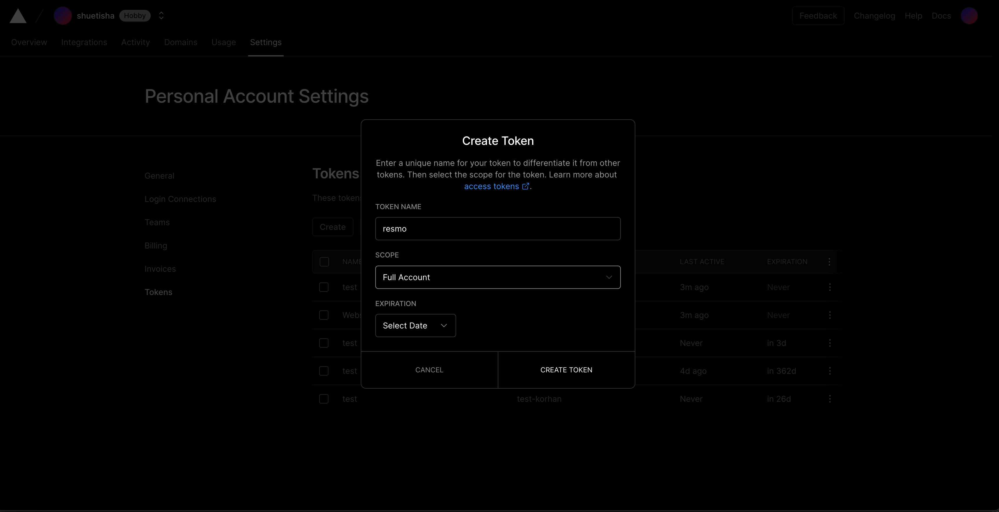
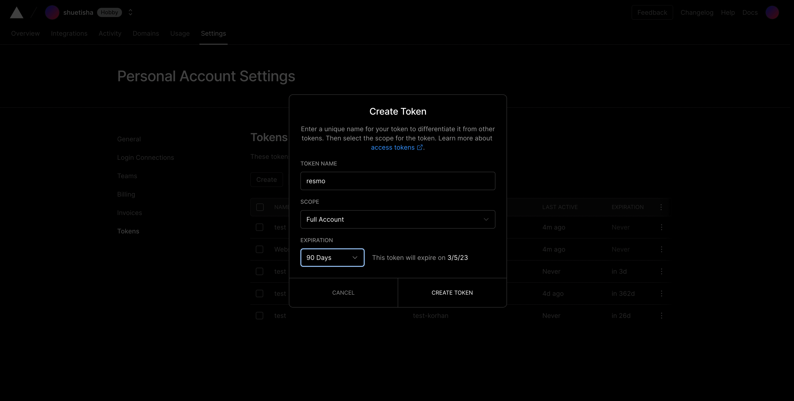
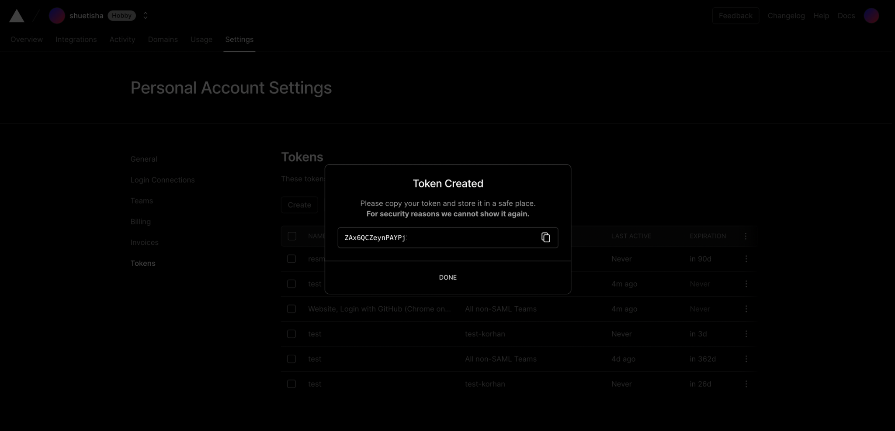
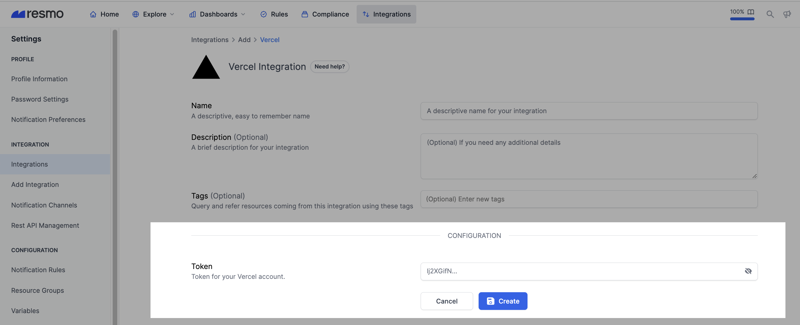

# Vercel Integration

## Resmo + Vercel Integration Fundamentals

<figure><figcaption></figcaption></figure>

Resmo integrates with Vercel to provide asset visibility, security, and compliance for your environment.

### What does Resmo offer to Vercel users?

* Collect your directory assets like members, teams, and projects from your Vercel account.
* Query your Vercel members, teams, projects, and more using SQL or free text search.
* Set up security rules to continuously evaluate your resource security.
* Understand resource relationships in context with graph maps.

### How does the integration work?

Resmo uses API to do the initial polling and collect existing resources. Following the initial polling, it receives updates and changes in real-time through webhook and regular polling.

#### Available resources

Resources you can collect with your Resmo Vercel integration include domains, checks, members, projects, and more.

**See the complete list:**



## Integration walkthrough

### How to install

1. Sign up or sign in to Resmo and go to the Integrations page.
2. Click the Add Integration button and add Vercel.

<figure><figcaption></figcaption></figure>

3\. Name the integration and optionally add a description.

<figure><figcaption></figcaption></figure>

4\. Go to the [Tokens Page](https://vercel.com/account/tokens) on your Vercel account. This page can be found by clicking your avatar and then clicking on Settings.

<figure><figcaption></figcaption></figure>

5\. Click Create and select the full access scope.

<figure><figcaption></figcaption></figure>

6\. Select the desired expiration time for your token.

<figure><figcaption></figcaption></figure>

7\. Click "Create Token".

<figure><figcaption></figcaption></figure>

8\. Copy your token.

9\. Paste it to the Token field on the setup page.

<figure><figcaption></figcaption></figure>

10\. Hit the Create button.

11\. All set! Now you can start running queries on your Vercel resources.

### How to uninstall

1. Navigate to your Integrations page and click the Vercel integration you want to remove.
2. To temporarily pause the integration, click the Disable button. This way, you'll be able to enable it back later. To permanently uninstall it, click the Delete button. This action cannot be undone.

<figure><figcaption></figcaption></figure>

### Support

Contact us via live chat or email us at contact@resmo.com for troubleshooting or support requests.
