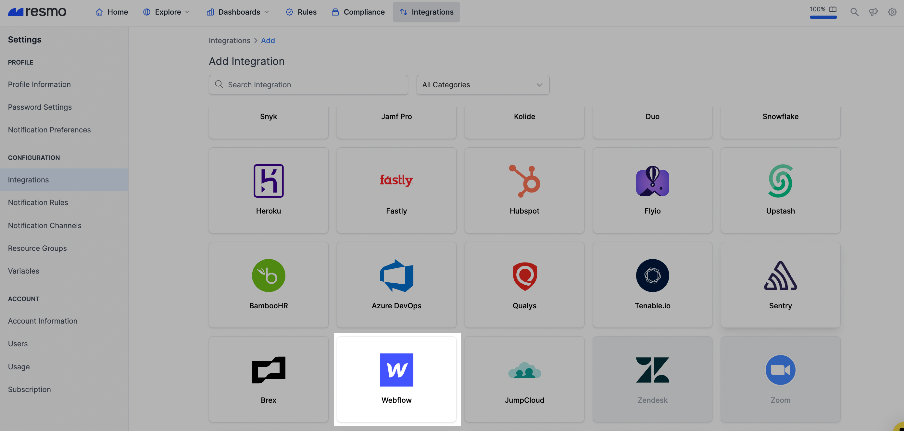
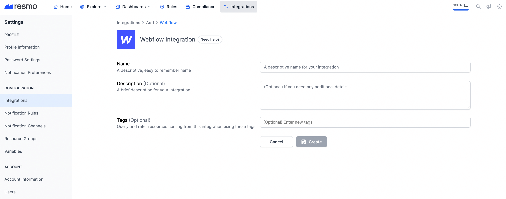
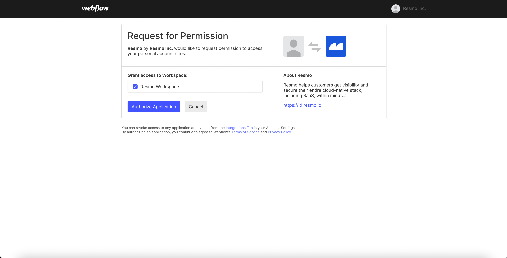

# Webflow Integration

## Resmo + Webflow Integration Fundamentals

<figure><figcaption></figcaption></figure>

Resmo integrates with Webflow to help you keep your assets visible, secure, and compliant.

### What does Resmo offer to Webflow users?

* Collect Webflow resources like access groups, domains, and sites in one place.
* Query your asset, configurations, and changes using the SQL query engine or free-text search
* Set up security and compliance rules for automated security checks
* Receive timely notifications when there is a critical rule change

### How does the integration work?

Resmo uses API to do the initial polling and collect existing resources. Following the initial polling, it receives updates and changes in real-time through webhook and regular polling.

#### Available resources

Resmo aggregates Webflow resources, including domains, access groups, and webhooks.

See the complete list:



## Integration walkthrough

### How to install

1. Sign up or sign in to Resmo.
2. Go to your Integrations page and click the Add Integration button.

<figure><figcaption></figcaption></figure>

3\. Then, add Webflow.

<figure><figcaption></figcaption></figure>

4\. Give a descriptive name to your Webflow integration and, optionally, a description.

<figure><figcaption></figcaption></figure>

5\. Once you fill in the fields, hit the Create button.

6\. You will be redirected to Webflow. Accept the required permissions.

<figure><figcaption></figcaption></figure>

7\. That's it! Now, your Resmo Webflow integration is all set. You can start collecting your resources and querying right away.&#x20;

### How to uninstall

1. Login to your Resmo account and navigate to the Integrations page.
2. Click the Webflow integration you want to uninstall.
3. To temporarily disable the integration, click the Disable button, or you can permanently remove it by clicking the Delete button.&#x20;

<figure><figcaption></figcaption></figure>

### Support

For further inquiries or to report any issues, please get in touch with us via live chat or email us at [contact@resmo.com](mailto:contact@resmo.com).
