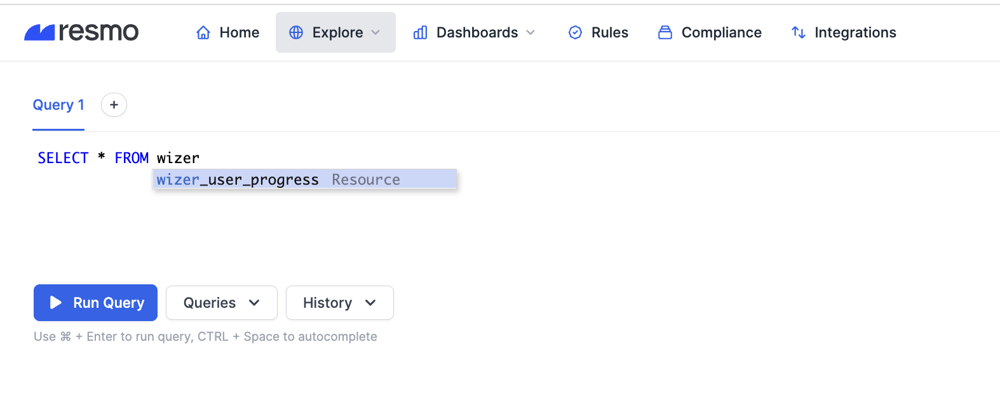
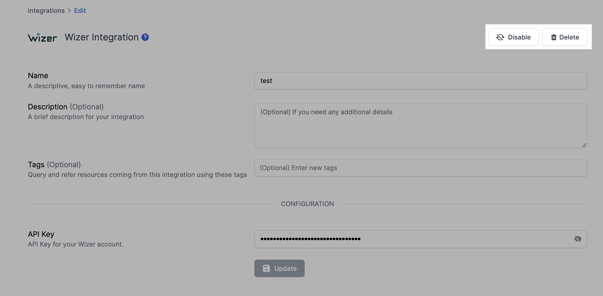

# Wizer Integration

## Resmo + Wizer Integration Fundamentals

<figure><figcaption></figcaption></figure>

Resmo seamlessly connects to Wizer to bring asset visibility, security, and compliance into your environment.

### What does Resmo offer to Wizer users?

* Collect your master report.
* Query your master report using SQL or free text search.
* Set up custom rules and run custom SQL queries to improve your asset visibility.
* Receive timely notifications when there is a security rule violation.

### How does the integration work?

Resmo uses API to do the initial polling and collect existing resources. Following the initial polling, it receives updates and changes in real-time through webhook and regular polling.

#### Available resources



## Integration walkthrough

### How to install

1. Select Wizer on the Integrations page of your Resmo account.
2. Click the Add Integration button at the bottom right corner of the opening modal.
3. Go to your Wizer account on a new tab.
4. Request your **API Key** information from Wizer via email.
5. After receiving your API Key, paste it to the API Key field on the setup page.
6. Hit the **Create** button.
7. All set! Now you can start running queries on your Wizer resources.

<figure><figcaption></figcaption></figure>

### How to uninstall

1. Select Wizer on your Integrations page.
2. Navigate to the Connected Integrations tab on the opening modal.
3. Click the Wizer integration you wish to remove.
4. To **temporarily pause** your Wizer integration, click the Disable button from the upper righthand of the page. This way, you can enable it back whenever you like.&#x20;
5. Or, you can **permanently uninstall** by clicking the Delete button instead. Mind that this action cannot be undone.

<figure><figcaption></figcaption></figure>
