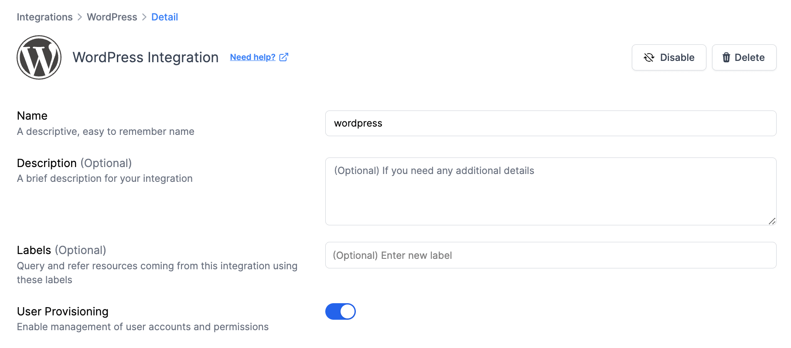
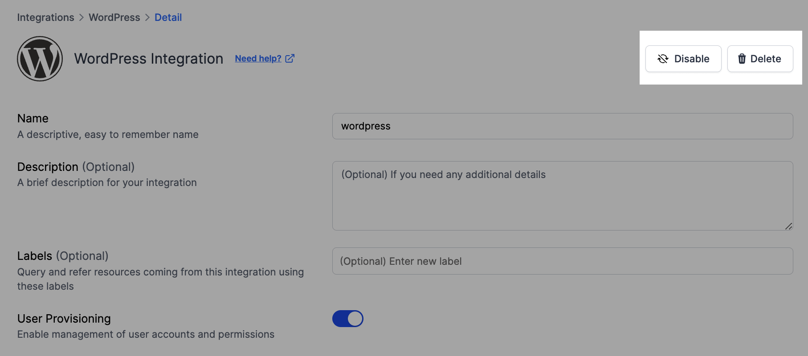

# WordPress Integration

<figure><figcaption></figcaption></figure>

Resmo's integration with WordPress brings a new level of visibility and control to your website management, ensuring your site remains secure, efficient, and user-friendly.

### **What does Resmo offer to WordPress users?**&#x20;

* Understand plugin and theme performance, to improve site speed and user experience.
* Keep track of user roles, access levels, and activities, ensuring your site's administrative actions align with security policies.
* Gain visibility into your site's configurations, including privacy settings and customizations, to maintain optimal functionality.
* Stay informed about crucial updates, such as new user registrations, role changes, plugin installations, and modifications to site settings, for proactive management.
* Use Resmo’s SQL query feature to drill down into specific data points, empowering you to make informed decisions about site management and security.

### **How does the integration work?**&#x20;

Resmo integrates seamlessly with WordPress through direct API connections, offering an initial detailed scan of your site. Following the setup, Resmo continuously syncs with your WordPress site, utilizing webhook notifications and regular polling to keep your data up-to-date in real-time.

**Available resources:**

* User
* Site

### Integration Walkthrough

#### How to Install

1. Navigate to the Integrations page within your Resmo account.
2. Scroll or search to find WordPress in the integration list.
3. Click on 'Add Integration'.
4. Enable User Provisioning to use user access related features in Resmo.
5. Click 'Create' to complete your integration setup. You're all set!

<figure><figcaption></figcaption></figure>

#### **How to Uninstall**

1. Go to your Integrations page in Resmo and locate your WordPress integration.&#x20;
2. Click the Connected Integrations tab.

<figure><figcaption></figcaption></figure>

3. For a temporary halt, select 'Disable'. To permanently remove the integration, click 'Delete'.
4. Under the Connected Integrations tab, select the WordPress site you intend to disconnect.

<figure><figcaption></figcaption></figure>
