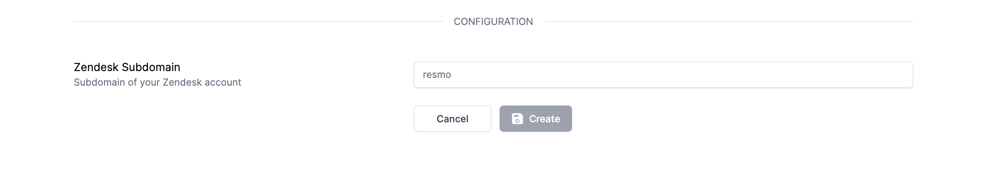
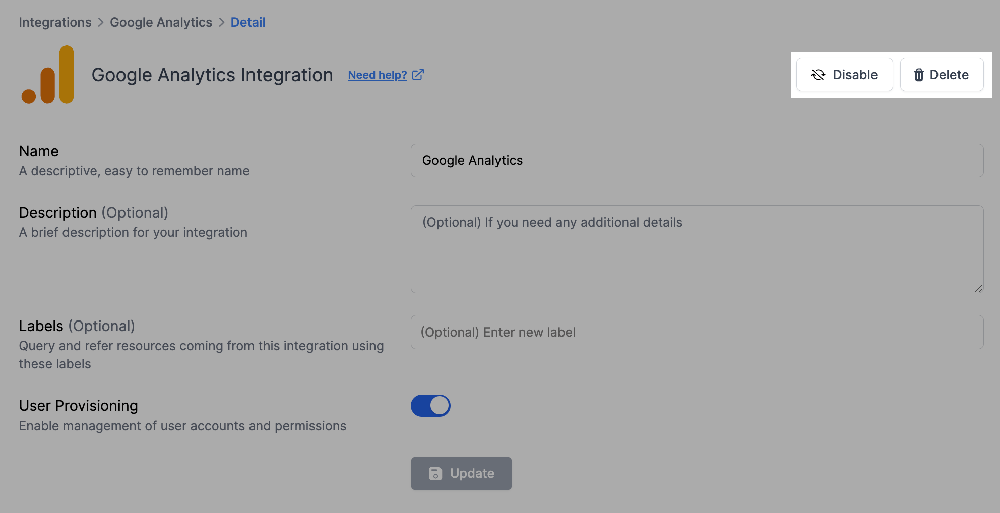

# Zendesk Integration

## Resmo + Zendesk Integration Fundamentals

<figure><figcaption></figcaption></figure>

Resmo seamlessly integrates with Zendesk to help keep your assets visible, secure, and compliant in real time.

### What does Resmo offer to Zendesk users?

* Collect your directory assets like users, tokens, and groups from your Zendesk account.
* Query your Zendesk users, tokens, apps, groups, and much more.
* Set up security rules based on Zendesk resource configurations.
* Get notified when there is a critical change in your security and compliance rules.

### How does the integration work?

Resmo has a Zendesk application that you can install once you sign up for a Resmo account. Our application uses API to make the initial polling and receive existing resources. Then, we receive resource changes and updates in real-time through regular polling.

#### Available resources



## Integration walkthrough

### How to install

1. Select Zendesk on the Integrations page of your Resmo account.
2. Click the Add Integration button at the bottom right corner of the opening modal.
3. On the Configuration section, type your Zendesk subdomain name into the related field.

<figure><figcaption></figcaption></figure>

4. Hit the Create button.
5. You'll be redirected to Zendesk.&#x20;
6. Accept the required permissions for the integrations.
7. Your Zendesk integration is ready! Now you can start querying your resources!

### How to uninstall

1. Select Zendesk on the Integrations page.
2. Navigate to the Connected Integrations tab on the opening modal.
3. Select the Zendesk integration you want to remove.
4. To temporarily pause the integration, click the Disable button from the top right. You can always enable it back later.&#x20;
5. The other option is permanent deletion. To uninstall your Zendesk integration permanently, you can click the Delete button.

<figure><figcaption></figcaption></figure>

### Support

Contact our team for further queries or troubleshooting about your Zendesk integration via live chat or email us at contact@resmo.com.
