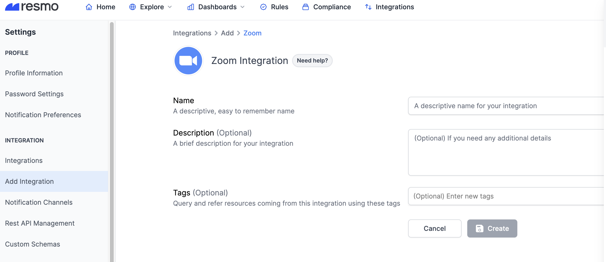
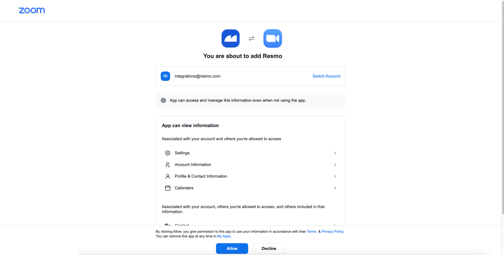
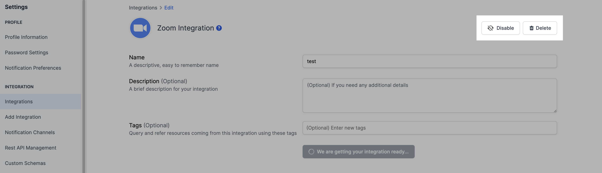

# Zoom Integration

## Resmo + Zoom Integration Fundamentals

<figure><figcaption></figcaption></figure>

Resmo's one-click integration with Zoom allows you to monitor and secure your assets in a single platform.

### What does Resmo offer to Zoom users?

* Collect your directory assets like users, roles, and groups from your Zoom account.
* Query your resources using SQL or free text search.
* Set up automated security and compliance checks for your Zoom assets.
* Receive timely notifications when there is a vulnerability or rule violation.

### How does the integration work?

Resmo uses API to do the initial polling and collect your existing Zoom resources. Following the initial polling, it receives updates and changes in real-time through webhook and regular polling.

#### Available resources

Resources you can collect with the integration include the following:

* Users
* Roles
* Groups
* Account Settings
* Account Lock Settings

## Integration walkthrough

### How to install

1. Sign up or sign in to Resmo and navigate to your Integrations page.
2. Click the Add Integration button and add Zoom.
3. Name your Zoom integration, and optionally, write a description.&#x20;

<figure><figcaption></figcaption></figure>

4\. Hit the Create button.

5\. You will be redirected to your Zoom account. Allow the required permissions.

<figure><figcaption></figcaption></figure>

6\. That's it. Now you can start querying your Zoom resources.

### How to uninstall

1. Go to your Integrations page on Resmo.
2. Click the Zoom integration you want to remove.
3. For temporary disabling, click the Disable button from the top right. You can enable your integration back later on. For permanent removal, click the Delete button instead. Note that deletion cannot be undone.

<figure><figcaption></figcaption></figure>

### Support

Contact us via live chat or email us at contact@resmo.com for further queries and troubleshooting regarding your Zoom integration.
