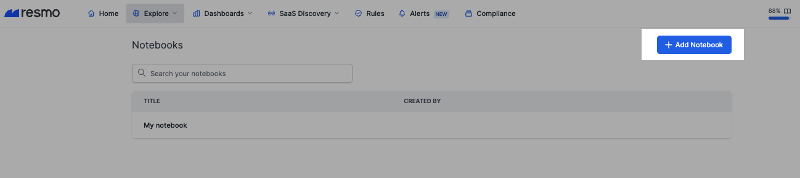
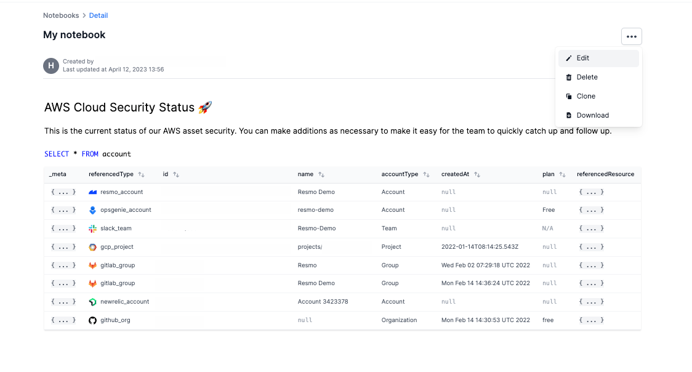
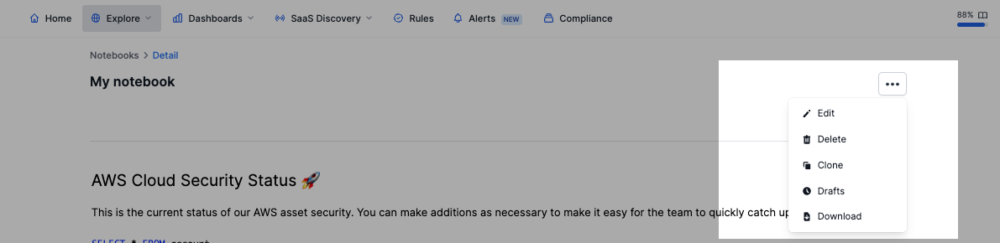

# Notebooks

Notebooks are interactive documents that enable users to visualize, explore, analyze, and present data-related content efficiently. These documents offer a well-organized platform for creating notes and generating visualizations using various cell types such as Text, SQL, and JavaScript.


By default, only account owners and administrators can access notebooks. To give specific notebook permissions to specified users, admins or owners need to [create policies](../users-and-permissions/rbac-role-based-access-control/custom-roles-and-policies.md).


### What do Notebooks offer to Resmo users?

* Enter rich text to your notes (H1, H2, Quotes, Numbered, and Bullet Lists) for enhanced note organization.&#x20;
* Create compelling visualizations in your notes, such as bar/line/pie charts, tables, graphs, and columns for better information presentation.&#x20;
* Utilize the Code Editor to integrate JavaScript code, enabling customizations and sophisticated features.&#x20;
* Streamline data analysis by writing and executing SQL queries with auto-complete functionality for improved efficiency.&#x20;
* Edit, clone, and delete notes as you like.
* Export your notes as PDF reports for easy sharing and offline access.

### Building blocks of Notebooks

A notebook is composed of building blocks called cells, which come in three types: Text, SQL, and JavaScript.

**Text cell:** Craft and format text blocks for easy organization.&#x20;

**SQL cell:** Display query results entered into the notebook, and if supported by the outputs, select various visualization types such as bar, pie, or line charts.&#x20;

**JavaScript cell:** Swiftly execute JS code and take advantage of predefined functions for enhanced functionality. For instance, you can assign a variable in JavaScript to the result of a query written using the SQL() function and utilize it later. Like the SQL cell, users can select different visualization types if the outputs permit. Additional Information:


Notebooks have a **limit of 50 cells each**. Users with the required permissions can create, edit, or clone notebooks as needed.


#### Visualization Options

* **Table:** Present the output in a tabular format.&#x20;
* **JSON:** Show the output as JSON.&#x20;
* **Bar:** Generate a bar chart based on the output.&#x20;
* **Pie:** Produce a pie chart using the output.&#x20;
* **Billboard:** Exhibit the output in a billboard-style format.&#x20;
* **Graph:** Develop a graph chart based on the output.&#x20;
* **Hidden:** Conceal the output.

### How to create a Notebook

1. Navigate to Explore>Notebooks.
2. Click the Add Notebook button from the top right.

<figure><figcaption></figcaption></figure>

3. Name your Notebook to find it quickly later.
4. Start by adding a cell; Code Editor, Text Editor, or SQL Editor.

<figure><figcaption></figcaption></figure>

5. Take your notes as you like with these building blocks.

* Bonus: You can move each element inside the document by drag-and-drop.

6. To run an SQL query, hit **Cmd+Enter**.

<figure><figcaption></figcaption></figure>

7. Once you're done with your note, click the Save button.


If a notebook is closed without being saved, a draft will be generated that is visible exclusively to you.


8. You can find your notes on the Notebooks page. If you have a lot of notes, try using the search bar.
9. To edit a note, open it and click the ellipsis icon> Edit/Clone/Delete.

<figure><figcaption></figcaption></figure>

10. To download a note, click the ellipsis icon>Download.

* Resmo creates an export link that remains active for 30 minutes before expiring.

**Tip:** You can share a notebook by sharing its URL.

### Support

Contact our support team via live chat or email us at contact@resmo.com for further queries or troubleshooting.
