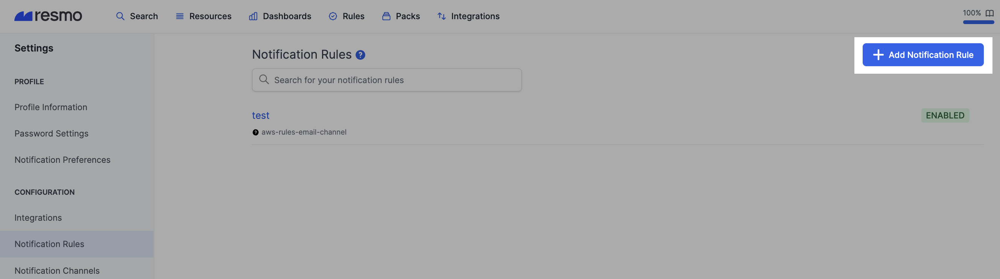
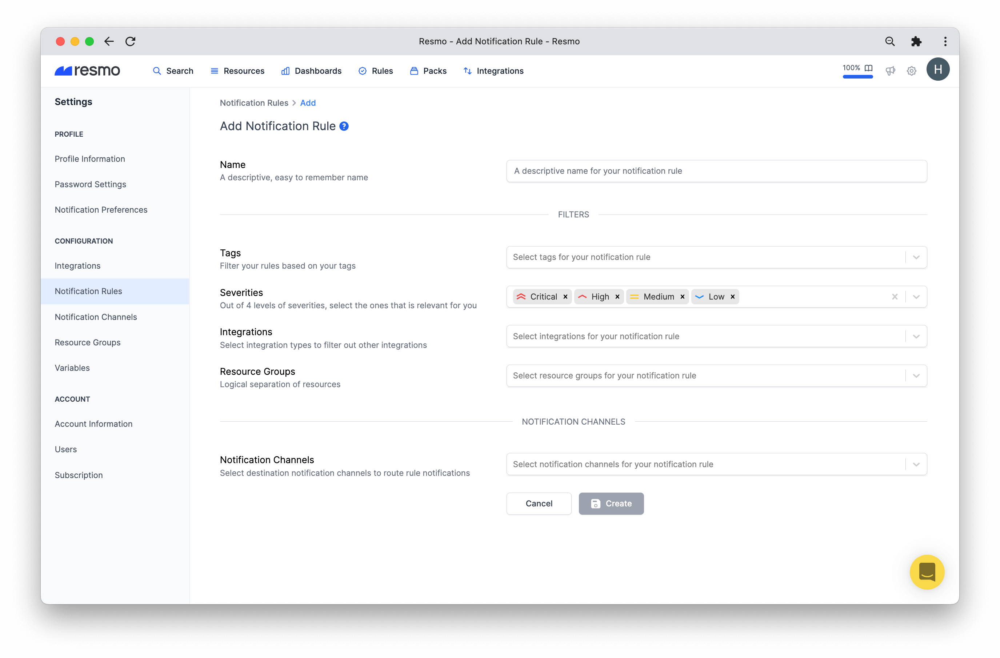

# Notification Rules

Notification rules are a set of rules that notify you based on custom criteria when there is a rule breach. Resmo sends out these notifications to your selected notification channels.&#x20;

Mind that you won't get notified of a regular rule breach; only notification rules send alerts so that you avoid alert fatigue.

### How notification rules work

Notification rules have four critical elements:&#x20;

**Tags:** Tags help you filter your rules. (Optional)

**Severities:** There are four levels of severity. Select the ones that require your attention in order to receive only the alerts that matter.

**Integrations:** A notification rule requires at least one integration to operate.

**Notification Channels:** Your rule notifications will be sent to the channels of your choice, including Slack, webhook, email, and Opsgenie.

### How to add a notification rule

1. Navigate to Settings>Notification Rules.

.png>)

2\. Click on the Add Notification Rule button.

3\. Give a descriptive name to your rule.

4\. Fill in the filter data (tags, severities, integrations) to find your rule easier later.

5\. Select notification channel(s) to receive alerts when there is a rule violation. (Also see the [Notifications documentation](broken-reference).)

6\. Hit the Create button and your notification rule is all set. You can find it on your Notification Rules page.

### How to disable or delete a notification rule

.png>)

* Open the notification rule you wish to disable or delete.
* Hit the Disable button to temporarily pause it or click Delete to permanently remove it.

### Support

If you have any questions about notification rules, feel free to contact us via live chat on our website or email us at contact@resmo.com.
