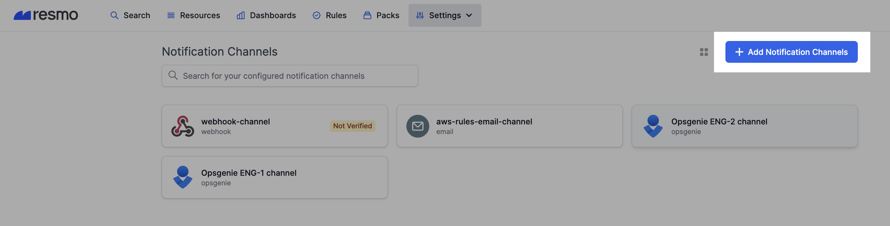
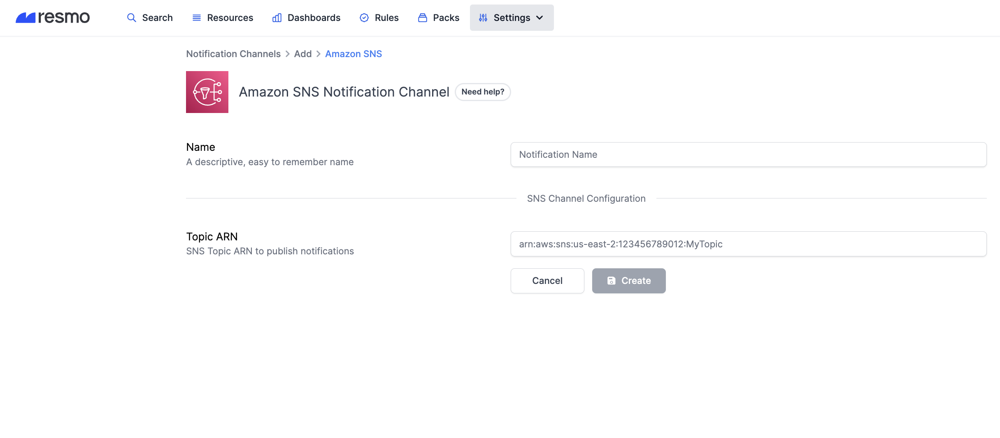

# Amazon SNS Notification Channel

### How do Amazon SNS notification channels work?

In order to create an Amazon SNS notification channel on Resmo, you need to permit the Resmo AWS account to send new notifications using the cloud formation template. (More information can be found in the [setup steps](amazon-sns-notification-channel.md#how-to-set-up-a-pagerduty-notification-channel).) Once you copy and paste the created SNS topic's ARN on the related Resmo field, you can start using your notification channel.

### How to set up an Amazon SNS notification channel

1. Login to your Resmo account and Settings>Notification Channels.

2\. Then, click the Add Notification Channels button.

3\. Click Add for Amazon SNS. Next, name your notification channel.

4\. Give permission to the Resmo AWS account to publish new notifications using the cloud formation template. [Launch Stack](https://console.aws.amazon.com/cloudformation/home#/stacks/create/review?templateURL=https://resmo-downloads.s3.us-west-2.amazonaws.com/public/sns-channel-cloudformation-template.json\&param\_AWSAccount=512995177166).&#x20;

5\. Copy the created SNS Topic's ARN and paste it to the related field on the notification channel setup page.

6\. Click Create.

**Note:** You can manage created notification channels from the Notification Channels panel.

### How to delete an Amazon SNS notification channel

1. Login to your Resmo account and navigate to Settings>Notification Channels.
2. Select the Amazon SNS notification channel you wish to remove.
3. Click Delete from the top right corner to permanently remove the selected notification channel.
